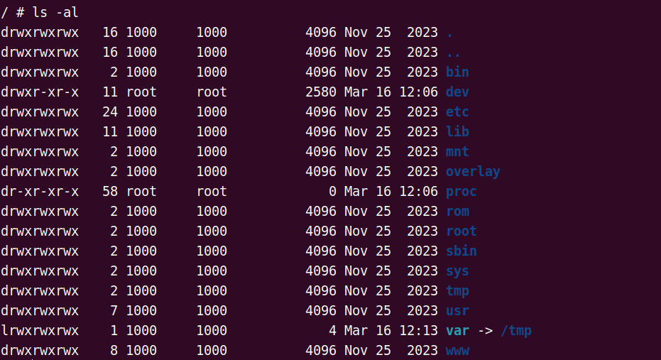
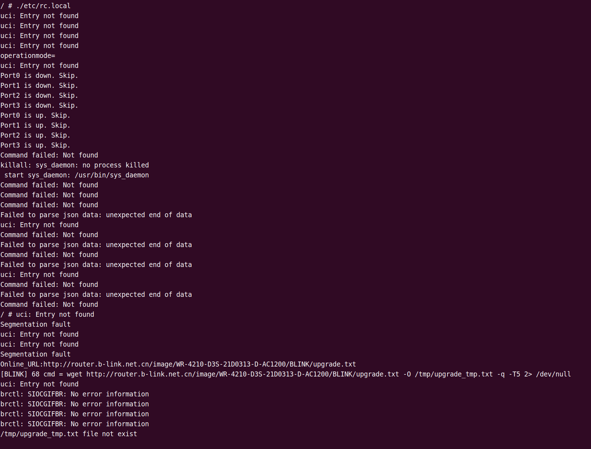
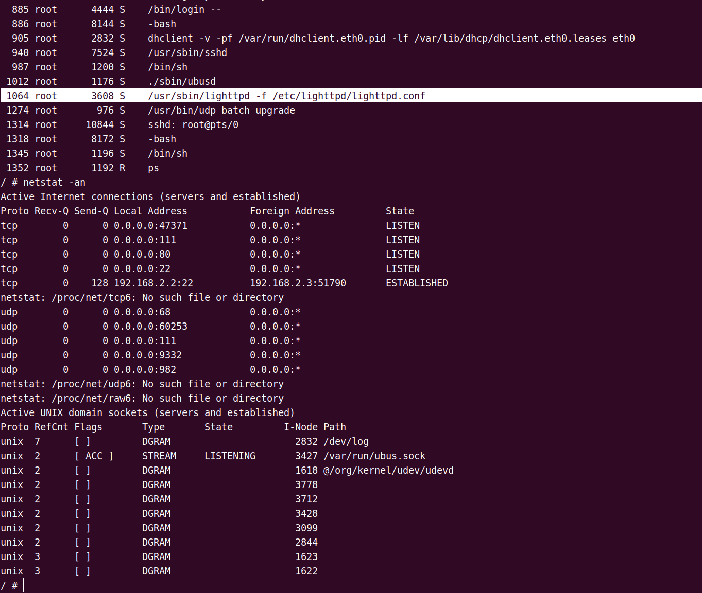
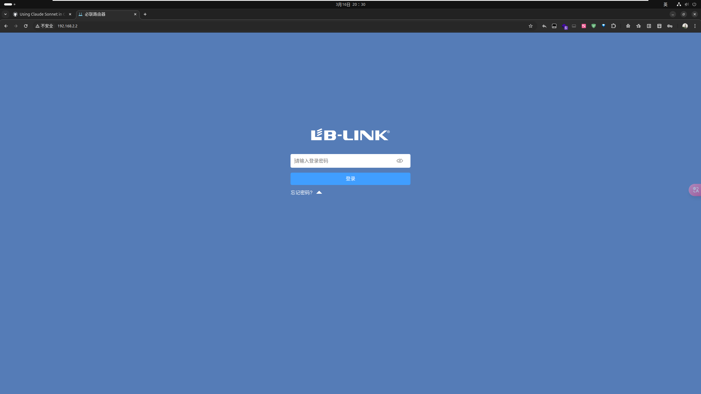
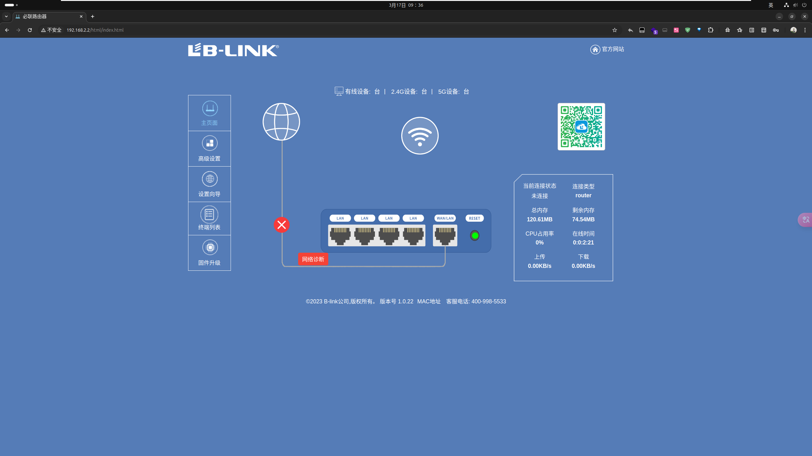
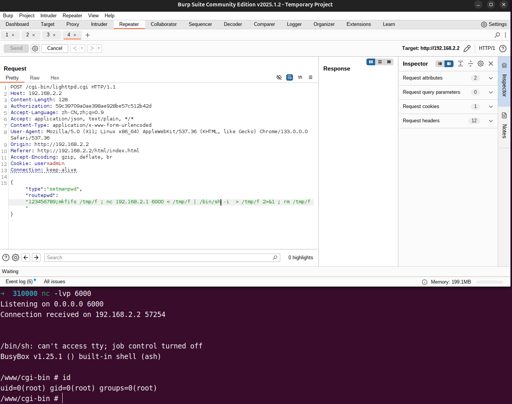

# AC3600分析


## 1.固件仿真

MIPS32 小端

用firmwalker跑一下，确定服务端是lighttpd


启动服务：

```
~ # /etc/init.d/Blink_Cloud start
 start Blink_Cloud: /usr/bin/Blink_Cloud
Failed to connect to ubus
```

同时/var目录指向/dev/null，存在问题

编译最新版本的binwalk解决了链接问题



直接运行：

```
/ # ./etc/init.d/Blink_Cloud start
 start Blink_Cloud: /usr/bin/Blink_Cloud
Failed to connect to ubus
```

```
/ # ./sbin/ubusd 
usock: No such file or directory
```

tmp目录下创建目录/run，再在后台启动ubus进程，接着运行Blink_Cloud,但是发现还是没用

再看看/etc目录下的文件，发现/etc/rc.local,直接运行，中途会有一些报错



另外开一个ssh连接进去，可以看到进程是启动了的，端口也是对外开放，前端也是可以正常渲染：





但是目前这个路由界面始终登录不上去，分析前面的启动脚本输出信息，一直显示uci相关的问题错误：可能的原因是脚本尝试访问不存在的UCI配置项路径或者文件不存在

```shell
/ # uci: Entry not found
uci: Entry not found
Segmentation fault
uci: Entry not found
Segmentation fault
```

`/etc/init.d/boot` 文件中有一系列创建文件夹的操作，执行`/etc/init.d/boot boot`,再执行`/etc/rc.local`,uci相关的问题消失，前端可以用密码`admin`正常登录了




## 2.漏洞挖掘

漏洞挖掘从功能点触发，并结合bp抓包分析

blonet师傅提到的一个漏洞点是在高级设置->系统设置->修改管理员密码

lighttpd.cgi只负责登录和后续接口的处理，真正功能的实现都在库函数里，定位到/usr/lib/libblinkapi.so库文件，定位到bs_SetManPwd()函数

发现system命令执行函数（这里的展示是经过hrtng插件优化过后的函数），但是前面的代码比较丑陋，不太好分析，所以调试一下，传入一个静态gdbserver，并且把gdb插件换成gef，对于异架构的支持更好


拿反弹shell




