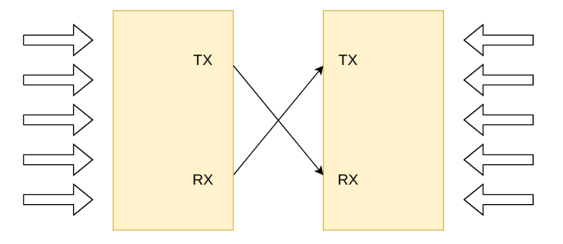

# 接口

> **串口、UART 口、COM 口、USB 口是指的物理接口形式(硬件)。而 TTL、RS-232、RS-485 是指的电平标准(电信号)**

## 1.基本概念

嵌入式系统中，接口是指用于将各种集成电路与其他外围设备交互连接的通信通路或总线，是微处理器 CPU 与外部世界的连接部件，是 CPU 与外界进行信息交换的中转站

发送方和接收方不需要共享时钟信号。数据的传输速率（波特率，每秒钟传输的二进制位数）在通信开始前由双方预先设定好，从而保证数据的正确接收

设置接口的原因：

- CPU 与外设二者的信号不兼容，包括信号线的功能定义、逻辑定义和时序关系。
- CPU 与外设的速度不匹配，CPU 的速度快，外设的速度慢。
- 若不通过接口，而由 CPU 直接对外设的操作实施控制，会使 CPU 处于穷于应付与外设打交道之中，大大降低 CPU 的效率。
- 若外设直接由 CPU 控制，会使外设的硬件结构依赖于 CPU，对外设本身的发展不利。

## 2.物理接口

### 2.1 URAT

异步收发传输器(Universal Asynchronous Receiver-Transmitter)，通常称作 UART，是一种全双工异步收发传输器

UART 使用的是异步串行通信，不使用时钟；以字符为传输单位，一位一位的顺序输送；通信中两个字符间的时间间隔是不固定的 ，然而同一个字符内两个相邻位之间的时间间隔是固定的

数据的传送速率用波特率来表示，即每秒钟传送的二进制位数

一般选波特率都会有 9600,19200,115200 等选项

UART 有 4 个 pin(VCC, GND, RXD, TXD), 用的 TTL 电平, 低电平为 0(0V)，高电平为 1(3.3V 或以上)：

* TX：发送数据端，要接对面设备的 RX
* RX：接收数据端，要接对面设备的 TX
* GND：保证两设备共地，有统一的参考平面
* VCC：供电 pin，一般是 3.3v，在我们的板子上没有过电保护，这个 pin 一般不接更安全

URAT数据帧格式：

电脑与URAT接口通信：ttl转usb

### 2.2 COM

特指台式计算机或一些电子设备上的 D-SUB 外形(一种连接器结构，VGA 接口的连接器也是 D-SUB)的串行通信口，应用了串口通信时序和 RS232 的逻辑电平

9 个 pin， 用的 RS232 电平, 它是负逻辑电平

### 2.3 USB

Universal Serial Bus, 中文是通用串行总线，它是一种快速双向的同步传输并可以进行热拔插的串行接口。但 USB 和串口完全是两个概念。虽然也是串行方式通信，但由于 USB 的通信时序和信号电平都和串口完全不同，因此和串口没有任何关系

### 2.4 console

它是连接 console 真终端的接口，所以叫它 console 口

数据信号也是使用的串行信号，也可叫它 COM 串口

物理形状可以是以太网口也可以是 DB25 或 DB9 的接口（物理形状）

### 2.5 JTAG

JTAG是一种国际标准测试协议，但没有标准的接口定义，甚至每家公司定义都不一样

接口的基本功能：

- 1.下载器，固件下载到设备中
- 2.DEBUG，调试模式
- 3.边界扫描，可以访问芯片内部的信号逻辑状态，还有芯片引脚的状态等

最常用的信号有四个，分别是TCK/TMS/TDO/TDI

- TCK：测试时钟
- TMS：测试模式选择，TMS用来设置JTAG接口处于某种特定的测试模式
- TDO：测试数据输出，数据通过TDO引 脚从JTAG接口输出
- TDI：测试数据输入，数据通过TDI引脚输入JTAG接口

## 3.电平标准

### 3.1 TTL

双极型三极管逻辑电路

### 3.2 RS232

电子工业协会(Electronic Industries Association，EIA) 制定的异步传输标准接口，同时对应着电平标准和通信协议(时序)

电平在 +5 至 +15 伏特表示逻辑 0，电平在 -5 至 -15 伏特表示逻辑 1

通常用 DB9，DB9 又有公头(针型)和母头(孔型)之分

还有 DB25，VGA 接口等

### 3.3 RS485

RS485 是一种串口接口标准，为了长距离传输采用差分方式传输，传输的是差分信号，抗干扰能力比 RS232 强很多

## 4.URAT定位

### 4.1 定位GND

GND和至少和一根外接天线是连接相通的，将万用表的档位调整至蜂鸣档，一只表笔置于天线的焊锡点，一只表笔置于串口，如果发出蜂鸣声，就是GND。

### 4.2 定位VCC

给路由器通电，VCC是供电引脚，路由器的VCC电压始终未3.30不会发生变化，找到它可以帮助我们排除RXD、TXD。

将万用表调整到直流20V上。将一只表笔放在GND上，测试其他哪只引脚电压为3.3V, 该引脚就为VCC。

### 4.3 定位TXD

输出引脚TXD，每次有数据传输的时候该引脚电压都会发生变化。什么时候有数据传输呢？根据个人经验路由器开机的时候有启动信息会从这个引脚输出，这时候电压就会发生变化，此引脚即为TXD。

### 4.4 定位RXD

输入引脚RXD，每次有外部数据传输到路由器的时候，RXD的电压都都会发生变化。这里其他3个引脚都确定了就剩下一个很容易的确定了RXD