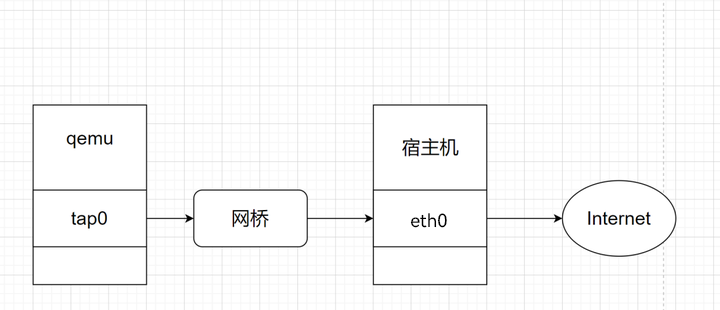

# 固件仿真

> QEMU（Quick Emulator）是一款开源的虚拟化工具和模拟器，用于在不同架构和操作系统之间进行硬件级别的虚拟化和模拟。它具有多种用途，包括虚拟机管理、嵌入式系统开发、操作系统开发和测试等
>
> 他支持多平台支持、硬件级模拟、嵌入式开发、虚拟机管理、快照和还原、高度可定制、性能优化
>
> QEMU 在虚拟化和模拟领域非常有用，它是一个强大的工具，可用于多种开发、测试和虚拟化场景。它还是一个开源项目，因此可以根据需要进行自定义和扩展
>
> 映像文件内核及文件系统下载地址：https://people.debian.org/~aurel32/；https://people.debian.org/~gio/dqib/

>仿真经验：确定 CPU 架构和信息收集-> 用户模式仿真(可以使用 chroot 更改为固件根目录获得一个 shell)-> 完整的文件系统仿真
>
>定位到/etc/rc.d 或/etc/init.d 并运行适当的 RC 脚本以启动用户态服务

## 1.局部仿真

QEMU-User（简称 QEMU-U）是 QEMU 项目的一部分，它提供了一种用户态的 CPU 模拟，允许在一个架构上运行的二进制程序在不同架构的系统上执行。具体来说，QEMU-User 允许将一个 CPU 架构的二进制程序在另一个 CPU 架构的系统上运行，而不需要完全模拟整个虚拟机。

如果仅仅只有单个 elf 静态链接文件，那么可以采用局部仿真的方法进行启动 例如 arm 架构的可以直接使用如下命令，然后监听 1234 端口，等待 gdb 连接。

这样就可以开启一个 12345 端口的 server，然后可以在另一个终端中使用 gdb 的 `target remote` 命令进行连接，然后调试

```shell
qemu-arm -g 12345 ./elf_fie
```

如果是动态链接的二进制文件，可以指定共享库的位置，可以使用 qemu-user 的 `-L` 选项指定当前目录，然后将动态库存放于当目录的 lib 子目录中


## 2.系统仿真

仿真的前提：

* QEMU 磁盘映像文件（qcow2）
* 为目标架构编译的 Linux 内核映像
* 初始 RAM 磁盘映像（initrd）（有时需要）

### 2.1 qemu 仿真脚本

QEMU-System 是 QEMU 项目的一部分，它提供了完整的虚拟化和仿真环境，允许用户模拟整个计算机系统，包括 CPU、内存、外部设备等。QEMU-System 是一种强大的工具，可用于多种用途，包括虚拟化、操作系统开发、嵌入式系统测试和仿真等。

QEMU-System 是一个非常强大和灵活的工具，广泛用于虚拟化、操作系统开发、嵌入式系统测试和仿真等领域。它是一个开源项目，因此用户可以根据需要进行自定义和扩展。

如果有文件系统，就可以使用 qemu-system 来进行系统仿真 举个例子来说明各个参数

```sh
sudo qemu-system-arm \
	-M vexpress-a9 \
	-kernel vmlinuz-3.2.0-4-vexpress \
	-initrd initrd.img-3.2.0-4-vexpress \
	-drive if=sd,file=debian_wheezy_armhf_standard.qcow2 \
	-append "root=/dev/mmcblk0p2 console=ttyAMA0" \
	-net nic \
	-net tap,ifname=tap0,script=no,downscript=no \
	-nographic
```

| 参数                   | 解释                                                         |
| ---------------------- | ------------------------------------------------------------ |
| `-M <machine>`         | 指定仿真目标机器类型（如：`pc`、`vexpress-a9`）              |
| `-kernel <file>`       | 指定内核映像文件                                             |
| `-initrd <file>`       | 指定初始 RAM 磁盘映像文件                                    |
| `-drive <opts>`        | 高级硬盘映像文件配置选项（如：`file=<file>,if=<interface>,media=<media>`） |
| `-drive file=<file>`   | 指定硬盘映像文件                                             |
| `-append <cmdline>`    | 向内核传递命令行参数                                         |
| `-net nic`             | 添加一个虚拟网络接口卡（默认为 `tap0`）                      |
| `-net user`            | 使用用户模式网络堆栈                                         |
| `-net tap,<opts>`      | 使用 TAP 接口进行网络配置（如：`ifname=<tapN>`、`script=<script>`、`downscript=<script>`） |
| `-netdev <opts>`       | 高级网络配置选项（例如：`tap,id=<id>,ifname=<tapN>,script=<script>,downscript=<script>`） |
| `-nographic`           | 禁用图形输出，所有输出通过控制台                             |
| `-smp <n>`             | 指定虚拟机使用的虚拟 CPU 数量                                |
| `-m <size>`            | 指定虚拟机内存大小（例如：`512M`、`1G`）                     |
| `-cpu <model>`         | 指定虚拟 CPU 模型（如：`qemu64`、`host`）                    |
| `-hda <file>`          | 指定第一个虚拟硬盘映像文件                                   |
| `-hdb <file>`          | 指定第二个虚拟硬盘映像文件                                   |
| `-hdc <file>`          | 指定第三个虚拟硬盘映像文件                                   |
| `-hdd <file>`          | 指定第四个虚拟硬盘映像文件                                   |
| `-cdrom <file>`        | 指定 CD-ROM 映像文件                                         |
| `-boot <device>`       | 指定启动设备顺序（例如：`a`、`c`、`d`、`n`）                 |
| `-device <device>`     | 添加虚拟设备（例如：`virtio-net-device,netdev=<id>`）        |
| `-serial <opts>`       | 配置虚拟机的串行端口（如：`file:<file>`、`pty`、`tcp:<host>:<port>`） |
| `-monitor <opts>`      | 配置 QEMU 监视器（如：`file:<file>`、`stdio`、`tcp:<host>:<port>`） |
| `-snapshot`            | 启动虚拟机时不保存更改（快照模式）                           |
| `-usb`                 | 启用 USB 支持                                                |
| `-device usb-<device>` | 添加 USB 设备（如：`usb-mouse`、`usb-keyboard`、`usb-storage`） |
| `-redir <opts>`        | 重定向主机到虚拟机的网络端口（如：`tcp:<host-port>::<guest-port>`） |
| `-display <opts>`      | 配置显示输出（如：`sdl`、`curses`、`gtk`、`vnc=<host>:<port>`） |
| `-spice <opts>`        | 配置 SPICE 协议支持，用于高性能的远程显示（如：`port=<port>`） |
| `-enable-kvm`          | 启用 KVM 加速（需要硬件支持）                                |
| `-full-screen`         | 以全屏模式启动虚拟机                                         |
| `-pidfile <file>`      | 将 QEMU 进程 ID 写入指定文件                                 |
| `-daemonize`           | 以守护进程模式运行 QEMU                                      |
| `-rtc <opts>`          | 配置 RTC 选项（如：`base=utc`、`base=localtime`、`clock=host`） |
| `-name <name>`         | 指定虚拟机名称                                               |
| `-uuid <uuid>`         | 指定虚拟机 UUID                                              |

其他结构示例：

```sh
sudo qemu-system-mips \
	-M malta \
	-kernel vmlinux-3.2.0-4-4kc-malta \
	-hda debian_wheezy_mips_standard.qcow2 \
	-append "root=/dev/sda1 console=tty0" \
	-net nic -net tap,ifname=tap0,script=no,downscript=no \
	-nographic
```

```sh
sudo qemu-system-mipsel \
	-M malta \
	-kernel vmlinux-3.2.0-4-4kc-malta \
	-hda debian_wheezy_mipsel_standard.qcow2 \
	-append "root=/dev/sda1 console=tty0" \
	-net nic -net tap,ifname=tap0,script=no,downscript=no \
	-nographic
```

### 2.2 qemu 网络配置

为了让虚拟机能够和 qmu 通信，需要配置一下网络：

配置网络的基本原理：



宿主机工具安装：

```shell
sudo apt install bridge-utils uml-utilities
```

网络配置脚本 `net.sh`:(配置成功，会多出两个虚拟网卡 `br0` 和 `tap0`, 每次重启虚拟机后，都需要重新配置一下)

```shell
#!/bin/sh
sudo brctl addbr br0                   # 添加一个名为 br0 的网桥
sudo ifconfig br0 192.168.2.3/24 up    # 启用 br0 接口
sudo tunctl -t tap0 -u root            # 创建一个只许 root 访问的 tap0 接口
sudo ifconfig tap0 192.168.2.1/24 up   # 启用 tap0 接口
sudo brctl addif br0 tap0              # 在虚拟网桥中增加一个 tap0 接口
```

取消网络配置脚本 `unset_net.sh`:

```shell
#!/bin/sh
sudo ifconfig br0 down # 关闭设备
sudo ifconfig tap0 down # 关闭设备
sudo brctl delbr br0 # 删除网桥
sudo tunctl -d tap0 # 删除网卡
```

qemu 里配置网络与 `tap0` 在同一网段内：

```sh
ifconfig eth0 192.168.2.2/24 up
ping 192.168.2.1 
```

### 2.3 上传文件系统

传入文件系统

```sh
sudo scp -r ./squashfs-root root@192.168.2.2:/root/
```

这里有个坑，如果直接传入 squashfs-root，var 下的软链接会出问题，导致后面相关服务无法正常启动

然后将 squashfs-root 的压缩包传入 qemu 中并解压

```sh
tar -czvf rootfs.tar.gz squashfs-root
sudo scp -r rootfs.tar.gz root@192.168.2.2:/root/
tar -xzvf rootfs.tar.gz
```

出现传输或者连接时的 `Unable to negotiate with x.x.x.x port 22: no matching host key type found. Their offer: ssh-rsa,ssh-dss` 问题

在命令行选项中添加 ` ssh -oHostKeyAlgorithms=+ssh-dss user@host -p port` 可以解决算法安全性问题

### 2.4 启动

挂载文件系统， chroot 命令创建隔离的文件系统环境，但这会导致无法在隔离的文件系统中访问原本的 /proc 和 /dev 目录，因为它们是特殊的虚拟文件夹（用于提供系统信息和设备的访问）

为了让 QEMU 环境正常运行，需将原本 QEMU 的 /proc 和 /dev 目录挂载到新创建的隔离环境中

```sh
chmod -R 777 squashfs-root
cd squashfs-root/
# 挂载文件系统
mount --bind /proc proc
mount --bind /dev dev
chroot . /bin/sh
```

```shell
/etc/init.d/boot boot     # 创建初始化环境
generate_default_cert     # 生成 ssl 证书文件
/etc/init.d/confd start   # 启动 confd 服务
/etc/init.d/nginx start   # 启动 nginx 服务
```


## 3.自动化仿真工具

Firmware Analysis Toolkit（简称 FAT）：https://github.com/attify/firmware-analysis-toolkit

主要功能;

- 固件提取：FAT 允许您从嵌入式设备中提取固件，无论它们是存储在闪存芯片、固态硬盘还是其他媒体上。这是进行后续分析的第一步。

- 固件分析：FAT 提供了各种分析工具，以帮助您深入研究固件的内部结构和组件。这包括文件系统解析、二进制文件分析、文件提取等。

- 字符串提取：该工具还能够从固件中提取字符串，以帮助您识别固件中可能包含的敏感信息或有用的配置参数。

- 固件比较：FAT 允许您比较不同版本的固件，以查找更改和差异。这对于检测漏洞修复或新功能添加等方面很有用。

- 漏洞分析：FAT 包括一些用于静态和动态漏洞分析的工具，以帮助您发现潜在的安全问题。

- 攻击面评估：该工具套件还提供了一些功能，用于评估嵌入式设备的潜在攻击面，帮助您识别可能的攻击矢量。

- 插件系统：FAT 支持插件系统，这意味着您可以编写自定义插件来扩展工具的功能，以满足特定的需求


FirmAE：https://github.com/pr0v3rbs/FirmAE：一个执行仿真和漏洞分析的全自动框架。FirmAE 使用五种仲裁技术显著提高仿真成功率（从 Firmadyne 的 16.28% 提高到 79.36%）

firmdyne：https://github.com/firmadyne/firmadyne

emux：https://github.com/therealsaumil/emux


## 4.GNS3

Graphical Network Simulator(GNS3)是一个网络设备模拟器软件，主要模拟 Cisco 的 Router Switch 和 Firewall


## 5.Unicorn

SEmu

Ghidra Emulato