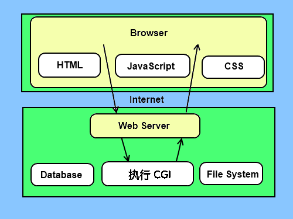
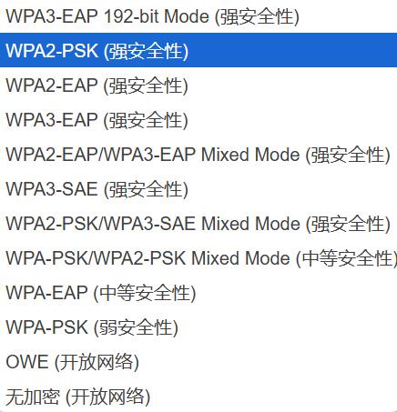

# 常见漏洞

## 1.CGI漏洞

概念：CGI漏洞是指web服务器上的cgi（Common Gateway Interface（通用网关接口）在Web服务器上运行的程序，用于处理来自客户端的请求并生成动态内容，用 Perl 、lua 或 Python 等语言编写的解释程序，只要服务器知道如何启动程序）程序存在安全漏洞，攻击者可以利用这些漏洞执行恶意代码或获取敏感信息

CGI是Web服务器与客户端之间的中间层，它负责接收来自客户端的请求，并将请求传递给后端程序进行处理。CGI不是一门编程语言。它是网页的表单和你写的程序之间通信的一种协议。可以用任何语言写一个CGI脚本，这些语言只要能接收输入输出信息，读取环境变量

默认的目录通常是/cgi-bin/

典型的CGI脚本做了如下的事情：

* 读取用户提交表单的信息
* 处理这些信息
* 输出，返回html响应

CGI漏洞类型：

* 输入验证漏洞：构造恶意输入来绕过输入验证机制，从而执行任意代码或获取敏感信息
* 环境变量注入漏洞：修改环境变量来控制CGI程序的行为，例如访问受限文件或执行系统命令
* 文件路径遍历漏洞：构造特殊路径来访问服务器上的其他文件或目录，可能导致敏感信息泄露或远程代码执行
* 缓冲区溢出漏洞：向CGI程序发送过长的数据来覆盖内存中的其他数据，导致程序崩溃或执行恶意代码

## 2.密码破解漏洞

常见的加密认证方式：WEP（逐渐被淘汰），WPA，WPA2，WPA3

另外，wifi联盟还推出了WPS技术（wifi protected setup），主要用于解决无线网络加密认证设定的步骤过于复杂

具有WPS功能的无线设备上通常由WPS按钮，按下该按钮或输入pin码，再经过简单的操作，即可完成无限加密设置，建立连接

## 3.web漏洞

路由器一般带有web管理服务，使用者可以通过web管理界面进行路由器管理和配置

常见SQL注入，命令执行，CSRF，，XSS等

## 4.路由器后门漏洞

开发软件的程序员为了日后调试和检测方便，在软件中设置的一个超级管理权限，一般情况下不容易被发现
