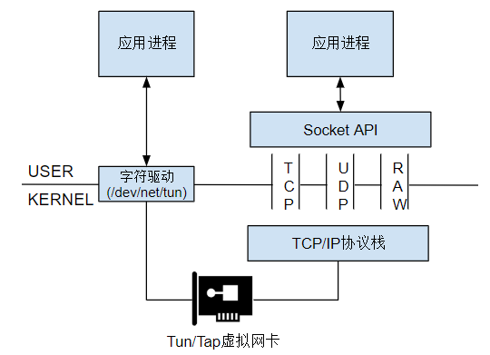

# 物理网卡与虚拟网卡

## 1.物理网卡

物理网卡主要与外界接收和发送数据：（内核和用户空间的数据传输由内核占用CPU来完成，内核和网卡之间的数据传输由网卡的DMA来完成）

- 收：外界向该物理网卡发送数据时，外界发送到网卡的数据最终会传输到内核空间的网络协议栈中
- 发：本机要从物理网卡发送数据时，数据将从内核的网络协议栈传输到网卡，网卡负责将数据发送出去

## 2.虚拟网卡

虚拟网卡的两端则是**内核网络协议栈和用户空间**，它负责在内核网络协议栈和用户空间的程序之间传递数据：

- 发送到虚拟网卡的数据来自于用户空间，然后被内核读取到网络协议栈中
- 内核写入虚拟网卡准备通过该网卡发送的数据，目的地是用户空间

只要为虚拟网卡提供网卡驱动程序，使其在内核中可以注册成为网卡设备，就可以成功使用，但对于虚拟网卡，使用ip命令都只是临时添加，重启失效

### 2.1 tun/tap

tun与tap都是虚拟网卡设备，tap比tun更接近于物理网卡，其主要区别如下：

| tun                      | tap                          |
| ------------------------ | ---------------------------- |
| 三层设备，外层封装ip头   | 两层设备，外层封装以太网帧头 |
| ppp点对点设备，无mac地址 | 以太网设备，有mac地址        |

用户空间对tun/tap驱动程序的操作的两种交互方式：虚拟网络接口和字符设备/dev/net/tun

* 写入字符设备/dev/net/tun的数据会发送到虚拟网络接口中
* 发送到虚拟网络接口中的数据也会出现在该字符设备上

### 2.2 virtual bridge

安装：`apt-get install bridge-utils`

bridge可以在两个或多个网络段之间转发数据包，bridge的行为类似于虚拟网络交换机

## 3.物理网卡与虚拟网卡区别

物理网卡是硬件网卡，它位于硬件层，虚拟网卡则可以看作是用户空间的网卡

他们能够达到的功能是相同的，唯一的区别就是传输数据的方式不同：物理网卡以比特流的方式传输数据，虚拟网卡则直接在内存中拷贝数据(即，在内核之间和读写虚拟网卡的程序之间传输）

所以，**虚拟网卡不可能向外界发送数据，外界数据也不可能直接发送到虚拟网卡上**，但是可以将网络数据发送到另一个虚拟/物理网卡上
