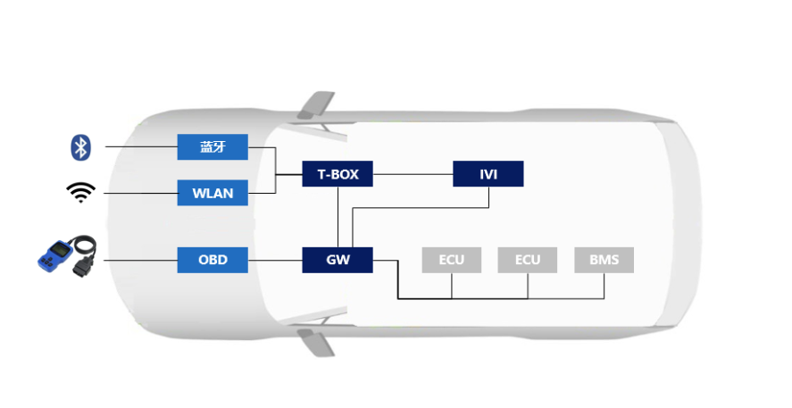

# 车联网基础

V2X(Vehicle To Anything)：表示车与X通信，X可以是车(Vehicle)、路(Road)或者其他相关基础设施，V2X的典型应用有左转辅助、紧急刹车提示、闯红灯警告、过弯速度警告、施工路段提醒、实时天气信息提醒等

ADAS(Advanced Driver Assistance System):ADAS是在驾驶过程中辅助驾驶员的系统，它的功能包括安全告警功能、自适应控制功能、信息提示功能等

TBOX：智能网联汽车上用于联网的重要模块，又名T盒、车载无线终端等，国外一般称之为TCU（Telematics Control Unit，远程信息控制单元）。上端与TSP(Telematics Service Provider)服务器相连，下端通过CAN总线等与汽车其他模块相连

LIN 总线协议：用于车辆中低速数据传输，如门控、照明和仪表板等

MOST (Media Oriented System Transport)： 面向媒体的系统传输总线，MOST 是汽车业合作的成果，而不具备正式的标准。它是一种专门针对车内使用而开发的、服务于多媒体应用的数据总线技术。