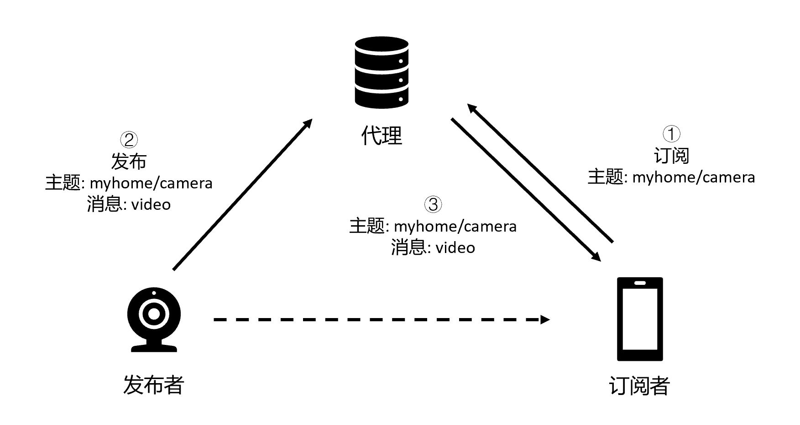

# MQTT

## 1.介绍

MQTT（Message Queuing Telemetry Transport，消息队列遥测传输协议），是一种基于发布/订阅（publish/subscribe）模式的 "轻量级" 通讯协议，该协议构建于 TCP/IP 协议上

协议特点：

- MQTT 协议轻量、简单、开放和易于实现
- MQTT 是基于发布 (Publish) / 订阅 (Subscribe) 范式的消息协议，支持一对多
- MQTT 工作在 TCP/IP 协议族上
- 有三种消息发布服务质量
- 小型传输，开销很小（固定长度的头部是 2 字节，最小的报文也就是 2 字节），协议交换最小化，以降低网络流量
- MQTT 默认端口为1883，加密的端口为8883（加密后会增大网络开销）

## 2.基本原理

MQTT 协议中有三种角色和一个主要概念，三种角色分别是发布者（PUBLISHER）、订阅者（SUBCRIBER）、代理（BROKER），还有一个主要的概念为主题（TOPIC）

该协议具有总线的特点，所有数据并不直接发送至接收端，而是先发送至一个总线服务器（也就是代理），由其负责转发

消息通过主题标识，订阅者根据主题订阅消息才会接收消息

## 3.MQTT安全

攻击点：

* 认证：弱口令
* 传输：默认未加密，可中间人攻击
* 配置错误
* 自身漏洞

开源利用工具：https://github.com/akamai-threat-research/mqtt-pwn

测试工具：https://cloud-tools.emqx.com/，https://testclient-cloud.mqtt.cool/