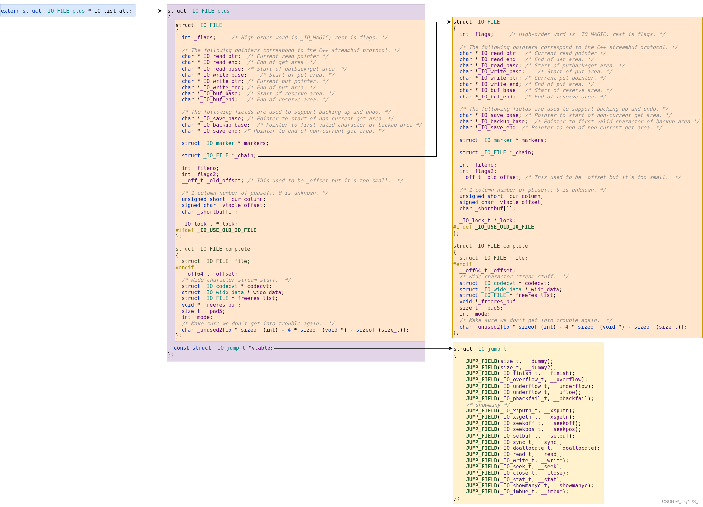
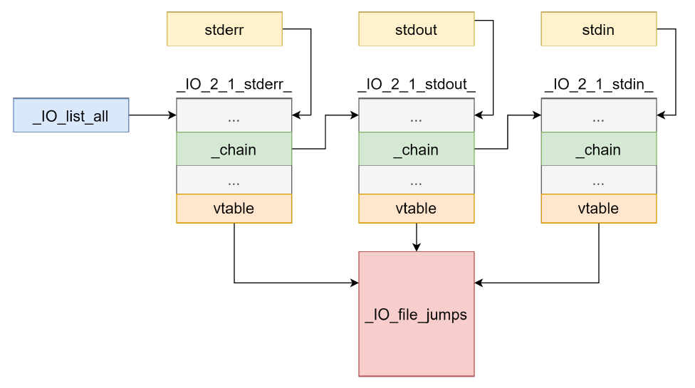
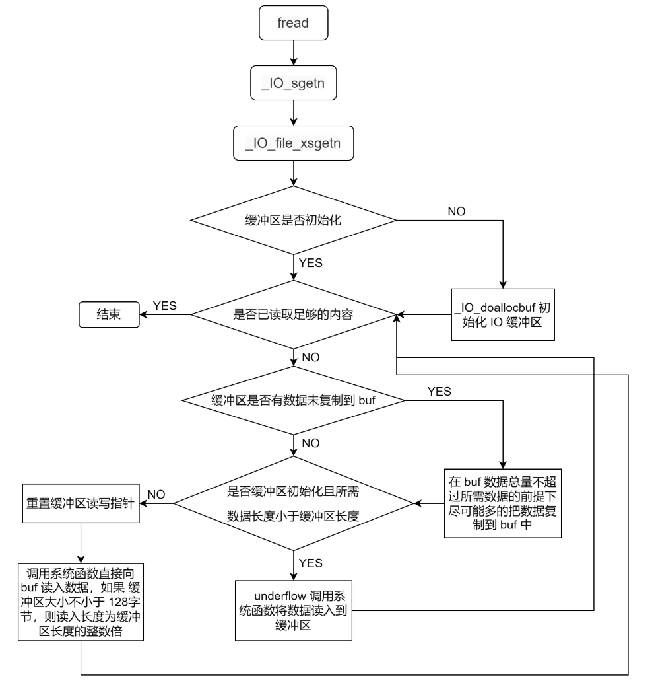
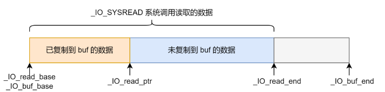
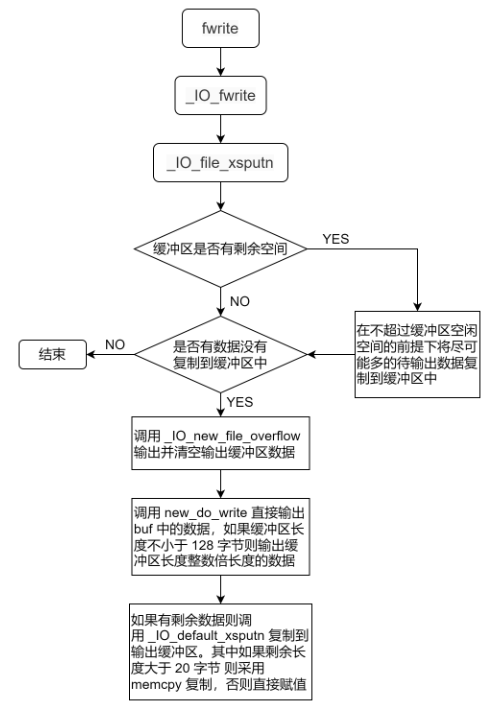
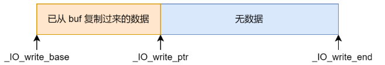
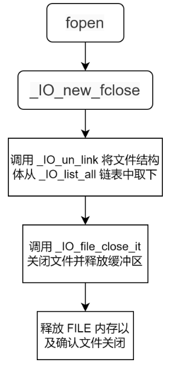

# IO_FILE 基础

> IO_FILE 主要是 glibc 中用来输入输出的一些结构体，主要设计目的是减少系统调用，提高性能


## 1.FILE 结构

IO_FILE 定义的主要结构关系图：

定义在 glibc 的/libio/libioP.h

```c
/* The opaque type of streams.  This is the definition used elsewhere.  */
typedef struct _IO_FILE FILE;
```



* 各种文件结构采用单链表的形式连接起来，通过 `_IO_list_all` 访问
* vatble 为函数指针结构体，存放着各种 IO 相关的函数的指针, `_IO_jump_t` 结构体是 I/O 流操作的虚函数表(vtable)
* 初始情况下 _IO_FILE 结构有 `_IO_2_1_stderr_` ， `_IO_2_1_stdout_` ， `_IO_2_1_stdin_` 三个，通过 `_IO_list_all` 将这三个结构，定义在/libio/stdfiles.c 中

```c
#ifdef _IO_MTSAFE_IO
# define DEF_STDFILE(NAME, FD, CHAIN, FLAGS) \
  static _IO_lock_t _IO_stdfile_##FD##_lock = _IO_lock_initializer; \
  static struct _IO_wide_data _IO_wide_data_##FD \
    = { ._wide_vtable = &_IO_wfile_jumps }; \
  struct _IO_FILE_plus NAME \
    = {FILEBUF_LITERAL(CHAIN, FLAGS, FD, &_IO_wide_data_##FD), \
       &_IO_file_jumps};
#else
# define DEF_STDFILE(NAME, FD, CHAIN, FLAGS) \
  static struct _IO_wide_data _IO_wide_data_##FD \
    = { ._wide_vtable = &_IO_wfile_jumps }; \
  struct _IO_FILE_plus NAME \
    = {FILEBUF_LITERAL(CHAIN, FLAGS, FD, &_IO_wide_data_##FD), \
       &_IO_file_jumps};
#endif

DEF_STDFILE(_IO_2_1_stdin_, 0, 0, _IO_NO_WRITES);
DEF_STDFILE(_IO_2_1_stdout_, 1, &_IO_2_1_stdin_, _IO_NO_READS);
DEF_STDFILE(_IO_2_1_stderr_, 2, &_IO_2_1_stdout_, _IO_NO_READS+_IO_UNBUFFERED);

struct _IO_FILE_plus *_IO_list_all = &_IO_2_1_stderr_;
libc_hidden_data_def (_IO_list_all)
```

* DEF_STDFILE 宏，它有两个版本：

  * 在多线程安全模式下（_IO_MTSAFE_IO 定义时），包含了线程锁定机制
  * 在非多线程模式下，使用更简单的版本

* DEF_STDFILE 宏为每个标准流创建了一个 `_IO_FILE_plus` 结构体实例，并有一些文件描述符，链式关系和特定的标志位

  * 特殊设置：
    - stdin 被设置为不可写（`_IO_NO_WRITES`）
    - stdout 被设置为不可读（`_IO_NO_READS`）
    - stderr 被设置为不可读且无缓冲（`_IO_NO_READS+_IO_UNBUFFERED`）

* 最后设置了 `_IO_list_all` 指针指向 stderr，建立了一个链表结构，这个链表包含了所有打开的流

* /libio/stdio.c 中，设置了 3 个全局变量分别指向

* ```c
  _IO_FILE *stdin = (FILE *) &_IO_2_1_stdin_;
  _IO_FILE *stdout = (FILE *) &_IO_2_1_stdout_;
  _IO_FILE *stderr = (FILE *) &_IO_2_1_stderr_;
  ```



## 2.IO_FILE 链表操作

相关函数定义在/libio/genops.c：

`_IO_link_in` 函数的主要目的是将一个 FILE 流添加到全局链表中，头插法

```c
#define _IO_LINKED 0x80 /* Set if linked (using _chain) to streambuf::_list_all.*/
```

```c
void _IO_link_in (struct _IO_FILE_plus *fp)
{
    // 检查文件流是否已经在链表中
    if ((fp->file._flags & _IO_LINKED) == 0)
    {
        // 设置链接标志
        fp->file._flags |= _IO_LINKED;
        
        #ifdef _IO_MTSAFE_IO
        // 多线程安全相关的操作
        _IO_cleanup_region_start_noarg (flush_cleanup);
        _IO_lock_lock (list_all_lock);
        run_fp = (_IO_FILE *) fp;
        _IO_flockfile ((_IO_FILE *) fp);
        #endif

        // 将文件流添加到链表头部
        fp->file._chain = (_IO_FILE *) _IO_list_all;
        _IO_list_all = fp;

        #ifdef _IO_MTSAFE_IO
        // 解锁相关操作
        _IO_funlockfile ((_IO_FILE *) fp);
        run_fp = NULL;
        _IO_lock_unlock (list_all_lock);
        _IO_cleanup_region_end (0);
        #endif
    }
}
```

`IO_un_link` 函数的主要目的是从链表中移除一个 FILE 流节点


## 3.fopen

调用链条：主要在/libio/iofopen.c中

* `fopen`

* `_IO_new_fopen`

  ```c
  _IO_FILE *
  _IO_new_fopen (const char *filename, const char *mode)
  {
    return __fopen_internal (filename, mode, 1);
  }
  ```

* `__fopen_internal`

  ```c
  _IO_FILE *
  __fopen_internal (const char *filename, const char *mode, int is32)
  {
    struct locked_FILE
    {
      struct _IO_FILE_plus fp;
  #ifdef _IO_MTSAFE_IO
      _IO_lock_t lock;
  #endif
      struct _IO_wide_data wd;
    } *new_f = (struct locked_FILE *) malloc (sizeof (struct locked_FILE)); // malloc创建locked_FILE结构体
  
    if (new_f == NULL)
      return NULL;
  #ifdef _IO_MTSAFE_IO
    new_f->fp.file._lock = &new_f->lock;
  #endif
    // 对malloc的结构体进行初始化
    _IO_no_init (&new_f->fp.file, 0, 0, &new_f->wd, &_IO_wfile_jumps);
    _IO_JUMPS (&new_f->fp) = &_IO_file_jumps;
    // _IO_new_file_init_internal内部调用_IO_link_in，入链条
    _IO_new_file_init_internal (&new_f->fp);
  #if  !_IO_UNIFIED_JUMPTABLES
    new_f->fp.vtable = NULL;
  #endif
    // 执行系统调用打开文件
    if (_IO_file_fopen ((_IO_FILE *) new_f, filename, mode, is32) != NULL)
      return __fopen_maybe_mmap (&new_f->fp.file);
  
    _IO_un_link (&new_f->fp);
    free (new_f);
    return NULL;
  }
  ```

  

## 4.fread

调用链条：主要在/libio/iofread.c,/libio/fileops.c中

`_IO_fread` 调用 `_IO_sgetn`





```c
_IO_size_t
_IO_file_xsgetn (_IO_FILE *fp, void *data, _IO_size_t n)
{
  _IO_size_t want, have;
  _IO_ssize_t count;
  char *s = data;

  want = n;
  
  // 缓冲区初始化
  if (fp->_IO_buf_base == NULL)
    {
      /* Maybe we already have a push back pointer.  */
      if (fp->_IO_save_base != NULL)
	{
	  free (fp->_IO_save_base);  // 释放旧的备份缓冲区
	  fp->_flags &= ~_IO_IN_BACKUP;
	}
      _IO_doallocbuf (fp); // 分配新的缓冲区
    }
  
  // 循环读取
  while (want > 0)
    {
      have = fp->_IO_read_end - fp->_IO_read_ptr; // 缓冲区可用空间
      // 如果缓冲区中数据足够
      if (want <= have)
	{
	  memcpy (s, fp->_IO_read_ptr, want);
	  fp->_IO_read_ptr += want;
	  want = 0;
	}
      // 如果缓冲区中数据不足
      else
	{
      // 先把已有的拷贝至缓冲区
	  if (have > 0)
	    {
	      s = __mempcpy (s, fp->_IO_read_ptr, have);
	      want -= have;
	      fp->_IO_read_ptr += have;
	    }

	  /* Check for backup and repeat */
	  if (_IO_in_backup (fp))
	    {
	      _IO_switch_to_main_get_area (fp);
	      continue;
	    }

	  /* If we now want less than a buffer, underflow and repeat
	     the copy.  Otherwise, _IO_SYSREAD directly to
	     the user buffer. */
      // 不能满足全部的需求，则调用__underflow调用系统调用读入数据
	  if (fp->_IO_buf_base
	      && want < (size_t) (fp->_IO_buf_end - fp->_IO_buf_base))
	    {
	      if (__underflow (fp) == EOF)
		break;

	      continue;
	    }

	  /* These must be set before the sysread as we might longjmp out
	     waiting for input. */
	  _IO_setg (fp, fp->_IO_buf_base, fp->_IO_buf_base, fp->_IO_buf_base);
	  _IO_setp (fp, fp->_IO_buf_base, fp->_IO_buf_base);

	  /* Try to maintain alignment: read a whole number of blocks.  */
      // 内存对齐优化
	  count = want;
	  if (fp->_IO_buf_base)
	    {
	      _IO_size_t block_size = fp->_IO_buf_end - fp->_IO_buf_base;
	      if (block_size >= 128)
		count -= want % block_size;
	    }

	  count = _IO_SYSREAD (fp, s, count);
	  if (count <= 0)
	    {
	      if (count == 0)
		fp->_flags |= _IO_EOF_SEEN;
	      else
		fp->_flags |= _IO_ERR_SEEN;

	      break;
	    }

	  s += count;
	  want -= count;
	  if (fp->_offset != _IO_pos_BAD)
	    _IO_pos_adjust (fp->_offset, count);
	}
    }

  return n - want;
}
libc_hidden_def (_IO_file_xsgetn)
```


## 5.fwrite





## 6.fclose



本节图片参考：https://blog.csdn.net/qq_45323960/article/details/123810198