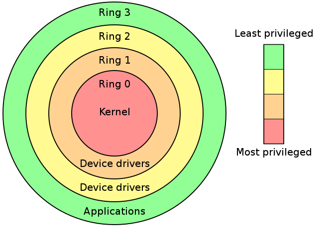

# 内核基础

https://www.kernel.org/pub/linux/kernel/

https://toolchains.bootlin.com/toolchains.html

https://musl.cc/


内核编译所需要的库：

```c
# 核心编译工具
sudo apt install gcc make bc bison flex libssl-dev libelf-dev

# 内核配置工具
sudo apt install libncurses5-dev libncursesw5-dev

# 压缩相关库
sudo apt install zlib1g-dev liblz4-dev liblzma-dev libzstd-dev

# 其他常用库
sudo apt install dwarves rsync kmod cpio initramfs-tools-core
```

busybox编译所需要的库：

```c
# 基本C库开发包
sudo apt install libc6-dev

# 静态库支持（如果需要静态编译）
sudo apt install libc6-dev-i386 lib32gcc-s1 lib32stdc++6
```

QEMU编译所需要的库：

```c
# 核心编译工具
sudo apt install -y gcc make cmake ninja-build pkg-config

# Python相关（QEMU构建系统需要）
sudo apt install -y python3 python3-pip python3-dev python3-venv

# 基础库
sudo apt install zlib1g-dev libglib2.0-dev libpixman-1-dev libslirp-dev

sudo apt install -y \
    liburing-dev \
    libnfs-dev

# SDL支持（图形界面）
sudo apt install libsdl2-dev libsdl2-image-dev

# GTK支持
sudo apt install libgtk-3-dev

# VNC支持
sudo apt install libvncserver-dev

# Spice支持（高级图形）
sudo apt install libspice-server-dev libspice-protocol-dev

# 网络库
sudo apt install libcap-ng-dev libattr1-dev

# 存储格式支持
sudo apt install libaio-dev libcap-dev libiscsi-dev

# 压缩库
sudo apt install liblzo2-dev libsnappy-dev libbz2-dev liblzma-dev libzstd-dev

# 加密库
sudo apt install libgcrypt20-dev libgnutls28-dev

# 音频库
sudo apt install libasound2-dev libpulse-dev

# KVM支持
sudo apt install libvirt-dev

# USB支持
sudo apt install libusb-1.0-0-dev libusbredirparser-dev

# 智能卡支持
sudo apt install libcacard-dev

# 调试工具
sudo apt install valgrind

# 文档生成
sudo apt install texinfo

# 额外协议支持
sudo apt install libcurl4-gnutls-dev libssh-dev

# RDMA支持
sudo apt install librdmacm-dev libibverbs-dev

# 安全启动支持
sudo apt install libseccomp-dev
```

buildroot编译所需要的库：

```c
sudo apt install -y git make gcc g++ unzip patch bc libncurses5-dev \
    libssl-dev libelf-dev bison flex rsync cpio python3 python3-pip \
    file wget
```


内核编译：

```c
wget https://www.kernel.org/pub/linux/kernel/vx.x/linux-x.x.x.tar.gz
tar -xvf linux-x.x.x.tar.gz

# 配置内核
make menuconfig

# 编译
make bzImage -j$(nproc)

# 安装模块 (可选)
sudo make modules_install

# 安装内核 (可选)
sudo make install
```

镜像格式说明：

- Image: 未压缩的内核镜像，主要用于ARM64和RISC-V
- zImage: 压缩的内核镜像，自解压，常用于ARM32、PowerPC等
- bzImage: “big zImage”，x86架构的压缩内核镜像
- uImage: U-Boot格式的内核镜像，包含加载地址等信息
- vmlinux: 未压缩的ELF格式内核镜像，主要用于调试


权限分级：



https://github.com/Symph0nia/Golconde