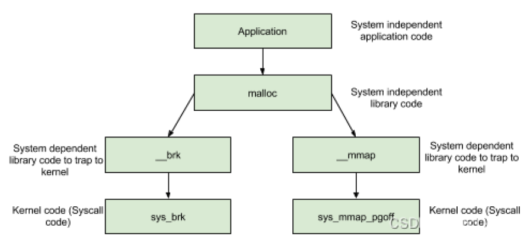

# 堆基础

## 1.概述


* .bss 段之上，向上扩展的一块内存是由 `brk` 系统调用分配的堆空间
* .stack 空间之下，向下扩展的一块包含文件映射和匿名映射的内存，是由 `mmap` 系统调用分配的堆空间
* 对于不同的应用来说，由于内存的需求各不相同等特性，因此目前堆的实现有很多种，具体如下

```
dlmalloc  – General purpose allocator
ptmalloc2 – glibc
jemalloc  – FreeBSD and Firefox
tcmalloc  – Google
libumem   – Solaris
```

* 常见 ctf 是以 glibc 中堆的实现为主
* 内存分配的基本思想：
  * 堆管理器负责向操作系统申请内存，然后将其返回给用户程序，但是频繁的系统调用会造成大量的开销。为了保持内存管理的高效性，内核一般都会预先分配很大的一块连续的内存，然后让堆管理器通过某种算法管理这块内存。只有当出现了堆空间不足的情况，堆管理器才会再次与操作系统进行交互
  * 一般来说，用户释放的内存并不是直接返还给操作系统的，而是由堆管理器进行管理。这些释放的内存可以来响应用户新申请的内存的请求


## 2.堆的基本操作

### 2.1 malloc

```c
void *malloc(size_t size);
```

* malloc (memory allocation) 函数是 C 语言标准库中用于动态内存分配的一个基本函数。它分配一块至少为 size 字节的连续内存区域，并返回一个指向这块内存的指针
* 特殊情况：
  * 当 size = 0 时，返回当前系统允许的堆的最小内存块（The minimum size is 16 bytes on most 32bit systems, and 24 or 32 bytes on 64bit systems.）
  * 当 size 为负数时，由于在大多数系统上， size_t 是无符号数，所以程序就会申请很大的内存空间，但通常来说都会失败，因为系统没有那么多的内存可以分配

### 2.2 realloc

```c
void *realloc(void *ptr, size_t size);
```

* realloc 函数用于重新分配之前通过 malloc ， calloc 或 realloc 函数分配的内存区域。它可以改变内存块的大小，或者释放内存块，或分配新的内存块
* 参数：
  * ptr ：指向需要重新分配的内存块的指针
  * size ：新的内存块的大小，以字节为单位
* 情况：
  * ptr 为空且 size > 0 ，相当于 malloc 
  * ptr 不为空， size = 0 ，相当于释放原来的堆块，相当于 free
  * ptr 不为空， size 大于原来的堆块大小，则如果该堆块后面的堆块空闲则合并堆块，否则先释放原堆块，然后再申请一个更大的堆块，原堆块内容会被拷贝过去
  * ptr 不为空， size 不大于原来的堆块大小，如果切割后剩下的堆块大于等于 MINSIZE 则切割并释放，然后返回原堆块

### 2.3 calloc

```c
void *calloc(size_t nmemb, size_t size);
```

* calloc (contiguous allocation) 函数是 C 语言标准库中用于动态内存分配的一个函数。与 malloc 相似， calloc 用于分配内存。该函数在分配时会清空 chunk 上的内容，这使得我们无法通过以往的重复存取后通过 chunk 上残留的脏数据的方式泄露信息（例如通过 bins 数组遗留的脏数据泄露 libc 基址等），同时该函数不从 tcache 中拿 chunk ，但是 free() 函数默认还是会先往 tcache 里放的，这无疑增加了我们利用的难度

* malloc 和 calloc 之间的主要区别是后者在返回指向内存的指针之前把它初始化成 0

* ```
  calloc(0x20);
  //等同于
  ptr=malloc(0x20);
  memset(ptr,0,0x20);
  ```

* nmemb ：需要分配的元素个数。

* size ：每个元素的大小，以字节为单位。

* 总的分配的字节大小是 nmemb * size 

* 成功时，返回指向新分配内存的指针。为避免内存泄漏，必须用 free() 或 realloc() 解分配返回的指针。失败时，返回空指针

### 2.4 free

```c
void free(void *ptr);
```

* free 函数会释放由 ptr 所指向的内存块。这个内存块有可能是通过 malloc 函数得到的，也有可能是通过相关的函数 realloc 得到的
* free 不会清除内存块中的数据
* 异常情况处理：
  * 当 p 为空指针时，函数不执行任何操作
  * 当 p 已经被释放之后，再次释放会出现乱七八糟的效果，这其实就是 double free
  * 除了被禁用 (mallopt) 的情况下，当释放很大的内存空间时，程序会将这些内存空间还给系统，以便于减小程序所使用的内存空间
* 被 free 的 chunk 的信息会被按一定规则放到一个链表中，用户申请时会先从 bin 中寻找

### 2.5 mallopt

```c
int mallopt(int param,int value)
```

* param ：指定要修改的动态内存分配参数。这个参数是一个整数，定义了哪一个特性将会被修改。例如，它可以是控制内存对齐、缓存大小或者相似行为的选项。
  * M_MXFAST ：设置 malloc 用于小块内存分配的最大 fast bin 的大小。
  * M_TRIM_THRESHOLD ：设置 sbrk 释放内存回操作系统的阈值。
  * M_TOP_PAD ：设置 sbrk 请求额外内存时，上面的额外内存量。
  * M_MMAP_THRESHOLD ：设置使用 mmap 进行内存分配的阈值。
  * M_MMAP_MAX ：设置可以使用 mmap 进行内存分配的最大数目。
* value ：新的值，针对 param 指定的特性。具体的值取决于 param，有些特性可能需要非零值来启用，零值来禁用，有些则需要具体的数值。
* 返回值是一个整数，指示函数调用是否成功:
  * 如果成功，返回非零值。
  * 如果失败（例如，不支持的参数或值），返回零。

## 3.底层的系统调用

调用过程：

当一个进程发生缺页中断的时候，进程会陷入核心态，执行以下操作：

- 检查要访问的虚拟地址是否合法
- 查找/分配一个物理页
- 填充物理页内容（读取磁盘，或者直接置 0，或者什么都不做）
- 建立映射关系（虚拟地址到物理地址的映射关系）
- 重复执行发生缺页中断的那条指令

* **用户应用程序调用** : 开发者 在 " 用户空间 “ 的 应用程序 中调用 malloc 等函数 , 申请 动态分配 ” 堆内存 " ,
* **系统调用** : 用户空间 的 内存管理函数 调用 " 内核与用户层接口 “ 中的 brk sbrk mmap munmap 等函数 , 这些函数就是 ” 系统调用 " 函数 ; 系统调用接口 是 用户层的 malloc 函数 与 内核层的 vmalloc 函数之间的 桥梁 ;
* **内核层调用** : 内核与用户层接口 的 内存管理函数 调用 " Linux 内核 " 中的 kmalloc vmalloc 函数 ;

在 main arena 中通过 sbrk 扩展 heap，而在 thread arena 中通过 mmap 分配新的 heap

通过 `sbrk` 获得的新的堆的内存地址和之前的地址是连续的，而 `mmap` 获得的地址由参数设定

当开辟的空间小于 128K 时，调用 brk（）函数，当开辟的空间大于 128K 时，mmap（）系统



### 3.1 用户层内存管理

- C 语言 : 在 C 中 , 使用 malloc 动态分配 " 堆内存 " , 使用 free 回收 " 堆内存 " ;
- C++ 语言 : 在 C++ 中 , 使用 new 关键字 动态分配 " 堆内存 " , 使用 delete 关键字 回收 " 堆内存 " ;
- C++ STL : STL 中 , 堆内存是自动分配 , 自动回收的 , 不需要用户进行手动操作 ;

### 3.2 系统层内存管理

#### 3.2.1 (s)brk

```c
#include<unistd.h>
int brk(void * addr); //将数据段的结束设置为 addr 指定的值，当该值合理时，系统有足够的内存，并且进程没有超过其最大数据大小
void * sbrk(intptr_t increment); //以增量字节增加程序的数据空间。以 0 为增量调用 sbrk()可用于查找程序中断的当前位置
```

* 对于堆的操作，操作系统提供了 brk 函数，glibc 库提供了 sbrk 函数，可以通过增加 brk 的大小来向操作系统申请内存

* .bss 段之上，向上扩展的一块内存是由 brk 系统调用分配的堆空间，由于是把 brk 的值向上推，只分配虚拟内存，不对应物理内存，因此还没有初始化，当第一次读写数据时，引起内核的缺页中断，内核才分配对应的物理内存，然后虚拟地址空间建立映射关系

* 初始时，堆的起始地址 start_brk 以及堆的当前末尾 brk 指向同一地址。根据是否开启 ASLR，两者的具体位置会有所不同
  * 不开启 ASLR 保护时，start_brk 以及 brk 会指向 data/bss 段的结尾
  * 开启 ASLR 保护时，start_brk 以及 brk 也会指向同一位置，只是这个位置是在 data/bss 段结尾后的随机偏移处

#### 3.2.2 mmap，munmap

```c
#incldue<sys/mman.h>
void * mmap(void * addr, size_t length,int prot,int flags,int fd,off_t offset);
int munmap(void *addr, size_t length);
```

* malloc 会使用 mmap 来创建独立的匿名映射段，并将文件或设备映射到这块内存中。匿名映射的目的主要是可以申请以 0 填充的内存，并且这块内存仅被调用进程所使用
  * addr：指定映射的起始地址，若该参数为 NULL 时，则由操作系统自己决定 mapping 的起始地址
  * length：指定映射的大小，该值必须大于 0
  * prot：描述这段映射的内存保护属性，且不能与打开文件时设置的访问模式相冲突
  * flags：这个字段指定了 mapping 的一些行为属性，例如是否修改原本被映射的文件，对于映射到同一块区域的其它进程是否可见等等。其中，**当设置了 `MAP_ANONYMOUS` 属性后，这块地址空间将不会映射到任何文件，其内容将会被初始化为 0，我们称这块空间为匿名（Anonymous）空间，匿名空间可以用来作为堆空间。** 此时，fd 参数将会被忽略，offset 参数应设置为 0
  * fd：指向将被映射到内存中的文件对象
  * offset：被映射内容在文件中的起始偏移，该值必须是页（4KB）的整数倍
* stack 空间之下，向下扩展的一块包含文件映射和匿名映射的内存，是由 mmap 系统调用分配的堆空间
* `munmap` 则用于删除指定地址范围内的映射

注意：通过 `brk()` 或 `mmap()` 申请内存时都是一页一页的去申请，如果我只需要几个字节的内存，却跟操作系统申请了一整页的内存，那就显得很浪费了；并且，如果每次分配内存都走系统调用，也会增加操作系统的负担，因此，诞生了堆分配器，通过实现 malloc 与 free 辅助操作系统进行堆的管理

### 3.3 内核层内存管理

在 Linux 内核中 , 通过 `kmalloc` `vmalloc` `__get_free_pages` 函数管理内存

