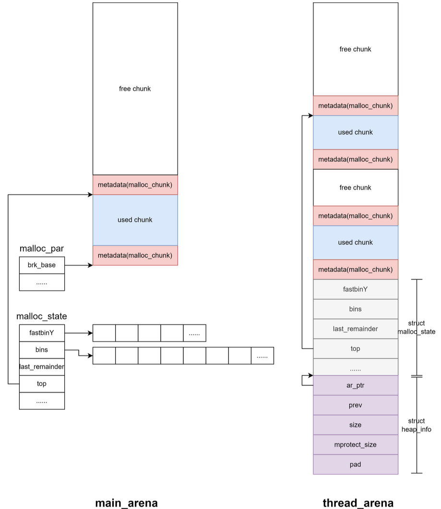
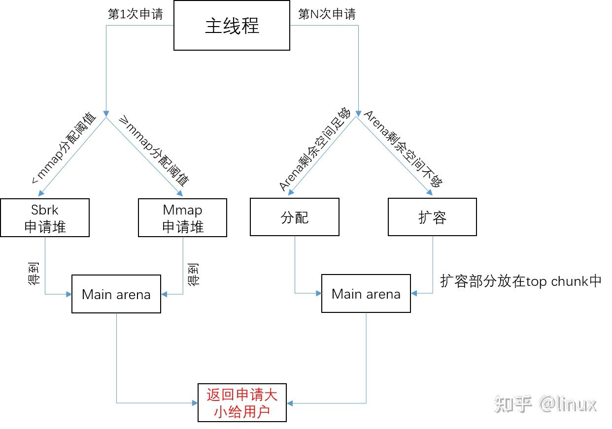
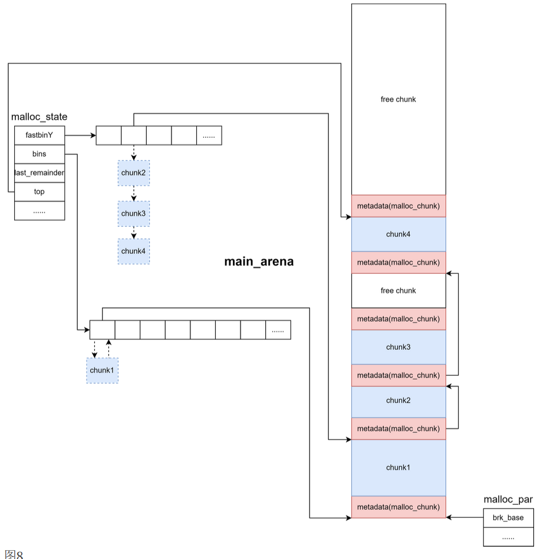
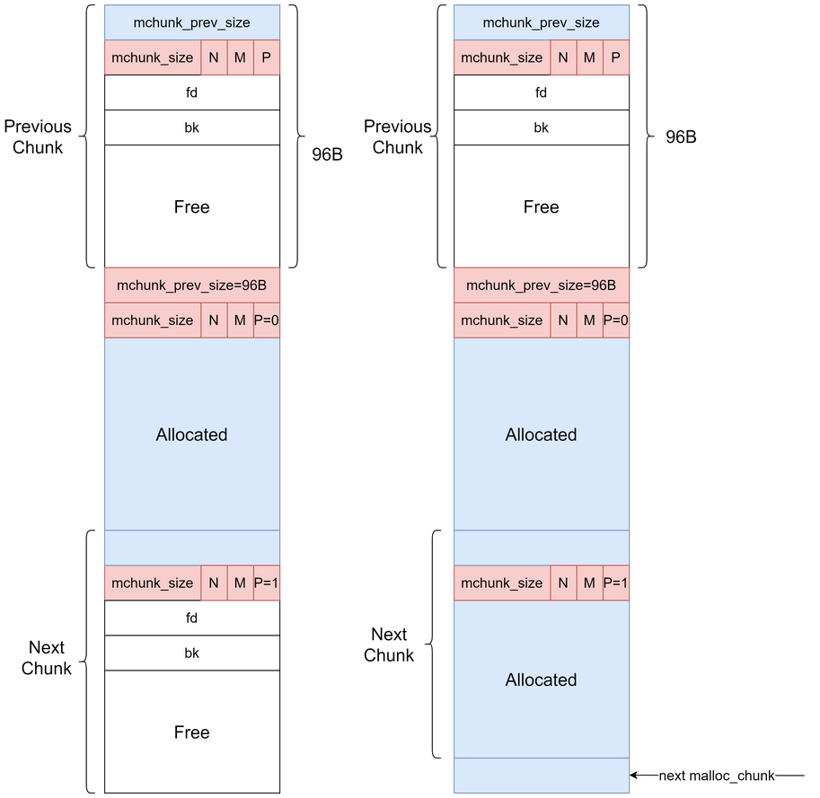
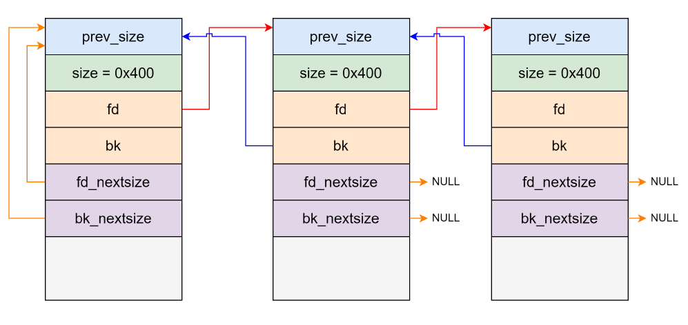
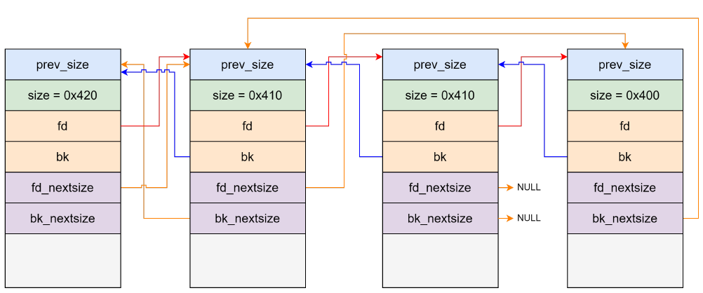

# 堆相关数据结构


## 1.主要概念

* arena：通过 sbrk 或 mmap 系统调用，可以视作是操作系统分配给应用进程的内存缓存池
  * arena 个数的限制：
    * 对于 32 位操作系统：arena 的个数 = 2 * 处理器核心数+1
    * 对于 64 位操作系统：arena 的个数 = 8 * 处理器核心数+1
  * 为线程分配的堆区，按线程的类型可以分为 2 类：
    * main arena：主线程建立的 arena；
    * thread arena：子线程建立的 arena；
    
  * main arena 通常一定被主线程占有，其他线程则占用 thread arena。实际上，很多情况下，线程和 arena 的关系并非一一对应的，一个 arena 被多条线程占用也是常见的
  
    
  
* bin：一个用以保存 Free chunk 链表的表头信息的指针数组，按所悬挂链表的类型可以分为 4 类:
    * Fast bin

    * Unsorted bin

    * Small bin

    * Large bin

* chunk：逻辑上划分的一小块内存，根据作用不同分为 4 类：
    * Allocated chunk：即分配给用户且未释放的内存块；
    * Free chunk：即用户已经释放的内存块；
    * Top chunk
    * Last Remainder chunk


## 2.malloc_par

```c
struct malloc_par
{
  /* Tunable parameters */
  unsigned long trim_threshold;    /* top chunk 的收缩阈值 */
  INTERNAL_SIZE_T top_pad;         /* 在分配内存时是否添加额外的 pad，默认该字段为 0 */
  INTERNAL_SIZE_T mmap_threshold;  /*  mmap 分配阈值 */
  INTERNAL_SIZE_T arena_test;      /* 当每个进程的分配区数量小于等于 arena_test 时，不会重用已有的分配区 */
  INTERNAL_SIZE_T arena_max;       /* 当系统中的分配区数量达到 arena_max，就不会再创建新的分配区，只会重用已有的分配区 */

  /* Memory map support */
  int n_mmaps;                     /* 当前进程使用 mmap()函数分配的内存块的个数 */
  int n_mmaps_max;                 /* mmap()函数分配的内存块的最大数量 */
  int max_n_mmaps;                 /* mmap()函数分配的内存块的数量的最大值 */
  /* the mmap_threshold is dynamic, until the user sets
     it manually, at which point we need to disable any
     dynamic behavior. */
  int no_dyn_threshold;            /* 否开启 mmap 分配阈值动态调整机制，默认值为 0，即开启 */

  /* Statistics */
  /* mmapped_mem 和 max_mmapped_mem 都用于统计 mmap 分配的内存大小，一般情况下两个字段的值相等 */
  INTERNAL_SIZE_T mmapped_mem;    
  INTERNAL_SIZE_T max_mmapped_mem;

  /* First address handed out by MORECORE/sbrk.  */
  char *sbrk_base;                  /* 堆的起始地址 */

#if USE_TCACHE
  /* Maximum number of buckets to use.  */
  size_t tcache_bins;              /* tcache bins 的数量 */
  size_t tcache_max_bytes;         /* 最大 tache 的大小 */
  /* Maximum number of chunks in each bucket.  */
  size_t tcache_count;             /* 每个 tcache bins 中 tcaches 的最大数量 */
  /* Maximum number of chunks to remove from the unsorted list, which
     aren't used to prefill the cache.  */
  size_t tcache_unsorted_limit;
#endif
};
```

* 在 ptmalloc 中使用 malloc_par 结构体来记录堆管理器的相关参数，该结构体定义于 malloc.c 中
* 主要是定义了和 mmap 和 arena 相关的一些参数（如数量上限等），以及 sbrk 的基址：
  * trim_threshold：用于 main_arena 中保留内存量的控制。当释放的 chunk 为 mmap 获得的，同时大小大于 mmap_threshold ，则除了更新 mmap_threshold 外还会将 trim_threshold 乘 2 。当释放的 chunk 大小不在 fast bin 范围合并完 size 大于 FASTBIN_CONSOLIDATION_THRESHOLD 即 0x10000 ，会根据该字段缩小 top chunk
  * top_pad：初始化或扩展堆的时候需要多申请的内存大小
  * mmap_threshold：决定 sysmalloc 是通过 mmap 还是 sbrk 分配内存的界限，如果申请的内存大小大于该值则采用 mmap 分配，否则采用 sbrk 扩展 heap 区域分配。并且这个值是动态调整的，如果释放的内存是通过 mmap 得到的则 mmap_threshold 与该内存大小取 max 。并且 mmap_threshold 最大不能超过 DEFAULT_MMAP_THRESHOLD_MAX ，即 0x2000000 
  
    
  
    
  * n_mmaps ：mmap 的内存数量，即 ptmalloc 每次成功 mmap 则 n_mmaps 加 1，ptmalloc 每次成功 munmap 则 n_mmaps 减 1
  * n_mmaps_max ：n_mmaps 的上限，即最多能 mmap 的内存数量
  * max_n_mmaps ：n_mmaps 达到过的最大值
  * no_dyn_threshold ：表示是否禁用 heap 动态调整保留内存的大小，默认为 0 
  * mmapped_mem ：当前 mmap 的内存大小总和。
  * max_mmapped_mem ：mmap 的内存大小总和达到过的最大值
  * sbrk_base ：表示通过 brk 系统调用申请的 heap 区域的起始地址


## 3.malloc_state(arena)

```c
struct malloc_state
{
  /* Serialize access.  */
  /* Mutex 用于串行化访问分配区，当有多个线程访问同一个分配区时，用于多线程互斥锁，用以保证线程安全。 */
  /* 第一个获得这个 mutex 的线程将使用该分配区分配内存，分配完成后, */
  /* 释放该分配区的 mutex，以便其它线程使用该分配区 */
  __libc_lock_define (, mutex);

  /* Flags (formerly in max_fast).  */
  /* Flags 记录了分配区的一些标志 ，如：是否有 fastbin 、内存是否连续等*/
  int flags;

  /* Set if the fastbin chunks contain recently inserted free blocks.  */
  /* Note this is a bool but not all targets support atomics on booleans.  */
  /* 标志位，判断 fastbin 最近是否有插入块 */
  int have_fastchunks;

  /* Fastbins */
  /* mchunkptr 与 mfastbinptr 类型其实都是 malloc_chunk 结构体*/
  /* 用来记录和管理 fastbin chunk, 存放 fastbin chunk 的数组, 里面的元素是各条不同大小的 fastbin 链的首地址*/
  mfastbinptr fastbinsY[NFASTBINS];

  /* Base of the topmost chunk -- not otherwise kept in a bin */
  /* top chunk , top chunk 的首地址 */
  mchunkptr top;

  /* The remainder from the most recent split of a small request */
  /* Last remainder chunk */
  /*chunk 切割中的剩余部分。malloc 在分配 chunk 时若是没找到 size 合适的 chunk 而是找到了一个 size 更大的 chunk */
  /*则会从大 chunk 中切割掉一块返回给用户，剩下的那一块便是 last_remainder ，其随后会被放入 unsorted bin 中*/
  mchunkptr last_remainder;

  /* Normal bins packed as described above */
  /* 存放闲置 chunk 的数组。bins 包括 large bin，small bin 和 unsorted bin */
  mchunkptr bins[NBINS * 2 - 2];

  /* Bitmap of bins */
  /*记录 bin 是否为空的 bitset 。需要注意的是 chunk 被取出后若一个 bin 空了并不会立即被置 0 ，而会在下一次遍历到时重新置位。*/
  unsigned int binmap[BINMAPSIZE];

  /* Linked list */ 
  /* 指向下一个分配区的指针，一个进程内所有的 arena 串成了一条循环单向链表 */
  struct malloc_state *next;

  /* Linked list for free arenas.  Access to this field is serialized
     by free_list_lock in arena.c.  */
  /* 指向下一个空闲的分配区 */
  struct malloc_state *next_free;

  /* Number of threads attached to this arena.  0 if the arena is on
     the free list.  Access to this field is serialized by
     free_list_lock in arena.c.  */
  /* 附加到当前分配区的进程数 */
  INTERNAL_SIZE_T attached_threads;

  /* Memory allocated from the system in this arena.  */
  /* 记录当前 arena 在堆区中所分配到的内存的总大小 */
  INTERNAL_SIZE_T system_mem;
  /* 当操作系统予进程以内存时， system_mem 会随之增大，当内存被返还给操作系统时， sysyetm_mem 会随之减小 */
  /* max_system_mem 变量便是用来记录在这个过程当中 system_mem 的峰值 */
  INTERNAL_SIZE_T max_system_mem;
};
```

* arena 意思是竞技场，也可理解为线程内存池

* 当程序第一次向操作系统申请内存空间时，操作系统会分配一块很大的内存给程序，以减少内核态与用户态的切换，提高了程序的运行效率。这一整块连续的内存区域就是 arena

* 大部分情况下对于每个线程而言其都会单独有着一个 arena 实例用以管理属于该线程的堆内存区域。ptmalloc 内部的内存池结构是由 malloc_state 结构体进行定义的，即 arena 本身便为 malloc_state 的一个实例对象。malloc_state 结构体定义于 malloc/malloc.c 中

* main_arena 为一个定义于 malloc.c 中的静态的 malloc_state 结构体, 即理解为指向 malloc_state 结构体的一个指针。由于其为 libc 中的静态变量/全局变量，被分配在 libc 的 .data 段上。该 arena 会被随着 libc 文件一同加载到 Memory Mapping Segment。因此在堆题中通常通过泄露 arena 的地址以获得 libc 在内存中的基地址

  ```c
  static struct malloc_state main_arena =
  {
      .mutex = _LIBC_LOCK_INITIALIZER,
      .next = &main_arena,
      .attached_threads = 1
  };
  ```



## 4.heap_info

heap info 记录的是 malloc_state 的地址

```c
typedef struct _heap_info
{
  /* 指向所属分配区的指针 */
  mstate ar_ptr; /* Arena for this heap. */
  
  /* 用于将同一个分配区中的 sub_heap 用单向链表链接起来 */
  /* prev 指向链表中的前一个 heap_info */
  struct _heap_info *prev; /* Previous heap. */
  
  /* 表示当前 sub_heap 中的内存大小，以 page 对齐 */
  size_t size;   /* Current size in bytes. */

  /* 当前 sub_heap 中被读写保护的内存大小，*/
  /* 也就是说还没有被分配的内存大小*/
  size_t mprotect_size; /* Size in bytes that has been mprotected
                           PROT_READ|PROT_WRITE.  */
  
  /* Make sure the following data is properly aligned, particularly
     that sizeof (heap_info) + 2 * SIZE_SZ is a multiple of
     MALLOC_ALIGNMENT. */
  /* 段用于保证 sizeof (heap_info) + 2 * SIZE_SZ 是按 MALLOC_ALIGNMENT 对齐的 , 用以在 SIZE_SZ 不正常的情况下进行填充以让内存对齐，正常情况下 pad 所占用空间应为 0 字节*/
  char pad[-6 * SIZE_SZ & MALLOC_ALIGN_MASK];
} heap_info;
```


## 5.malloc_chunk

```c
struct malloc_chunk {
  
  /* 如果前一个 chunk 是空闲的，该域表示前一个 chunk 的大小(包括 chunk 头)。*/
  /* 否则，该字段可以用来存储物理相邻的前一个 chunk 的数据。 */
  INTERNAL_SIZE_T      mchunk_prev_size;  /* Size of previous chunk (if free).  */
  /* 当前 chunk 的大小，描述的是整个 chunk 的大小，包含这描述字段和数据 */
  /* 该 chunk 的大小，大小必须是 2 * SIZE_SZ 的整数倍。*/
  /* 32 位系统中，SIZE_SZ 是 4；64 位系统中，SIZE_SZ 是 8 */
  INTERNAL_SIZE_T      mchunk_size;       /* Size in bytes, including overhead. */

  /* 指针 fd 和 bk 只有当该 chunk 块空闲时才存在*/
  /* 其作用是用于将对应的空闲 chunk 块加入到空闲 chunk 块链表中统一管理*/
  struct malloc_chunk* fd;         /* double links -- used only if free. */
  struct malloc_chunk* bk;

  /* Only used for large blocks: pointer to next larger size.  */
  /* 当前的 chunk 存在于 large bins 中时，large bins 中的空闲 chunk */
  /* 是按照大小排序的，但同一个大小的 chunk 可能有多个，增加了这两个字段 */
  /* 可以加快遍历空闲 chunk，并查找满足需要的空闲 chunk，fd_nextsize 指 */
  /* 向下一个比当前 chunk 大小大的第一个空闲 chunk，bk_nextszie 指向前 */
  /* 一个比当前 chunk 大小小的第一个空闲 chunk */
  struct malloc_chunk* fd_nextsize; /* double links -- used only if free. */
  struct malloc_chunk* bk_nextsize;
};
```

* 由 malloc 申请的内存为 chunk 。这块内存在 ptmalloc 内部用 malloc_chunk 结构体来表示。当程序申请的 chunk 被 free 后，会被加入到相应的空闲管理列表中
* Minimum allocated size: 
  * 4-byte ptrs:  16 bytes    (including 4 overhead)
  * 8-byte ptrs:  24/32 bytes (including, 4/8 overhead)

* mchunk_size 低 3bit：（mchunk_size 大小必须是 2 * SIZE_SZ 的整数倍。该字段的低三个 bit 对 chunk 的大小没有影响)
  * NON_MAIN_ARENA ，记录当前 chunk 是否不属于主线程，1 表示不属于，0 表示属于。
  * IS_MAPPED ，记录当前 chunk 是否是由 mmap 分配的，如果块被映射，该位置 1
  * PREV_INUSE ，记录前一个 chunk 块是否被分配。一般来说，堆中第一个被分配的内存块的 size 字段的 P 位都会被设置为 1，以便于防止访问前面的非法内存。当一个 chunk 的 size 的 P 位为 0 时，我们能通过 prev_size 字段来获取上一个 chunk 的大小以及地址。这也方便进行空闲 chunk 之间的合并。
* fd ， bk : 在 fastbin 和 bins 中使用的 forward 和 backward 指针，仅仅在内存块为空闲块时有意义
  * fd 指向下一个（非物理相邻）空闲的 chunk
  * bk 指向上一个（非物理相邻）空闲的 chunk

* fd_nextsize ， bk_nextsize : largebin 双向链表指针，仅在 largebin 为空闲内存块时有意义
  * fd_nextsize: 指向前一个与当前 chunk 大小不同的第一个空闲块，不包含 bin 的头指针。
  * bk_nextsize: 指向后一个与当前 chunk 大小不同的第一个空闲块，不包含 bin 的头指针。
  * 一般空闲的 large chunk 在 fd 的遍历顺序中，按照由大到小的顺序排列。这样做可以避免在寻找合适 chunk 时挨个遍历。




## 6.fastbin

* fastbin 上放置的均是单向链表，是通过 fd 形成的一条单线链表，采取 **LIFO** 策略( LIFO: 全称 Last in, First out，后进先出，类似于栈)
  * fastbin 是用来存放小的 malloc_chunk 的，当用户释放一块不大于 max_fast 的 chunk（即小内存）的时候，会默认会被放到 fastbin 链表上，一般小于或等于 176（0xb0），实际上是 fastbin 的大小是在 [0x20, 0x80]，只用到了 6 之前的，7、8、9 这些都没有使用，对于字节的内存申请（包括 malloc_chunk 头部和用户申请的字节数总和），会先尝试在 fastbin 中查找。fastbin 可以存 10 个 malloc_chunk 链表，每个链表的 malloc_chunk，在链表内部的大小是相同的。fastbin 中实际只用了 0~6(最大为 0x80)，最后三个是保留项，暂时没有使用 

* fastbin 中 chunk 的 **PREV_INUSE 始终被置为 1**。为了它们不会和其它被释放的 chunk 合并。除非调用 malloc_consolidate 函数。
* 安全机制：
  * size ：在 malloc() 函数分配 fastbin size 范围的 chunk 时，若是对应的 fastbin 中有空闲 chunk ，在取出前会检查其 size 域与对应下标是否一致，不会检查标志位，若否便会触发 abort 
  * double free：在 free() 函数中会对 fast bin 链表的头结点进行检查，若将要被放入 fast bin 中的 chunk 与对应下标的链表的头结点为同一 chunk ，则会触发 abort 
  * Safe linking 机制（only glibc2.32 and up）：自 glibc 2.32 起引入了 safe-linking 机制，其核心思想是在链表上的 chunk 中并不直接存放其所连接的下一个 chunk 的地址，而是存放下一个 chunk 的地址与【 fd 指针自身地址右移 12 位】所异或得的值，使得攻击者在得知该 chunk 的地址之前无法直接利用其构造任意地址写。fastbin 的入口节点存放的仍是未经异或的 chunk 地址。另外第一个加入 fastbin 的 chunk 的 fd 字段可以泄露堆地址（右移 12 位）


## 7.bins

* 用户释放掉的 chunk 不会马上归还给系统，ptmalloc 会统一管理 heap 和 mmap 映射区域中的空闲的 chunk 。当用户再一次请求分配内存时， ptmalloc 分配器会试图在空闲的 chunk 中挑选一块合适的给用户。这样可以避免频繁的系统调用，降低内存分配的开销。
* 在具体的实现中，ptmalloc 采用分箱式方法对空闲的 chunk 进行管理。首先，它会根据空闲的 chunk 的大小以及使用状态将 chunk 初步分为 3 类：small bins，large bins，unsorted bins
* bin：顾名思义，垃圾桶。即用来管理空闲内存块，通常用链表结构进行组织，被释放掉的堆块要么与 top chunk 合并，要么进 bin 链
* top_chunk 不属于任何 bin！只有 free_chunk 依附于 bin！
* 每个 bin 由 bin 数组中的两个值表示。第一个是指向'HEAD'的指针，第二个是指向 bin 列表的'TAIL'的指针。在 fastbin（单链表）的情况下，第二个值是 NULL
* 为了简化在双链表中的使用，每个 bin 头都充当 malloc_chunk。这避免了头文件的特殊大小写。但是为了节省空间和提高局部性，只分配了 bin 的 fd/bk 指针，然后使用重定位技巧将它们视为 malloc_chunk*的字段
* 被 free 的 chunk 会放置于双向链表的头部，而在分配 chunk 时则是从链表的尾部取 chunk，即 bin 中的 chunk 链表采取* *FIFO 机制**
* 

### 6.1 unsorted bin

* unsorted bin 可以视为空闲 chunk 回归其所属 bin 之前的缓冲区。像 small bin 一样采用双向链表维护。chunk 大小乱序，对于存放在 unsorted bin 中的 chunk 的 size 并没有做限制
* 用户调用 free 函数时，ptmalloc 首先会尝试将要释放的 malloc_chunk 放入 fastbin 中，如果条件不符合（尺寸太大），那么会直接塞入 unsorted bin 的头部。在后续继续调用 malloc 函数申请新的内存块时，ptmalloc 会在合适的时机(当其无法满足 malloc 的申请，就会将所有内容放入合适的 Bins 中)重新对 unsorted bin 里的 malloc_chunk 进行整理（将合适的块放入合适的 bins 双向链表中）
* 在这个 Bin 中，堆管理器会立刻合并在 **物理地址上相邻的 chunk。** 在 malloc 的时候会优先(如果大小较小，则可能先从 Fast Bin 开始)遍历这个 Bin 去找合适的内存地址 

### 6.2 smallbin

* smallbin 采用双向链表，smallbin 中每个 bin 对应的链表采用 **FIFO** 的规则（FIFO 是英文 First In First Out 的缩写，先进先出），由于每个小 bin 仅存储一种大小的块，因此它们会自动排序 
* 每个 smallbin 维护的 chunk 大小确定，并且 smallbin 维护的最大的 chunk 为 1008 字节（x86 下），即 0x3f0 的 chunk 大小

### 6.3 largebin

* largebin 采用双向链表，其中一共包括 63 个 bin ，每个 bin 中的 chunk 的大小不一致，而是处于一定区间范围内
* malloc_state 的 bins 中 fd 和 bk 仍然是链表的头和尾，不会受大小相同块影响
* fd_nextsize 和 bk_nextsize 的机制：
  * 当 large bin 里只有一个 chunk 时， fd_nextsize 和 bk_nextsize 指向自己
  * 当 large bin 里同一大小的 chunk 有多个时，只有相同大小 chunk 中的第一个的 fd_nextsize 和 bk_nextsize 指针有效，其余的 chunk 的 fd_nextsize 和 bk_nextsize 设为 NULL。若干个大小相同的堆块, 只有首堆块的 `fd_nextsize` 和 `bk_nextsize` 会指向其他堆块, 后面的堆块的 `fd_nextsize` 和 `bk_nextsize` 均为 0
* 注意：
  * 按照大小，从大到小排序（小的链接 large bin 块）
  * 如果大小相同，按照 free 的时间排序
  * 多个大小相同的堆块，只有首堆块的 fd_nextsize 和 bk_nextsize 会指向其他堆块，后面的堆块的 fd_nextsize 和 bk_nextsize 均为 0
  * size 最大的 chunk 的 bk_nextsize 指向最小的 chunk，size 最小的 chunk 的 fd_nextsize 指向最大的 chunk







## 7.top_chunk

* 程序第一次进行 malloc 的时候， heap 会被分为两块，一块给用户，剩下的那块就是 top chunk。其实，所谓的 top chunk 就是处于当前堆的物理地址最高的 chunk 。这个 chunk 不属于任何一个 bin，它的作用在于当所有的 bin 都无法满足用户请求的大小时，如果其大小不小于指定的大小，就进行分配，并将剩下的部分作为新的 top_chunk。否则，就对 heap 进行扩展后再进行分配。在 main_arena 中通过 sbrk 扩展 heap ，而在 thread arena 中通过 mmap 分配新的 heap 。
* top chunk 初始值是 unsorted bin 的数组 chunk
* 注意，top_chunk 的 prev_inuse 比特位始终为 1，否则其前面的 chunk 就会被合并到 top_chunk 中。


## 8.last remainder

* 在用户使用 malloc 请求分配内存时，ptmalloc2 找到的 chunk 可能并不和申请的内存大小一致，这时候就将分割之后的剩余部分称之为 last remainder chunk , unsorted bin 也会存这一块。top chunk 分割剩下的部分不会作为 last remainder


## 9.tcache

* tcache 是 glibc 2.26 (ubuntu 17.10) 之后引入的一种技术，它为每个线程创建一个缓存（cache），从而实现无锁的分配算法，有不错的性能提升，解决 **一个进程下多个线程对堆进行的异步操作问题** , 与 fast bin 类似。tcache 引入了两个新的结构体， tcache_entry 和 tcache_perthread_struct

```c
typedef struct tcache_entry
{
	struct tcache_entry *next;
} tcache_entry;

typedef struct tcache_perthread_struct
{
	char counts[TCACHE_MAX_BINS];
	tcache_entry *entries[TCACHE_MAX_BINS];
} tcache_perthread_struct;

# define TCACHE_MAX_BINS 64
static __thread tcache_perthread_struct *tcache = NULL;
```

* tcache_entry 用于链接空闲的 chunk 结构体，其中的 next 指针指向下一个大小相同的 chunk。需要注意的是这里的 **next 指向 chunk 的 user data**，而 fast bin 的 fd 指向 chunk 开头的地址。而且， tcache_entry 会复用空闲 chunk 的 user data 部分

* 每个 thread 都会维护一个 tcache_perthread_struct ，它是整个 tcache 的管理结构，一共有 TCACHE_MAX_BINS 个计数器和 TCACHE_MAX_BINS 项 tcache_entry 。这个结构在 tcache_init 函数中被初始化在堆上，大小为 0x250（高版本为 0x290）。其中数据部分前 64 为 counts ，剩下的为 entries 结构。如果能控制这个堆块就可以控制整个 tcache

* counts 记录了 tcache_entry 链上空闲 chunk 的数目，每条链上最多可以有 7 个 chunk 。注意指针指向的位置是 fd 指针，这一点与 fast bin 不同。

  

  

* 与 fastbin 相同的是释放进入 tcache 的 chunk 的下一个相邻 chunk 的 PREV_INUSE 位不清零。

* 当一个 chunk 被释放时，首先进入 tcache bin，而不是 fast bin，这样当该线程再次申请分配的时候，如果在其线程 tcache bin 上有空闲 chunk，就从 tcache bin 中取出，无需等待堆锁，从而实现加速分配。填满了这个大小的 tcache bin 后，再释放的 chunk 才会进入 fast bin

* stash 机制：当申请的大小在 tcache 范围的 chunk 在 tcache 中没有，此时 ptmalloc 会在其他 bin 里面找，如果找到了会将该 chunk 返回，并将剩下的 chunk 放到 tcache 中，直到 tcache 填满

### 9.1 触发在 tcache 中放入 chunk 的操作

* malloc 时：
  * 如果从 fastbin 中成功返回了一个需要的 chunk，那么对应 fastbin 中的其他 chunk 会被放进相应的 tcache bin 中，直到上限。需要注意的是 chunks 在 tcache bin 的顺序和在 fastbin 中的顺序是反过来的
  * smallbin 中的情况与 fastbin 相似，双链表中的剩余 chunk 会被填充到 tcache bin 中，直到上限
  * binning code（chunk 合并等其他情况）中，每一个符合要求的 chunk 都会优先被放入 tcache，而不是直接返回（除非 tcache 被装满）。寻找结束后，tcache 会返回其中一个
* free 时：在 fastbin 的操作之前进行，如果 chunk size 符合要求，并且对应的 bins 还未装满，则将其放进去。

### 9.2 触发在 tcache 中取出 chunk 的操作

* 在 `__libc_malloc()` 调用 `_int_malloc()` 之前，如果 tcache bin 中有符合要求的 chunk，则直接将它返回
* bining code 中，如果在 tcache 中放入 chunk 达到上限，则会直接返回最后一个 chunk
* binning code 结束后，如果没有直接返回（如上），那么如果有至少一个符合要求的 chunk 被找到，则返回最后一个

### 9.3 安全性

`tcache_put()` 和 `tcache_get()` 分别用于从单链表中放入和取出 chunk：

可以看到注释部分，它假设调用者已经对参数进行了有效性检查，然而由于对 tcache 的操作在 free 和 malloc 中往往都处于很靠前的位置，导致原来的许多有效性检查都被无视了。这样做虽然有利于提升执行效率，但对安全性造成了负面影响。

```c
/* Caller must ensure that we know tc_idx is valid and there's room
   for more chunks.  */
static __always_inline void
tcache_put (mchunkptr chunk, size_t tc_idx)
{
  tcache_entry *e = (tcache_entry *) chunk2mem (chunk);
  assert (tc_idx < TCACHE_MAX_BINS);
  e->next = tcache->entries[tc_idx];
  tcache->entries[tc_idx] = e;
  ++(tcache->counts[tc_idx]);
}

/* Caller must ensure that we know tc_idx is valid and there's
   available chunks to remove.  */
static __always_inline void *
tcache_get (size_t tc_idx)
{
  tcache_entry *e = tcache->entries[tc_idx];
  assert (tc_idx < TCACHE_MAX_BINS);
  assert (tcache->entries[tc_idx] > 0);
  tcache->entries[tc_idx] = e->next;
  --(tcache->counts[tc_idx]);
  return (void *) e;
}
```

