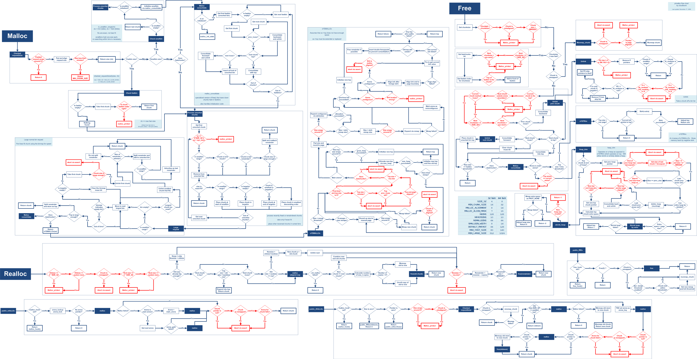
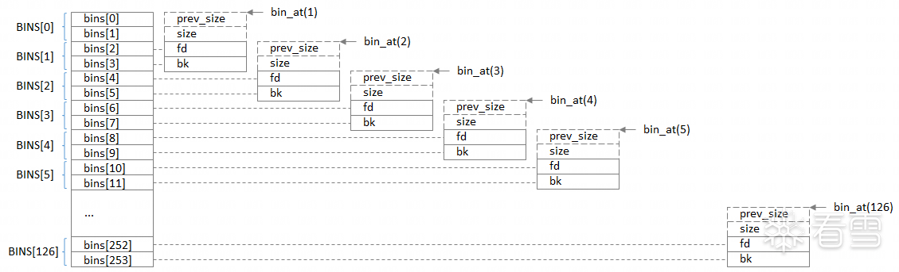
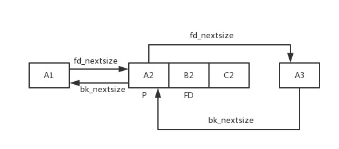
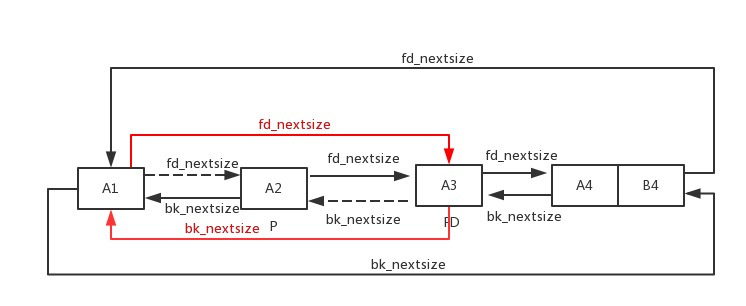

# 核心函数




## 1.宏

```c
#ifndef INTERNAL_SIZE_T
# define INTERNAL_SIZE_T size_t
#endif

/* The corresponding word size.  */
#define SIZE_SZ (sizeof (INTERNAL_SIZE_T))

/* The corresponding bit mask value.  */
#define MALLOC_ALIGN_MASK (MALLOC_ALIGNMENT - 1)

#define MALLOC_ALIGNMENT (2 * SIZE_SZ < __alignof__ (long double) \
			  ? __alignof__ (long double) : 2 * SIZE_SZ)
```

* INTERNAL_SIZE_T 宏展开后其实就是 size_t，32 位下为 4 字节，64 位下为 8 字节，SIZE_SZ 为其别名
* MALLOC_ALIGNMENT 则定义了 chunk 在内存中对齐的字节数，一般来说算出来都是对 2*SIZE_SZ 对齐，即 32 位下 8 字节对齐，64 位下 16 字节对齐
* MALLOC_ALIGEN_MASK 的值则是 MALLOC_ALIGENMENT - 1, 因为 MALLOC_ALIGNMENT 的值是 2 的幂，所以 MALLOC_ALIGEN_MASK 的低位全是 1，利用 er'jign'zh 可以直接进行地址对齐操作


```c
/* conversion from malloc headers to user pointers, and back */

#define chunk2mem(p)   ((void*)((char*)(p) + 2*SIZE_SZ))
#define mem2chunk(mem) ((mchunkptr)((char*)(mem) - 2*SIZE_SZ))
```

* chunk2mem 将 p 转化为 char 类型的指针并通过跳过内存块头部的两个 size_t 字段，将内存块指针转换为用户数据指针
* mem2chunk 将指向 memory 的指针转换为指向 chunk 的指针，即指针由指向 fd 移动到指向 chunk header，与 chunk2mem 互为逆操作


```c
# define offsetof(type,ident) ((size_t)&(((type*)0)->ident))

/* The smallest possible chunk */
#define MIN_CHUNK_SIZE        (offsetof(struct malloc_chunk, fd_nextsize))

/* The smallest size we can malloc is an aligned minimal chunk */

#define MINSIZE  \
  (unsigned long)(((MIN_CHUNK_SIZE+MALLOC_ALIGN_MASK) & ~MALLOC_ALIGN_MASK))

/* Check if m has acceptable alignment */

#define aligned_OK(m)  (((unsigned long)(m) & MALLOC_ALIGN_MASK) == 0)

#define misaligned_chunk(p) \
  ((uintptr_t)(MALLOC_ALIGNMENT == 2 * SIZE_SZ ? (p) : chunk2mem (p)) \
   & MALLOC_ALIGN_MASK)
```

* offsetof 以 0 作为地址基底来取地址的，可以很方便地计算出某个成员的偏移
* MIN_CHUNK_SIZE 是可分配的最小的 chunk 的 size，为由 prev_size 到 fd_nextsize 的偏移量，32 位下是 0x10，64 位下是 0x20，即一个最小的 chunk 应当包含有 chunk header 和 fd、bk
* MINSIZE 所能分配的最小 chunk 的 size。先做加法是为了确保地址被移动到下一个对齐边界，然后再将低位清零对齐
* aligned_OK 用来检查是否对齐
* misaligned_chunk 用来检测一个 chunk 是否为未对齐的 chunk，若是则返回未对齐的字节数


```C
/*
   Check if a request is so large that it would wrap around zero when
   padded and aligned. To simplify some other code, the bound is made
   low enough so that adding MINSIZE will also not wrap around zero.
 */

#define REQUEST_OUT_OF_RANGE(req)                                 \
  ((unsigned long) (req) >=						      \
   (unsigned long) (INTERNAL_SIZE_T) (-2 * MINSIZE))

/* pad request bytes into a usable size -- internal version */

#define request2size(req)                                         \
  (((req) + SIZE_SZ + MALLOC_ALIGN_MASK < MINSIZE)  ?             \
   MINSIZE :                                                      \
   ((req) + SIZE_SZ + MALLOC_ALIGN_MASK) & ~MALLOC_ALIGN_MASK)

/* Same, except also perform an argument and result check.  First, we check
   that the padding done by request2size didn't result in an integer
   overflow.  Then we check (using REQUEST_OUT_OF_RANGE) that the resulting
   size isn't so large that a later alignment would lead to another integer
   overflow.  */
#define checked_request2size(req, sz) \
({				    \
  (sz) = request2size (req);	    \
  if (((sz) < (req))		    \
      || REQUEST_OUT_OF_RANGE (sz)) \
    {				    \
      __set_errno (ENOMEM);	    \
      return 0;			    \
    }				    \
})
```

* REQUEST_OUT_OF_RANGE 将请求的内存大小与一个计算出的极限值进行比较，来检测请求是否超出了允许的范围
* request2size 将用户请求的内存大小转换为内存对齐的大小，这个转换后的大小便是实际分配给用户的 chunk 的 size；若是请求的内存大小小于 MINSIZE 得到的 size 直接为 MINSIZE，否则则会得到一个与 MALLOC_ALIGNMENT 对齐的 chunk size
* checked_request2size 实际上是 request2size 宏封装上了 size 检查的宏 REQUEST_OUT_OF_RANGE


```c
/* size field is or'ed with PREV_INUSE when previous adjacent chunk in use */
#define PREV_INUSE 0x1

/* extract inuse bit of previous chunk */
#define prev_inuse(p)       ((p)->mchunk_size & PREV_INUSE)


/* size field is or'ed with IS_MMAPPED if the chunk was obtained with mmap() */
#define IS_MMAPPED 0x2

/* check for mmap()'ed chunk */
#define chunk_is_mmapped(p) ((p)->mchunk_size & IS_MMAPPED)


/* size field is or'ed with NON_MAIN_ARENA if the chunk was obtained
   from a non-main arena.  This is only set immediately before handing
   the chunk to the user, if necessary.  */
#define NON_MAIN_ARENA 0x4

/* Check for chunk from main arena.  */
#define chunk_main_arena(p) (((p)->mchunk_size & NON_MAIN_ARENA) == 0)

/* Mark a chunk as not being on the main arena.  */
#define set_non_main_arena(p) ((p)->mchunk_size |= NON_MAIN_ARENA)
```


```c
#define SIZE_BITS (PREV_INUSE | IS_MMAPPED | NON_MAIN_ARENA)

/* Get size, ignoring use bits */
#define chunksize(p) (chunksize_nomask (p) & ~(SIZE_BITS))

/* Like chunksize, but do not mask SIZE_BITS.  */
#define chunksize_nomask(p)         ((p)->mchunk_size)

/* Ptr to next physical malloc_chunk. */
#define next_chunk(p) ((mchunkptr) (((char *) (p)) + chunksize (p)))

/* Size of the chunk below P.  Only valid if prev_inuse (P).  */
#define prev_size(p) ((p)->mchunk_prev_size)

/* Set the size of the chunk below P.  Only valid if prev_inuse (P).  */
#define set_prev_size(p, sz) ((p)->mchunk_prev_size = (sz))

/* Ptr to previous physical malloc_chunk.  Only valid if prev_inuse (P).  */
#define prev_chunk(p) ((mchunkptr) (((char *) (p)) - prev_size (p)))

/* Treat space at ptr + offset as a chunk */
#define chunk_at_offset(p, s)  ((mchunkptr) (((char *) (p)) + (s)))

/* extract p's inuse bit */
#define inuse(p)							      \
  ((((mchunkptr) (((char *) (p)) + chunksize (p)))->mchunk_size) & PREV_INUSE)

/* set/clear chunk as being inuse without otherwise disturbing */
#define set_inuse(p)							      \
  ((mchunkptr) (((char *) (p)) + chunksize (p)))->mchunk_size |= PREV_INUSE

#define clear_inuse(p)							      \
  ((mchunkptr) (((char *) (p)) + chunksize (p)))->mchunk_size &= ~(PREV_INUSE)


/* check/set/clear inuse bits in known places */
#define inuse_bit_at_offset(p, s)					      \
  (((mchunkptr) (((char *) (p)) + (s)))->mchunk_size & PREV_INUSE)

#define set_inuse_bit_at_offset(p, s)					      \
  (((mchunkptr) (((char *) (p)) + (s)))->mchunk_size |= PREV_INUSE)

#define clear_inuse_bit_at_offset(p, s)					      \
  (((mchunkptr) (((char *) (p)) + (s)))->mchunk_size &= ~(PREV_INUSE))


/* Set size at head, without disturbing its use bit */
#define set_head_size(p, s)  ((p)->mchunk_size = (((p)->mchunk_size & SIZE_BITS) | (s)))

/* Set size/use field */
#define set_head(p, s)       ((p)->mchunk_size = (s))

/* Set size at footer (only when chunk is not in use) */
#define set_foot(p, s)       (((mchunkptr) ((char *) (p) + (s)))->mchunk_prev_size = (s))
```

* SIZE_BITS 表示三个标志位全为 1
* chunksize 清除 size 字段的标志位，得到原始的 chunk size
* chunksize_nomask 用于获取内存块的大小，但不对大小进行掩码操作
* next_chunk 获得指向该 chunk 的相邻的下一个 chunk 的指针
* prev_size 前一个 chunk 大小
* prev_chunk 获得指向该 chunk 的物理相邻的上一个 chunk 的指针，前一个 chunk 必须处于 free 状态
* chunk_at_offset 将 ptr + offset 位置作为一个 chunk 来对待, offset 也可以为一个负值
* inuse 通过下一个 chunk 的 P 标志位来检查本 chunk 是否被使用
* set_inuse，clear_inuse 设置清除 P 标志位


```c
typedef struct malloc_chunk *mbinptr;

/* addressing -- note that bin_at(0) does not exist */
#define bin_at(m, i) \
  (mbinptr) (((char *) &((m)->bins[((i) - 1) * 2]))			      \
             - offsetof (struct malloc_chunk, fd))

/* analog of ++bin */
#define next_bin(b)  ((mbinptr) ((char *) (b) + (sizeof (mchunkptr) << 1)))

/* Reminders about list directionality within bins */
#define first(b)     ((b)->fd)
#define last(b)      ((b)->bk)
```

* bin_at 取出位于下标 i 的 bin chunk，需要注意的是在这里获得的指针为原始存在 bin 中的指针再减去了 chunk  header 的大小所得到的值，这是由于在 bins 数组中存放的为 fd/bk，需要减去 chunk  header 的大小才能获得一个指向 chunk 的指针而不是指向 mem 的指针；从这里我们也可以看出一个 bin 占据 bins 数组两格的空间



* next_bin 是将 mchunkptr 左移一位相当于乘以二，也就是跳过两个 mchunkptr 结构体，获取下一个 bin
* first，last 是获得 bin chunk 的的 fd 和 bk


```c
/* Conservatively use 32 bits per map word, even if on 64bit system */
#define BINMAPSHIFT      5
#define BITSPERMAP       (1U << BINMAPSHIFT)
#define BINMAPSIZE       (NBINS / BITSPERMAP)

#define idx2block(i)     ((i) >> BINMAPSHIFT)
#define idx2bit(i)       ((1U << ((i) & ((1U << BINMAPSHIFT) - 1))))

#define mark_bin(m, i)    ((m)->binmap[idx2block (i)] |= idx2bit (i))
#define unmark_bin(m, i)  ((m)->binmap[idx2block (i)] &= ~(idx2bit (i)))
#define get_binmap(m, i)  ((m)->binmap[idx2block (i)] & idx2bit (i))
```

- bins 的数量过多，故 ptmalloc 在 bin 的遍历查找中使用一种称之为 binmap 的一级索引结构。binmap 使用「位向量」来标记 bins 数组中的每一个 bin，以便于能够快速遍历 bins
- 在一个 bin 被置空时其 binmap 内对应的标志位并不会被立即清空，只会在下次重新遍历时重新置位
- binmap 的设计思想是充分利用每一位来进行 bin 状态的标记
- idx2block ()：由 bin 对应 bins 数组的 index 获取其对应的 binmap 中的 map 的 index（0~3）
- idx2bit ()：由 bin 对应 bins 数组的 index 获取其对应的 binmap 中的 map 的 bit（该值应为 2^n，n 为 [0, 31] 中任一整数）

- mark_bin ()：在 binmap 中标记该 bin 为非空（设该 bit 为 1）

- unmark_bin ()：在 binmap 中标记该 bin 为空（设该 bit 为 0）

- get_binmap ()：获得一个 bin 在 binmap 中的标记位的原始值

## 2.malloc 解析

glibc 的源码实现时，其实并没有 malloc 函数。其实该函数真正调用的是 `__libc_malloc` 函数，`__libc_malloc` 函数只是用来简单封装 `_int_malloc` 函数。`_int_malloc` 才是申请内存块的核心

### 2.1 __libc_malloc

首先检查是否有内存分配函数的钩子函数（__malloc_hook），这个主要用于用户自定义的堆分配函数，方便用户快速修改堆分配函数并进行测试。这里需要注意的是，用户申请的字节一旦进入申请内存函数中就变成了无符号整数

```c
void *__libc_malloc(size_t bytes) {
    mstate ar_ptr;    //指向一个 mstate 类型的结构体
    void * victim;    //指向实际分配给调用者的内存块
    // 检查是否有内存分配钩子，如果有，调用钩子并返回.
    void *(*hook)(size_t, const void *) = atomic_forced_read(__malloc_hook);  //data 段的 hook
    if (__builtin_expect(hook != NULL, 0))
        return (*hook)(bytes, RETURN_ADDRESS(0));
```

__builtin_expect(EXP, N)，返回值等于 exp，它允许程序员将最有可能执行的分支告诉编译器，让编译器告诉 CPU 提前加载该分支下的指令, 表示的意思是：EXP == N 的概率很大

一般的使用方法是将_builtin_expect 指令封装为 likely 和 unlikely 宏。这两个宏的写法如下

if(exp)等同于__builtin_expect((exp), x)，与 x 的值无关

```c
#define likely(x)     __builtin_expect(!!(x), 1) //x 很可能为真
#define unlikely(x)   __builtin_expect(!!(x), 0) //x 很可能为假
```

```c
int x, y;
 if(unlikely(x > 0))
    y = 1; 
else 
    y = -1;
```

上面的代码中 gcc 编译的指令会预先读取 y = -1 这条指令，这适合 x 的值大于 0 的概率比较小的情况

#### 2.1.1 arena_get

接着寻找一个 arena 来试图分配内存，涉及锁的相关操作

```c
#define arena_get(ptr, size) do { \
      ptr = thread_arena;						      \
      arena_lock (ptr, size);						      \
  } while (0)

#define arena_lock(ptr, size) do {					      \
      if (ptr)								      \
        __libc_lock_lock (ptr->mutex);					      \
      else								      \
        ptr = arena_get2 ((size), NULL);				      \
  } while (0)
```

#### 2.1.2 调用 _int_malloc

去申请对应内存

```c
victim = _int_malloc (ar_ptr, bytes);
```

#### 2.1.3 失败情况处理

如果分配失败的话，ptmalloc 会尝试再去寻找一个可用的 arena，并分配内存

```c
/* Retry with another arena only if we were able to find a usable arena
 before.  */
if (!victim && ar_ptr != NULL)
{
  LIBC_PROBE (memory_malloc_retry, 1, bytes);
  ar_ptr = arena_get_retry (ar_ptr, bytes);
  victim = _int_malloc (ar_ptr, bytes);
}

if (ar_ptr != NULL)
__libc_lock_unlock (ar_ptr->mutex);

assert (!victim || chunk_is_mmapped (mem2chunk (victim)) ||
      ar_ptr == arena_for_chunk (mem2chunk (victim)));
return victim;
```

#### 2.1.4 解锁返回内存

申请到了 arena，那么在退出之前还得解锁

```c
 if (ar_ptr != NULL)
    __libc_lock_unlock (ar_ptr->mutex);
```

判断目前的状态是否满足以下条件：

- 要么没有申请到内存
- 要么是 mmap 的内存（mmap 也是在 int_malloc 中完成的）
- 要么申请到的内存必须在其所分配的 arena 中

最后返回内存，malloc 失败返回 null

```c
assert (!victim || chunk_is_mmapped (mem2chunk (victim)) ||
      ar_ptr == arena_for_chunk (mem2chunk (victim)));
return victim;
```

获取一个 arena 并锁定相应的互斥体

```c
#define arena_get(ptr, size) do { \
      ptr = thread_arena;						      \
      arena_lock (ptr, size);						      \
  } while (0)
```

### 2.2 _int_malloc

_int_malloc 是内存分配的核心函数，其核心思路有如下:

- 它根据用户申请的 **内存块大小** 以及 **相应大小 chunk 通常使用的频度**（fastbin chunk, small chunk, large chunk），依次实现了不同的分配方法
- 它由小到大依次检查不同的 bin 中是否有相应的空闲块可以满足用户请求的内存
- 当所有的空闲 chunk 都无法满足时，它会考虑 top chunk
- 当 top chunk 也无法满足时，堆分配器才会进行内存块申请
- `_int_malloc()` 函数返回的内存是 mem 而不是 chunk，因此可以直接返回给用户进行使用

#### 2.2.1 初始变量

定义变量并将用户申请的内存大小转换为内部的 chunk 大小

```c
INTERNAL_SIZE_T nb;               /* normalized request size */
unsigned int idx;                 /* associated bin index */
mbinptr bin;                      /* associated bin */

mchunkptr victim;                 /* inspected/selected chunk */
INTERNAL_SIZE_T size;             /* its size */
int victim_index;                 /* its bin index */

mchunkptr remainder;              /* remainder from a split */
unsigned long remainder_size;     /* its size */

unsigned int block;               /* bit map traverser */
unsigned int bit;                 /* bit map traverser */
unsigned int map;                 /* current word of binmap */

mchunkptr fwd;                    /* misc temp for linking */
mchunkptr bck;                    /* misc temp for linking */

#if USE_TCACHE
size_t tcache_unsorted_count;	    /* count of unsorted chunks processed */
#endif

/*
 Convert request size to internal form by adding SIZE_SZ bytes
 overhead plus possibly more to obtain necessary alignment and/or
 to obtain a size of at least MINSIZE, the smallest allocatable
 size. Also, checked_request2size traps (returning 0) request sizes
 that are so large that they wrap around zero when padded and
 aligned.
*/

checked_request2size (bytes, nb);

/* There are no usable arenas.  Fall back to sysmalloc to get a chunk from
 mmap.  */
if (__glibc_unlikely (av == NULL))
{
  void *p = sysmalloc (nb, av);
  if (p != NULL)
alloc_perturb (p, bytes);
  return p;
}
```

如果 av = 0，基本上就是 arena 都被锁住的情况，概率很小。如果暂时没用 arena，那么就 sysmalloc

```c
if (__glibc_unlikely (av == NULL))
{
  void *p = sysmalloc (nb, av);
  if (p != NULL)
  alloc_perturb (p, bytes);
  return p;
}
```

#### 2.2.2 fastbin

如果申请的 chunk 的大小位于 fastbin 范围内，需要注意的是这里比较的是无符号整数。此外，是从 fastbin 的头结点开始取 chunk。

fastbin 数组初始化时都是 null!! 这不同于 small/large/unsorted bin  因为 init malloc_state 时，就没有对 fastbinsY 数组进行处理        

fastbins 中的所有 chunk 的 bk 是没有用到的，因为是单链表

分配区的初始化函数默认分配区的实例 av 中的所有字段 都清 0 了！！   

因为 mmap 匿名文件映射出来的内存是由内核创建的全为进制零文件！！      

即匿名文件创建时就初始化为全 0！自然 mmap 出来的 heap 也是全 0

```c
if ((unsigned long) (nb) <= (unsigned long) (get_max_fast())) {
    // 得到对应的 fastbin 的下标
    idx             = fastbin_index(nb);
    // 得到对应的 fastbin 的头指针
    mfastbinptr *fb = &fastbin(av, idx);
    mchunkptr    pp = *fb;
    // 利用 fd 遍历对应的 bin 内是否有空闲的 chunk 块，
    do {          //正常情况下这里 while 实际上就循环了 1 次
        victim = pp;
        if (victim == NULL) break;//因为 fastbin 数组没有初始化，即内容为 0
    } while ((pp = catomic_compare_and_exchange_val_acq(fb, victim->fd,victim)) != victim);    
    // 存在可以利用的 chunk
    if (victim != 0) {
        // 检查取到的 chunk 大小是否与相应的 fastbin 索引一致。因为有可能 bin 中因 double free，修改 size!!
        // 根据取得的 victim ，利用 chunksize 计算其大小。
        // 利用 fastbin_index 计算 chunk 的索引。
        if (__builtin_expect(fastbin_index(chunksize(victim)) != idx, 0)) {
            errstr = "malloc(): memory corruption (fast)";
        errout:
            malloc_printerr(check_action, errstr, chunk2mem(victim), av);
            return NULL;
        }
        // 细致的检查。。只有在 DEBUG 的时候有用
        check_remalloced_chunk(av, victim, nb);
        // 将获取的到 chunk 转换为 mem 模式
        void *p = chunk2mem(victim);
        // 如果设置了 perturb_type, 则将获取到的 chunk 初始化为 perturb_type ^ 0xff
        alloc_perturb(p, bytes);
        return p;
    }
}
```

#### 2.2.3 smallbin

smallbin，先进先出，取的是最先入 bin 的 chunk, 即 smallbin 中最下面的 chunk

```c
if (in_smallbin_range (nb))
{
  // 获取 small bin 的索引
  idx = smallbin_index (nb);
  // 获取对应 small bin 中的 chunk 指针
  bin = bin_at (av, idx);
  // 先执行 victim = last(bin)，获取 small bin 的最后一个 chunk
  // 如果 victim = bin ，那说明该 bin 为空。
  // 如果不相等，那么会有两种情况 
     if ((victim = last(bin)) != bin) {
        // 第一种情况，small bin 还没有初始化。
        if (victim == 0) /* initialization check */
            // 执行初始化，将 fast bins 中的 chunk 进行合并
            malloc_consolidate(av);
        // 第二种情况，small bin 中存在空闲的 chunk
        else {
            // 获取 small bin 中倒数第二个 chunk 。
            bck = victim->bk;
            // 检查 bck-> fd 是不是 victim，防止伪造
            if (__glibc_unlikely(bck->fd != victim)) {
                errstr = "malloc(): smallbin double linked list corrupted";
                goto errout;
            }
            // 设置 victim 对应的 inuse 位
            set_inuse_bit_at_offset(victim, nb);
            // 修改 small bin 链表，将 small bin 的最后一个 chunk 取出来
            bin->bk = bck;
            bck->fd = bin;
            // 如果不是 main_arena，设置对应的标志
            if (av != &main_arena) set_non_main_arena(victim);
            // 细致的检查，非调试状态没有作用
            check_malloced_chunk(av, victim, nb);
            // 将申请到的 chunk 转化为对应的 mem 状态
            void *p = chunk2mem(victim);
            // 如果设置了 perturb_type , 则将获取到的 chunk 初始化为 perturb_type ^ 0xff
            alloc_perturb(p, bytes);
            return p;
        }
    }
}
```

#### 2.2.4 largebin

当 fast bin、small bin 中的 chunk 都不能满足用户请求 chunk 大小时，就会考虑是不是 large bin。但是，其实在 large bin 中并没有直接去扫描对应 bin 中的 chunk，而是先利用 malloc_consolidate 函数处理 fast bin 中的  chunk，将有可能能够合并的 chunk 先进行合并后放到 unsorted bin 中，不能够合并的就直接放到 unsorted bin  中，然后再在下面的大循环中进行相应的处理。

为什么不直接从相应的 bin 中取出 large chunk 呢？这是 ptmalloc 的机制，它会在分配 large chunk 之前对堆中碎片 chunk 进行合并，以便减少堆中的碎片。

large request 才会去 consolidate fastbin！！ 因为 large chunk 申请的比较少，在这里希望通过集合 fastbin 的碎片 chunk 凑出 large chunk，从而提高利用率 因为 consolidate 耗时，small chunk 用的比较多，所以不值当的 consolidate!!

```c
else {
    // 获取 large bin 的下标。
    idx = largebin_index(nb);
    // 如果存在 fastbin 的话，会处理 fastbin
    if (have_fastchunks(av)) malloc_consolidate(av);
}
```

#### 2.2.5 unsorted bin

如果程序执行到了这里，那么说明与 chunk 大小正好一致的 bin (fast bin， small bin) 中没有 chunk 可以直接满足需求 ，但是 large chunk 则是在这个大循环中处理

在接下来的这个循环中，主要做了以下的操作

- 按照 FIFO 的方式逐个将 unsorted bin 中的 chunk 取出来
  - 如果是 small request，则考虑是不是恰好满足，是的话，直接返回。
  - 如果不是的话，放到对应的 bin 中。
- 尝试从 large bin 中分配用户所需的内存

该部分是一个大循环，这是为了尝试重新分配 small bin chunk，这是因为我们虽然会首先使用 large bin，top chunk 来尝试满足用户的请求，但是如果没有满足的话，由于我们在上面没有分配成功 small bin，我们并没有对 fast bin 中的 chunk 进行合并，所以这里会进行 fast bin chunk 的合并，进而使用一个大循环来尝试再次分配 small bin chunk

##### 2.2.5.1 unsorted bin 遍历

```c
// 如果 unsorted bin 不为空
// First In First Out
while ((victim = unsorted_chunks(av)->bk) != unsorted_chunks(av)) {
    // victim 为 unsorted bin 的最后一个 chunk
    // bck 为 unsorted bin 的倒数第二个 chunk
    bck = victim->bk;
    // 判断得到的 chunk 是否满足要求，不能过小，也不能过大
    // 一般 system_mem 的大小为 132K
    if (__builtin_expect(chunksize_nomask(victim) <= 2 * SIZE_SZ, 0) ||
        __builtin_expect(chunksize_nomask(victim) > av->system_mem, 0))
        malloc_printerr(check_action, "malloc(): memory corruption",
                        chunk2mem(victim), av);
    // 得到 victim 对应的 chunk 大小。
    size = chunksize(victim);
```

如果用户的请求为 smallbin chunk，那么我们首先考虑 last remainder，如果 last remainder 是 unsorted bin 中的唯一一块的话， 并且 last remainder 的大小分割后还可以作为一个 chunk

```c
  if (in_smallbin_range (nb) &&
      bck == unsorted_chunks (av) &&
      victim == av->last_remainder &&
      (unsigned long) (size) > (unsigned long) (nb + MINSIZE))
    {
      /* split and reattach remainder */
      remainder_size = size - nb;
      remainder = chunk_at_offset (victim, nb);
      unsorted_chunks (av)->bk = unsorted_chunks (av)->fd = remainder;
      av->last_remainder = remainder;
      remainder->bk = remainder->fd = unsorted_chunks (av);
      if (!in_smallbin_range (remainder_size))
        {
          remainder->fd_nextsize = NULL;
          remainder->bk_nextsize = NULL;
        }

      set_head (victim, nb | PREV_INUSE |
                (av != &main_arena ? NON_MAIN_ARENA : 0));
      set_head (remainder, remainder_size | PREV_INUSE);
      set_foot (remainder, remainder_size);

      check_malloced_chunk (av, victim, nb);
      void *p = chunk2mem (victim);
      alloc_perturb (p, bytes);
      return p;
    }
```

从 unsorted 列表中取出

```c
/* remove from unsorted list */
unsorted_chunks (av)->bk = bck;
bck->fd = unsorted_chunks (av);
```

如果从 unsorted bin 中取出来的 chunk 大小正好合适，就直接使用

```c
/* Take now instead of binning if exact fit */
if (size == nb) {
    set_inuse_bit_at_offset(victim, size);
    if (av != &main_arena) set_non_main_arena(victim);
    check_malloced_chunk(av, victim, nb);
    void *p = chunk2mem(victim);
    alloc_perturb(p, bytes);
    return p;
}
```

如果取出来的 chunk 在 smallbin 大小中

```
  if (in_smallbin_range (size))
    {
      victim_index = smallbin_index (size);
      bck = bin_at (av, victim_index);
      fwd = bck->fd;
    }
```

不在 smallbin 中，那么把取出来的 chunk 在 largebin 中

最终取出放到对应的 bin 中

```c
mark_bin(av, victim_index);
victim->bk = bck;
victim->fd = fwd;
fwd->bk    = victim;
bck->fd    = victim;
```

迭代 1000 次退出

```c
#define MAX_ITERS       10000
  if (++iters >= MAX_ITERS)
    break;   
```

##### 2.2.5.2 large chunk

如果请求的 chunk 在 large chunk 范围内，就在对应的 bin 中从小到大进行扫描，找到第一个合适的

```c
/*
   If a large request, scan through the chunks of current bin in
   sorted order to find smallest that fits.  Use the skip list for this.
 */
if (!in_smallbin_range(nb)) {
    bin = bin_at(av, idx);
    /* skip scan if empty or largest chunk is too small */
    // 如果对应的 bin 为空或者其中的 chunk 最大的也很小，那就跳过
    // first(bin)= bin-> fd 表示当前链表中最大的 chunk
    if ((victim = first(bin)) != bin &&
        (unsigned long) chunksize_nomask(victim) >=
            (unsigned long) (nb)) {
        // 反向遍历链表，直到找到第一个不小于所需 chunk 大小的 chunk
        victim = victim->bk_nextsize;
        while (((unsigned long) (size = chunksize(victim)) <
                (unsigned long) (nb)))
            victim = victim->bk_nextsize;

        /* Avoid removing the first entry for a size so that the skip
           list does not have to be rerouted.  */
        // 如果最终取到的 chunk 不是该 bin 中的最后一个 chunk，并且该 chunk 与其前面的 chunk
        // 的大小相同，那么我们就取其前面的 chunk，这样可以避免调整 bk_nextsize, fd_nextsize
        //  链表。因为大小相同的 chunk 只有一个会被串在 nextsize 链上。
        if (victim != last(bin) &&
            chunksize_nomask(victim) == chunksize_nomask(victim->fd))
            victim = victim->fd;
        // 计算分配后剩余的大小
        remainder_size = size - nb;
        // 进行 unlink
        unlink(av, victim, bck, fwd);

        /* Exhaust */
        // 剩下的大小不足以当做一个块
        if (remainder_size < MINSIZE) {
            set_inuse_bit_at_offset(victim, size);
            if (av != &main_arena) set_non_main_arena(victim);
        }
        /* Split */
        //  剩下的大小还可以作为一个 chunk，进行分割。
        else {
            // 获取剩下那部分 chunk 的指针，称为 remainder
            remainder = chunk_at_offset(victim, nb);
            /* We cannot assume the unsorted list is empty and therefore
               have to perform a complete insert here.  */
            // 插入 unsorted bin 中
            bck = unsorted_chunks(av);
            fwd = bck->fd;
            // 判断 unsorted bin 是否被破坏。
            if (__glibc_unlikely(fwd->bk != bck)) {
                errstr = "malloc(): corrupted unsorted chunks";
                goto errout;
            }
            remainder->bk = bck;
            remainder->fd = fwd;
            bck->fd       = remainder;
            fwd->bk       = remainder;
            // 如果不处于 small bin 范围内，就设置对应的字段
            if (!in_smallbin_range(remainder_size)) {
                remainder->fd_nextsize = NULL;
                remainder->bk_nextsize = NULL;
            }
            // 设置分配的 chunk 的标记
            set_head(victim,
                     nb | PREV_INUSE |
                         (av != &main_arena ? NON_MAIN_ARENA : 0));

            // 设置 remainder 的上一个 chunk，即分配出去的 chunk 的使用状态
            // 其余的不用管，直接从上面继承下来了
            set_head(remainder, remainder_size | PREV_INUSE);
            // 设置 remainder 的大小
            set_foot(remainder, remainder_size);
        }
        // 检查
        check_malloced_chunk(av, victim, nb);
        // 转换为 mem 状态
        void *p = chunk2mem(victim);
        // 如果设置了 perturb_type, 则将获取到的 chunk 初始化为 perturb_type ^ 0xff
        alloc_perturb(p, bytes);
        return p;
    }
}
```

##### 2.2.5.3 寻找合适 chunk

如果走到了这里，那说明对于用户所需的 chunk，不能直接从其对应的合适的 bin 中获取 chunk，所以我们需要来查找比当前 bin 更大的 fast bin ， small bin 或者 large bin

找到一个合适的 map，找到合适的 bin，简单检查 chunk，真正取出 chunk

#### 2.2.6 top_chunk

如果所有的 bin 中的 chunk 都没有办法直接满足要求（即不合并），或者说都没有空闲的 chunk。那么我们就只能使用 top chunk 了

```c
use_top:

    // 获取当前的 top chunk，并计算其对应的大小
    victim = av->top;
    size   = chunksize(victim);
    // 如果分割之后，top chunk 大小仍然满足 chunk 的最小大小，那么就可以直接进行分割。
    if ((unsigned long) (size) >= (unsigned long) (nb + MINSIZE)) {
        remainder_size = size - nb;
        remainder      = chunk_at_offset(victim, nb);
        av->top        = remainder;
        // 这里设置 PREV_INUSE 是因为 top chunk 前面的 chunk 如果不是 fastbin，就必然会和
        // top chunk 合并，所以这里设置了 PREV_INUSE。
        set_head(victim, nb | PREV_INUSE |
                             (av != &main_arena ? NON_MAIN_ARENA : 0));
        set_head(remainder, remainder_size | PREV_INUSE);

        check_malloced_chunk(av, victim, nb);
        void *p = chunk2mem(victim);
        alloc_perturb(p, bytes);
        return p;
    }
    // 否则，判断是否有 fast chunk
    /* When we are using atomic ops to free fast chunks we can get
       here for all block sizes.  */
    else if (have_fastchunks(av)) {
        // 先执行一次 fast bin 的合并
        malloc_consolidate(av);
        /* restore original bin index */
        // 判断需要的 chunk 是在 small bin 范围内还是 large bin 范围内
        // 并计算对应的索引
        // 等待下次再看看是否可以
        if (in_smallbin_range(nb))
            idx = smallbin_index(nb);
        else
            idx = largebin_index(nb);
    }
```

#### 2.2.7 内存不足 sysmalloc

```c
  /*
     Otherwise, relay to handle system-dependent cases
   */
  else
    {
      void *p = sysmalloc (nb, av);
      if (p != NULL)
        alloc_perturb (p, bytes);
      return p;
    }
```

### 2.3 arena_get_retry

若是 `_int_malloc()` 函数未能够成功获取到一个适合的堆块，则会向上层函数返回 NULL，因此在这里会对其返回的结果进行检测

由于 ptmalloc 考虑到可能是 arena 不足以提供所需空间的原因，故在这里首先会调用 `arena_gert_retry()` 函数，重新尝试获得一个新的 arena

检测无误后返回内存块

大概是会检测如下三个点：( **`assert`** 是一个 **宏**，用于在运行时检查一个条件是否为真，如果条件不满足，则运行时将终止程序的执行并输出一条错误信息)

- 所获得的堆块是否为 NULL
- 该堆块是否是通过 mmap 获得的
- （若该堆块是通过 mmap 获得的）该堆块所属的 arena 是否为我们此前所使用的 arena

在最后一步使用了 arena_for_chunk()宏，简单来说就是获取一个 chunk 所属的 arena

若是三个都没通过则说明内存分配过程中可能出了问题，则会直接触发 assert，随后 abort()终止进程，core dump

任一检测通过，则将获取到的堆块返回给上层调用的用户，整个 malloc 的进程就结束了

```c
  /* Retry with another arena only if we were able to find a usable arena
     before.  */
  if (!victim && ar_ptr != NULL)
    {
      LIBC_PROBE (memory_malloc_retry, 1, bytes);
      ar_ptr = arena_get_retry (ar_ptr, bytes);
      victim = _int_malloc (ar_ptr, bytes);
    }

  if (ar_ptr != NULL)
    __libc_lock_unlock (ar_ptr->mutex);

  assert (!victim || chunk_is_mmapped (mem2chunk (victim)) ||
          ar_ptr == arena_for_chunk (mem2chunk (victim)));
  return victim;
```


## 3.free 解析

free 函数把 chunk 放到 fastbin 或 unsorted bin。unsorted bin 当作 small bin 和 large bin 的缓冲，先把所有 chunk 放在这，等用到时再遍历分类，将找 bin 的开销往后移，并为 split 后的 remainder 提供安放处

### 3.1 __libc_free

类似于 malloc，free 函数也有一层封装，命名格式与 malloc 基本类似

free 掉 mmap 出来的 chunk，就是直接 munmap！！ 不入 bin！！

free(null)什么都不做！

```c
void
__libc_free (void *mem)
{
  mstate ar_ptr;
  mchunkptr p;                          /* chunk corresponding to mem */

  void (*hook) (void *, const void *)
    = atomic_forced_read (__free_hook);
  if (__builtin_expect (hook != NULL, 0))
    {
      (*hook)(mem, RETURN_ADDRESS (0));
      return;
    }

  if (mem == 0)                              /* free(0) has no effect */
    return;

  p = mem2chunk (mem);

  if (chunk_is_mmapped (p))                       /* release mmapped memory. */
    {
      /* See if the dynamic brk/mmap threshold needs adjusting.
	 Dumped fake mmapped chunks do not affect the threshold.  */
      if (!mp_.no_dyn_threshold
          && chunksize_nomask (p) > mp_.mmap_threshold
          && chunksize_nomask (p) <= DEFAULT_MMAP_THRESHOLD_MAX
	  && !DUMPED_MAIN_ARENA_CHUNK (p))
        {
          mp_.mmap_threshold = chunksize (p);
          mp_.trim_threshold = 2 * mp_.mmap_threshold;
          LIBC_PROBE (memory_mallopt_free_dyn_thresholds, 2,
                      mp_.mmap_threshold, mp_.trim_threshold);
        }
      munmap_chunk (p);
      return;
    }

  MAYBE_INIT_TCACHE ();

  ar_ptr = arena_for_chunk (p);
  _int_free (ar_ptr, p, 0);
}
libc_hidden_def (__libc_free)
```

### 3.2 _int_free

#### 3.2.1 初始变量和基本的内存检查

指针不能指向非法地址，同时还得对齐

同时，size 大小没有最小的 chunk 大，或者说，大小不是 MALLOC_ALIGNMENT 的整数倍都会报错

```c
INTERNAL_SIZE_T size;        /* its size */
mfastbinptr *fb;             /* associated fastbin */
mchunkptr nextchunk;         /* next contiguous chunk */
INTERNAL_SIZE_T nextsize;    /* its size */
int nextinuse;               /* true if nextchunk is used */
INTERNAL_SIZE_T prevsize;    /* size of previous contiguous chunk */
mchunkptr bck;               /* misc temp for linking */
mchunkptr fwd;               /* misc temp for linking */

size = chunksize (p);

/* Little security check which won't hurt performance: the
 allocator never wrapps around at the end of the address space.
 Therefore we can exclude some size values which might appear
 here by accident or by "design" from some intruder.  */
if (__builtin_expect ((uintptr_t) p > (uintptr_t) -size, 0)
  || __builtin_expect (misaligned_chunk (p), 0))
malloc_printerr ("free(): invalid pointer");
/* We know that each chunk is at least MINSIZE bytes in size or a
 multiple of MALLOC_ALIGNMENT.  */
if (__glibc_unlikely (size < MINSIZE || !aligned_OK (size)))
malloc_printerr ("free(): invalid size");

check_inuse_chunk(av, p);
```

#### 3.2.2 fastbin

上述检查都合格的话，判断当前的 bin 是不是在 fast bin 范围内，在的话就插入到 fastbin 头部，即成为对应 fastbin 链表的第一个 free chunk

另外，fast chunk不用考虑下一个chunk是不是top chunk！！ 因为fast chunk直接放入fastbin，不会判断top chunk！！ 只有不属于fast chunk，才会在合并的时候判断后面是不是top chunk。 要突出fast！

free_perturb 将 chunk 的 mem 部分全部设置为 perturb_byte(只要不设置 perturb_byte，就不会把 chunk 初始化)

atomic_store_relaxed 原子操作来设置 `av->have_fastchunks` 标志为 `true`

fastbin_index 获取 fastbin 的索引

&fastbin (av, idx) 获取对应 fastbin 的头指针，被初始化后为 NULL

```c
free_perturb (chunk2mem(p), size - 2 * SIZE_SZ);

atomic_store_relaxed (&av->have_fastchunks, true);
unsigned int idx = fastbin_index(size);
fb = &fastbin (av, idx);
```

再后面，就是对 chunk 的指针的操作了，同时会检查是否会出现 fast bin double free，并确保 fast bin 的加入前与加入后 size 相同

#### 3.2.3 合并非 mmap 的空闲 chunk

只有不是 fast bin 的情况下才会触发 unlink。 

合并的主要顺序为

- **先** 考虑物理 **低地址** 空闲块
- **后** 考虑物理 **高地址** 空闲块

合并后的 chunk 指向合并的 chunk 的低地址

合并时先拿锁

```c
else if (!chunk_is_mmapped(p)) {

/* If we're single-threaded, don't lock the arena.  */
if (SINGLE_THREAD_P)
  have_lock = true;

if (!have_lock)
  __libc_lock_lock (av->mutex);
```

然后进行一些轻量级的监测：

- 当前 free 的 chunk 不能为 top chunk
- 当前 free 的 chunk 的下一个 chunk 不能超过 arena 的边界
- 当前要 free 的 chunk 的使用标记没有被标记，double free
- 下一个 chunk 的大小是否不大于 2*SIZE_SZ，或者大于系统可提供的内存 av-> system_mem

```c
nextchunk = chunk_at_offset(p, size);

/* Lightweight tests: check whether the block is already the
   top block.  */
if (__glibc_unlikely (p == av->top))
  malloc_printerr ("double free or corruption (top)");
/* Or whether the next chunk is beyond the boundaries of the arena.  */
if (__builtin_expect (contiguous (av)
          && (char *) nextchunk
          >= ((char *) av->top + chunksize(av->top)), 0))
malloc_printerr ("double free or corruption (out)");
/* Or whether the block is actually not marked used.  */
if (__glibc_unlikely (!prev_inuse(nextchunk)))
  malloc_printerr ("double free or corruption (!prev)");

nextsize = chunksize(nextchunk);
if (__builtin_expect (chunksize_nomask (nextchunk) <= 2 * SIZE_SZ, 0)
|| __builtin_expect (nextsize >= av->system_mem, 0))
  malloc_printerr ("free(): invalid next size (normal)");

free_perturb (chunk2mem(p), size - 2 * SIZE_SZ);
```

前向合并：合并低地址 chunk

```c
/* consolidate backward */
if (!prev_inuse(p)) {
  prevsize = prev_size (p);
  size += prevsize;
  p = chunk_at_offset(p, -((long) prevsize));
  unlink(av, p, bck, fwd);
}
```

下一块不是 top chunk ，后向合并: 合并高地址 chunk，并将合并后的 chunk 放入到 **unsorted bin** 中

插入 unsorted bin 时，会判断上一个入 bin 的 chunk 的 bk 是不是 unsorted bin 的索引 chunk, 以免上一个 chunk 被篡改

```c
if (nextchunk != av->top) {
  /* get and clear inuse bit */
  nextinuse = inuse_bit_at_offset(nextchunk, nextsize);

  /* consolidate forward */
  if (!nextinuse) {
unlink(av, nextchunk, bck, fwd);
size += nextsize;
  } else
clear_inuse_bit_at_offset(nextchunk, 0);

  /*
Place the chunk in unsorted chunk list. Chunks are
not placed into regular bins until after they have
been given one chance to be used in malloc.
  */

  bck = unsorted_chunks(av);
  fwd = bck->fd;
  if (__glibc_unlikely (fwd->bk != bck))
malloc_printerr ("free(): corrupted unsorted chunks");
  p->fd = fwd;
  p->bk = bck;
  if (!in_smallbin_range(size))
{
  p->fd_nextsize = NULL;
  p->bk_nextsize = NULL;
}
  bck->fd = p;
  fwd->bk = p;

  set_head(p, size | PREV_INUSE);
  set_foot(p, size);

  check_free_chunk(av, p);
}
```

如果要释放的 chunk 的下一个 chunk 是 top chunk，那就合并到 top chunk

```c
else {
  size += nextsize;
  set_head(p, size | PREV_INUSE);
  av->top = p;
  check_chunk(av, p);
}
```

#### 3.2.4 向系统返回内存

如果合并后的 chunk 大小大于 64KB，并且 fastbins 中存在空闲 chunk，调用 malloc_consolidate()函数合并 fast bins 中的空闲 chunk 到 unsorted bin 中。 如果 free 的 chunk 很大，那说明之后很有可能会继续 malloc 这么大的 chunk，所以要 consolidate fastbin，减少碎片，以迎接接下来的 malloc large chunk。

如果当前分配区为主分配区，并且 top chunk 的大小大于 heap 的收缩阈值，调用 systrim() 函数缩小主分配区的 top chunk 大小

如果为非主分配区，调用 heap_trim()函数收缩非主分配区的 heap 大小

```c
/*
  If freeing a large space, consolidate possibly-surrounding
  chunks. Then, if the total unused topmost memory exceeds trim
  threshold, ask malloc_trim to reduce top.

  Unless max_fast is 0, we don't know if there are fastbins
  bordering top, so we cannot tell for sure whether threshold
  has been reached unless fastbins are consolidated.  But we
  don't want to consolidate on each free.  As a compromise,
  consolidation is performed if FASTBIN_CONSOLIDATION_THRESHOLD
  is reached.
*/

if ((unsigned long)(size) >= FASTBIN_CONSOLIDATION_THRESHOLD) {
  if (atomic_load_relaxed (&av->have_fastchunks))
malloc_consolidate(av);

  if (av == &main_arena) {
#ifndef MORECORE_CANNOT_TRIM
if ((unsigned long)(chunksize(av->top)) >=
    (unsigned long)(mp_.trim_threshold))
  systrim(mp_.top_pad, av);
#endif
  } else {
/* Always try heap_trim(), even if the top chunk is not
   large, because the corresponding heap might go away.  */
heap_info *heap = heap_for_ptr(top(av));

assert(heap->ar_ptr == av);
heap_trim(heap, mp_.top_pad);
  }
}

if (!have_lock)
  __libc_lock_unlock (av->mutex);
}
```

#### 3.2.5 释放 mmap 的 chunk

```
  else {
    munmap_chunk (p);
  }
```


## 4.malloc_consolidate

该函数主要有两个功能

- 由于多次的释放和 malloc 会不可避免的出现很多小的 chunk，这就有可能有两个连续的 chunk 虽然都是空闲的，但是由于是两个独立的 chunk，在 malloc 使用的时候并不能将他们作为一个 chunk 返回，因此就会降低内存的使用效率，为了减少碎片，就需要在合适的时候将这些相邻的空闲块给合并成一个大的 chunk。
- 合并的函数就是 malloc_consolidate, 调用它的时候就会对空闲块进行合并，函数的调用条件

调用时机：

- malloc largebin 的时候，当需要很大的 chunk 的时候，就会调用这个函数先进行一次合并，看看会不会多出来一些可以用的 chunk。
- 当 top chunk 中的空间不够用的时候
- free 函数之后，会对 chunk 进行前后合并，如果这个合并后的 chunk size 大于 FASTBIN_CONSOLIDATION_THRESHOLD，也会调用一次

操作：

- 若 fastbin 未初始化，即 global_max_fast 为 0，那就初始化 malloc_state。
- 如果已经初始化的话，就合并 fastbin 中的 chunk

```c
/*
  ------------------------- malloc_consolidate -------------------------

  malloc_consolidate is a specialized version of free() that tears
  down chunks held in fastbins.  Free itself cannot be used for this
  purpose since, among other things, it might place chunks back onto
  fastbins.  So, instead, we need to use a minor variant of the same
  code.
*/

static void malloc_consolidate(mstate av)
{
  mfastbinptr*    fb;                 /* current fastbin being consolidated */
  mfastbinptr*    maxfb;              /* last fastbin (for loop control) */
  mchunkptr       p;                  /* current chunk being consolidated */
  mchunkptr       nextp;              /* next chunk to consolidate */
  mchunkptr       unsorted_bin;       /* bin header */
  mchunkptr       first_unsorted;     /* chunk to link to */

  /* These have same use as in free() */
  mchunkptr       nextchunk;
  INTERNAL_SIZE_T size;
  INTERNAL_SIZE_T nextsize;
  INTERNAL_SIZE_T prevsize;
  int             nextinuse;
  mchunkptr       bck;
  mchunkptr       fwd;

  atomic_store_relaxed (&av->have_fastchunks, false);

  unsorted_bin = unsorted_chunks(av);

  /*
    Remove each chunk from fast bin and consolidate it, placing it
    then in unsorted bin. Among other reasons for doing this,
    placing in unsorted bin avoids needing to calculate actual bins
    until malloc is sure that chunks aren't immediately going to be
    reused anyway.
  */

  maxfb = &fastbin (av, NFASTBINS - 1);
  fb = &fastbin (av, 0);
  do {
    p = atomic_exchange_acq (fb, NULL);
    if (p != 0) {
      do {
	{
	  unsigned int idx = fastbin_index (chunksize (p));
	  if ((&fastbin (av, idx)) != fb)
	    malloc_printerr ("malloc_consolidate(): invalid chunk size");
	}

	check_inuse_chunk(av, p);
	nextp = p->fd;

	/* Slightly streamlined version of consolidation code in free() */
	size = chunksize (p);
	nextchunk = chunk_at_offset(p, size);
	nextsize = chunksize(nextchunk);

	if (!prev_inuse(p)) {
	  prevsize = prev_size (p);
	  size += prevsize;
	  p = chunk_at_offset(p, -((long) prevsize));
	  unlink(av, p, bck, fwd);
	}

	if (nextchunk != av->top) {
	  nextinuse = inuse_bit_at_offset(nextchunk, nextsize);

	  if (!nextinuse) {
	    size += nextsize;
	    unlink(av, nextchunk, bck, fwd);
	  } else
	    clear_inuse_bit_at_offset(nextchunk, 0);

	  first_unsorted = unsorted_bin->fd;
	  unsorted_bin->fd = p;
	  first_unsorted->bk = p;

	  if (!in_smallbin_range (size)) {
	    p->fd_nextsize = NULL;
	    p->bk_nextsize = NULL;
	  }

	  set_head(p, size | PREV_INUSE);
	  p->bk = unsorted_bin;
	  p->fd = first_unsorted;
	  set_foot(p, size);
	}

	else {
	  size += nextsize;
	  set_head(p, size | PREV_INUSE);
	  av->top = p;
	}

      } while ( (p = nextp) != 0);

    }
  } while (fb++ != maxfb);
}
```


## 5.sysmalloc

用于当前堆内存不足时，需要向系统申请更多的内存


## 6.unlink

```c
/* Take a chunk off a bin list */
#define unlink(AV, P, BK, FD) {                                            \
	// 由于 P 已经在双向链表中，所以有两个地方记录其大小，所以检查一下其大小是否一致(size 检查)
    if (__builtin_expect (chunksize(P) != prev_size (next_chunk(P)), 0))      \
      malloc_printerr ("corrupted size vs. prev_size");			      \
    FD = P->fd;								      \
    BK = P->bk;								      \
    // 检查 fd 和 bk 指针(双向链表完整性检查)
    if (__builtin_expect (FD->bk != P || BK->fd != P, 0))		      \
      malloc_printerr ("corrupted double-linked list");			      \
    else {								      \
        FD->bk = BK;							      \
        BK->fd = FD;							      \
        if (!in_smallbin_range (chunksize_nomask (P))			      \
            && __builtin_expect (P->fd_nextsize != NULL, 0)) {		      \
        // largebin 中 next_size 双向链表完整性检查 
	    if (__builtin_expect (P->fd_nextsize->bk_nextsize != P, 0)	      \
		|| __builtin_expect (P->bk_nextsize->fd_nextsize != P, 0))    \
	      malloc_printerr ("corrupted double-linked list (not small)");   \
            if (FD->fd_nextsize == NULL) {				      \
                if (P->fd_nextsize == P)				      \
                  FD->fd_nextsize = FD->bk_nextsize = FD;		      \
                else {							      \
                    FD->fd_nextsize = P->fd_nextsize;			      \
                    FD->bk_nextsize = P->bk_nextsize;			      \
                    P->fd_nextsize->bk_nextsize = FD;			      \
                    P->bk_nextsize->fd_nextsize = FD;			      \
                  }							      \
              } else {							      \
                P->fd_nextsize->bk_nextsize = P->bk_nextsize;		      \
                P->bk_nextsize->fd_nextsize = P->fd_nextsize;		      \
              }								      \
          }								      \
      }									      \
}
```

* unlink 用于从 bins 链中取出 P chunk

* 可以看出， **P 最后的 fd 和 bk 指针并没有发生变化**，但是当我们去遍历整个双向链表时，已经遍历不到对应的链表了。这一点没有变化还是很有用处的，因为我们有时候可以使用这个方法来泄漏地址

* 若是 chunk size 位于 small bin 的范围内，则 unlink 结束，否则标志着此时 chunk 的 fd_nextsize 与 bk_nextsize 字段是启用的，需要接着将之从 nextsize 链表中 unlink（large bin 特有）

* large bin 的 next_size 处理：

  * FD-> fd_nextsize == NULL 说明 FD 是处于同组内的
    * P-> fd_nextsize == P 说明 P 是链表中的第一个 chunk 且后面 chunk 大小与他相同，只有第一个 chunk 的 fd_nextsize 才会指向自己，P 被 unlink 则 FD 就变成链表中的第一个了
    * P-> fd_nextsize != P 说明 P 为同组 chunks 的第一个 chunk，且 FD 不是下一组尺寸相同的 chunks 的第一个 chunk

  
  
  * FD-> fd_nextsize != NULL 说明 FD 是下一组尺寸相同的 chunks 中的第一个 chunk（或者后面没有尺寸相同的）
  
    

具体被调用：

* malloc
  - 从恰好大小合适的 large bin 中获取 chunk。
    - 这里需要注意的是 fastbin 与 small bin 就没有使用 unlink，这就是为什么漏洞会经常出现在它们这里的原因。
    - 依次遍历处理 unsorted bin 时也没有使用 unlink 。
  - 从比请求的 chunk 所在的 bin 大的 bin 中取 chunk。
* free
  - 后向合并，合并物理相邻低地址空闲 chunk。
  - 前向合并，合并物理相邻高地址空闲 chunk（除了 top chunk）。
* malloc_consolidate
  - 后向合并，合并物理相邻低地址空闲 chunk。
  - 前向合并，合并物理相邻高地址空闲 chunk（除了 top chunk）。
* realloc
  - 前向扩展，合并物理相邻高地址空闲 chunk（除了 top chunk）。
