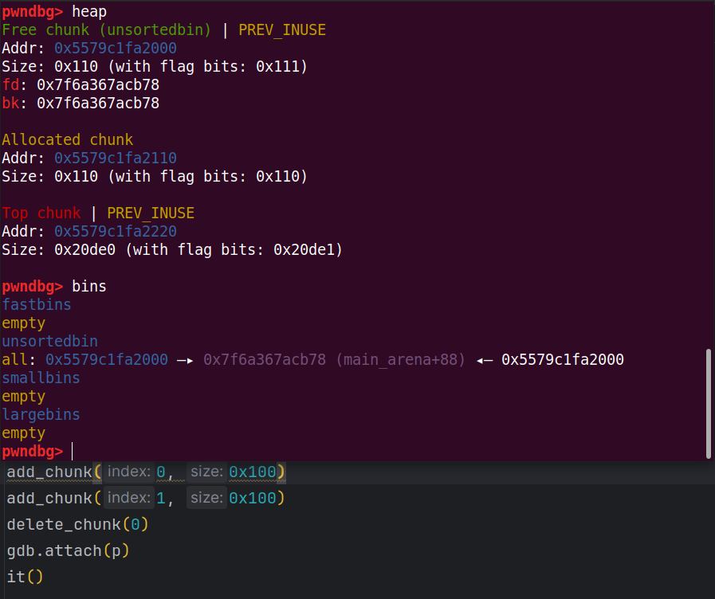
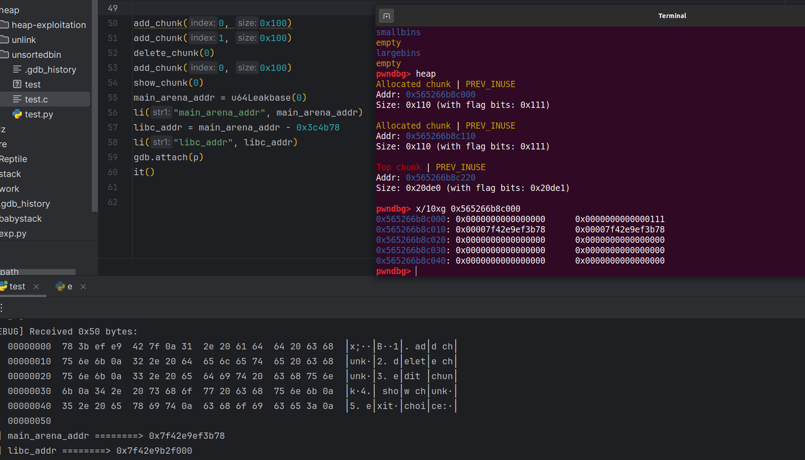
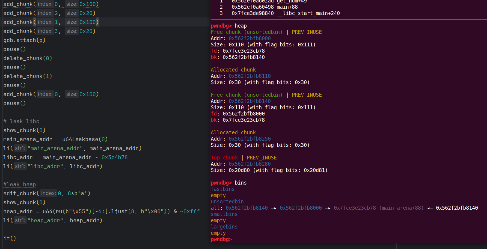

# unsorted bin leak

## 1.基本原理

由于 unsorted bin 是双向链表，因此在 unsorted bin 链表中必有一个节点的 fd 指针会指向 main_arena 结构体内部

如果我们可以把正确的 fd 指针 leak 出来，就可以获得一个与 main_arena 有固定偏移的地址，这个偏移可以通过调试得出

而 main_arena 是一个 struct malloc_state 类型的全局变量，是 ptmalloc 管理主分配区的唯一实例。

说到全局变量，立马可以想到他会被分配在 .data 或者 .bss 等段上，那么如果我们有进程所使用的 libc 的 .so 文件的话，我们就可以获得 main_arena 与 libc 基地址的偏移，从而获取 libc 的基地址


## 2.利用思路

超多漏洞测试程序：

```c
// gcc test.c -o test -g
#include<stdlib.h>
#include <stdio.h>
#include <unistd.h>

char* chunklist[100];

void menu() {
    puts("1. add chunk");
    puts("2. delete chunk");
    puts("3. edit chunk");
    puts("4. show chunk");
    puts("5. exit");
    puts("choice:");
}

int get_num(){
    char buf[0x10];
    read(0, buf, sizeof(buf));
    return atoi(buf);
}

void add_chunk(){
    puts("index:");
    int index = get_num();
    puts("size:");
    int size = get_num();
    chunklist[index] = malloc(size);
}

void delete_chunk(){
    puts("index:");
    int index = get_num();
    free(chunklist[index]);
}

void edit_chunk(){
    puts("index:");
    int index = get_num();
    puts("legth:");
    int length = get_num();
    puts("content:");
    read(0, chunklist[index], length);
}

void show_chunk(){
    puts("index:");
    int index = get_num();
    puts(chunklist[index]);
}

int main(){
    setbuf(stdin, NULL);
    setbuf(stdout, NULL);
    setbuf(stderr, NULL);
    while (1) {
        menu();
        switch (get_num()) {
            case 1: 
                add_chunk();
                break;
            case 2:
                delete_chunk();
                break;
            case 3:
                edit_chunk();
                break;
            case 4:
                show_chunk();
                break;
            case 5:
                exit(0);
            default:
                puts("invalid input");
        }
    
    }
}
```

调试版本：2.23

申请较大的堆块（不然会被放到 fastbin 中），申请两个，释放前一个，不然申请一个的话释放时就会和 top chunk 发生合并

可以很明显看到 unsortedbin 中泄露了相关的信息



main_arena 是在 libc 上的，show(0)就可以泄露堆中的内容，计算偏移从而可以得到 libc 基址

另一种不利用上面漏洞的方法是再申请一遍 malloc 的第一次大小，此时 unsortedbin 回到 allocated chunk 中，但此时 chun 中的内容并不会被清空，所以 main_arena 的内容仍然保存在上面



利用该方法既可以泄露 libc 地址，也可以泄露堆地址，两个地址不相邻的 chunk 都 free 到 unsortedbin 上，此时 chunk0 中的 bk 会保存堆中的地址

但是由于 0 截断，所以要先编辑 chunk0 中的 fd，然后接收地址再减去其偏移，在远程环境下，最好是直接 and 0xfff，后三位直接清 0，因为地址是四字节对齐的



同时，还可以泄露栈地址，利用 libc 上的 `_environ` 变量
