# tcache key 绕过

## 1.tcache key 基本概念

glibc2.29 版本起 tcache 新增了一个 key 字段，该字段位于 chunk 的 bk 字段，值为 tcache 结构体的地址，若 free() 检测到 chunk-> bk == tcache 则会遍历 tcache 查找对应链表中是否有该 chunk，难以进行tcache double free

最新版本的一些老 glibc （如新版的 2.27 等）也引入了该防护机制

由于 tcache 用的是 fd 字段所在地址，因此可以通过泄露 tcache key 来泄露堆地址

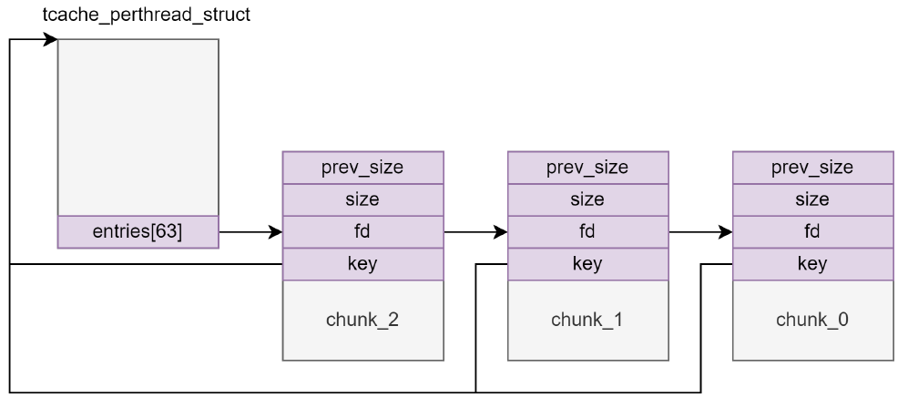

### 1.1 glibc-2.31

```c
typedef struct tcache_entry
{
  struct tcache_entry *next;
  /* This field exists to detect double frees.  */
  struct tcache_perthread_struct *key;
} tcache_entry;
```

```c
// glibc-2.31
static __always_inline void
tcache_put (mchunkptr chunk, size_t tc_idx)
{
  tcache_entry *e = (tcache_entry *) chunk2mem (chunk);

  /* Mark this chunk as "in the tcache" so the test in _int_free will
     detect a double free.  */
  e->key = tcache;

  e->next = tcache->entries[tc_idx];
  tcache->entries[tc_idx] = e;
  ++(tcache->counts[tc_idx]);
}

/* Caller must ensure that we know tc_idx is valid and there's
   available chunks to remove.  */
static __always_inline void *
tcache_get (size_t tc_idx)
{
  tcache_entry *e = tcache->entries[tc_idx];
  tcache->entries[tc_idx] = e->next;
  --(tcache->counts[tc_idx]);
  e->key = NULL;
  return (void *) e;
}

// _int_free 中对 key 的检查
#if USE_TCACHE
  {
    size_t tc_idx = csize2tidx (size);
    if (tcache != NULL && tc_idx < mp_.tcache_bins)
      {
	/* Check to see if it's already in the tcache.  */
	tcache_entry *e = (tcache_entry *) chunk2mem (p);

	/* This test succeeds on double free.  However, we don't 100%
	   trust it (it also matches random payload data at a 1 in
	   2^<size_t> chance), so verify it's not an unlikely
	   coincidence before aborting.  */
	if (__glibc_unlikely (e->key == tcache))
	  {
	    tcache_entry *tmp;
	    LIBC_PROBE (memory_tcache_double_free, 2, e, tc_idx);
	    for (tmp = tcache->entries[tc_idx];
		 tmp;
		 tmp = tmp->next)
	      if (tmp == e)
		malloc_printerr ("free(): double free detected in tcache 2");
	    /* If we get here, it was a coincidence.  We've wasted a
	       few cycles, but don't abort.  */
	  }

	if (tcache->counts[tc_idx] < mp_.tcache_count)
	  {
	    tcache_put (p, tc_idx);
	    return;
	  }
      }
  }
#endif
```

### 1.2.glibc-2.35

glibc-2.34 开始，tcache 的 key 不再是 `tcache_pthread_struct` 结构体地址，而是一个随机数 tcache_key ，因此不能通过 key 泄露堆地址

函数 `tcache_key_initialize` 用于初始化 `tcache_key`。首先尝试使用 `__getrandom` 函数生成随机数，如果失败，则使用 `random_bits` 函数生成随机数。对于 64 位系统，它会生成两个 32 位的随机数并将它们组合成一个 64 位的随机数

```c
// glibc-2.35

/* Process-wide key to try and catch a double-free in the same thread.  */
static uintptr_t tcache_key;

/* The value of tcache_key does not really have to be a cryptographically
   secure random number.  It only needs to be arbitrary enough so that it does
   not collide with values present in applications.  If a collision does happen
   consistently enough, it could cause a degradation in performance since the
   entire list is checked to check if the block indeed has been freed the
   second time.  The odds of this happening are exceedingly low though, about 1
   in 2^wordsize.  There is probably a higher chance of the performance
   degradation being due to a double free where the first free happened in a
   different thread; that's a case this check does not cover.  */
static void
tcache_key_initialize (void)
{
  if (__getrandom (&tcache_key, sizeof(tcache_key), GRND_NONBLOCK)
      != sizeof (tcache_key))
    {
      tcache_key = random_bits ();
#if __WORDSIZE == 64
      tcache_key = (tcache_key << 32) | random_bits ();
#endif
    }
}
/* Caller must ensure that we know tc_idx is valid and there's room
   for more chunks.  */
static __always_inline void
tcache_put (mchunkptr chunk, size_t tc_idx)
{
  tcache_entry *e = (tcache_entry *) chunk2mem (chunk);

  /* Mark this chunk as "in the tcache" so the test in _int_free will
     detect a double free.  */
  e->key = tcache_key;

  e->next = PROTECT_PTR (&e->next, tcache->entries[tc_idx]);
  tcache->entries[tc_idx] = e;
  ++(tcache->counts[tc_idx]);
}

/* Caller must ensure that we know tc_idx is valid and there's
   available chunks to remove.  */
static __always_inline void *
tcache_get (size_t tc_idx)
{
  tcache_entry *e = tcache->entries[tc_idx];
  if (__glibc_unlikely (!aligned_OK (e)))
    malloc_printerr ("malloc(): unaligned tcache chunk detected");
  tcache->entries[tc_idx] = REVEAL_PTR (e->next);
  --(tcache->counts[tc_idx]);
  e->key = 0;
  return (void *) e;
}

// _int_free 中对 key 的检查
#if USE_TCACHE
  {
    size_t tc_idx = csize2tidx (size);
    if (tcache != NULL && tc_idx < mp_.tcache_bins)
      {
	/* Check to see if it's already in the tcache.  */
	tcache_entry *e = (tcache_entry *) chunk2mem (p);

	/* This test succeeds on double free.  However, we don't 100%
	   trust it (it also matches random payload data at a 1 in
	   2^<size_t> chance), so verify it's not an unlikely
	   coincidence before aborting.  */
	if (__glibc_unlikely (e->key == tcache_key))
	  {
	    tcache_entry *tmp;
	    size_t cnt = 0;
	    LIBC_PROBE (memory_tcache_double_free, 2, e, tc_idx);
	    for (tmp = tcache->entries[tc_idx];
		 tmp;
		 tmp = REVEAL_PTR (tmp->next), ++cnt)
	      {
		if (cnt >= mp_.tcache_count)
		  malloc_printerr ("free(): too many chunks detected in tcache");
		if (__glibc_unlikely (!aligned_OK (tmp)))
		  malloc_printerr ("free(): unaligned chunk detected in tcache 2");
		if (tmp == e)
		  malloc_printerr ("free(): double free detected in tcache 2");
		/* If we get here, it was a coincidence.  We've wasted a
		   few cycles, but don't abort.  */
	      }
	  }

	if (tcache->counts[tc_idx] < mp_.tcache_count)
	  {
	    tcache_put (p, tc_idx);
	    return;
	  }
      }
  }
```


## 2.tcache key 清除

利用 UAF 手段将 free chunk 记录的 tcache key 清除，那么 `if (__glibc_unlikely (e->key == tcache))` 无法执行里面的内容，那么就会不有里面的 double free 的检查

那么按照之前 tcache poisoning 的手法，正常情况下 malloc 两次 `__free_hook` 应该可以被申请出来，但这里的版本是对 count 进行的检验，count 无法小于 0

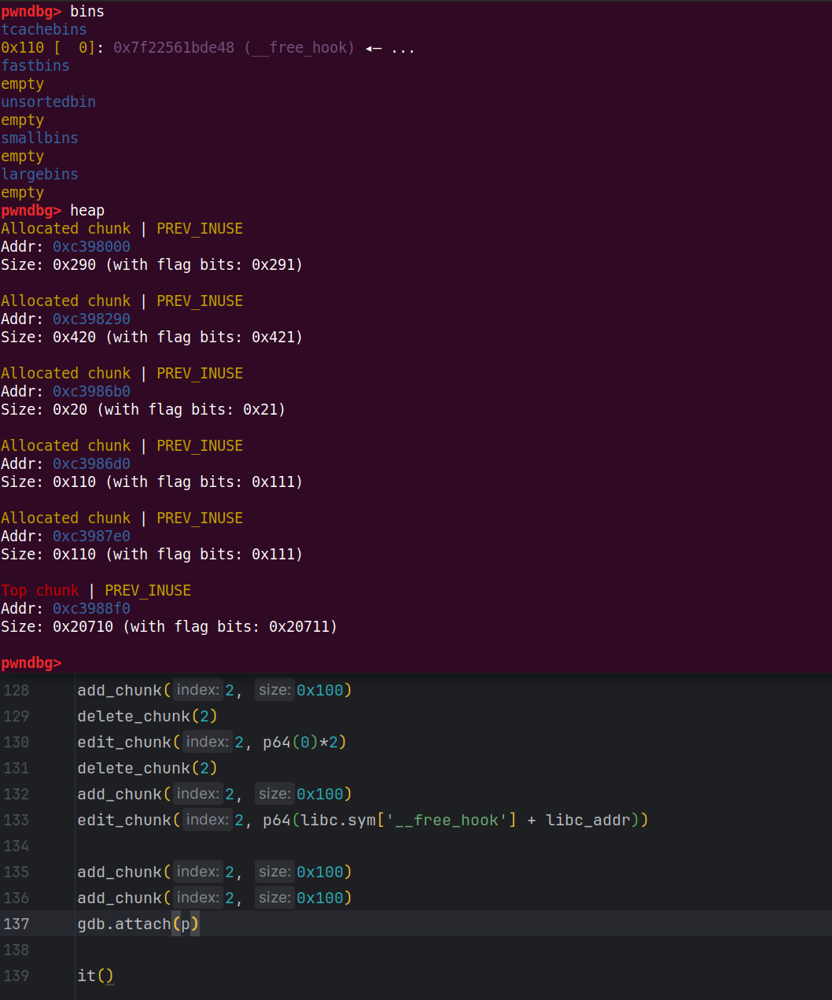

那么解决办法就是要让 `__free_hook` 申请出来的时候 counts 不为 0，那么我们可以在最开始释放一个 chunk 到 tcache 中，那么的话 tcache 的 counts 就为 3 了，但其实申请的堆块 10 已经在 tcache 中找不到了，接下来就是暴力修改 key，double free 让堆块 2 指向了自己，那么再申请出来修改堆块 2 的 next，再次申请我们就可以看 `__free_hook` 可以申请出来了

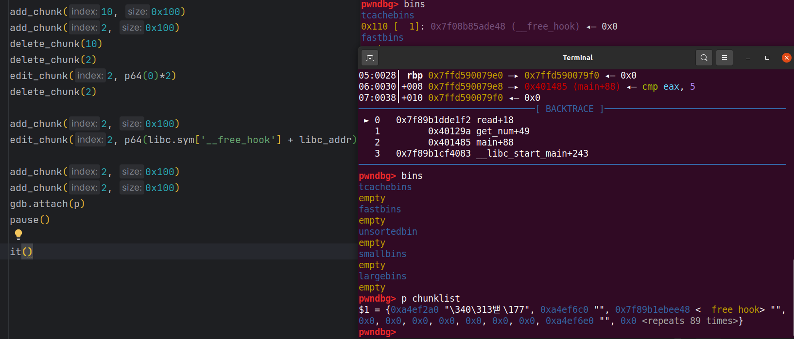


## 3.house of kauri

通过越界修改 size 使两次 free 的同一块内存进入不同的 entries，那么将 size 大的申请出来，我们就可以对 size 小的（实际同一块内存区域）进行修改

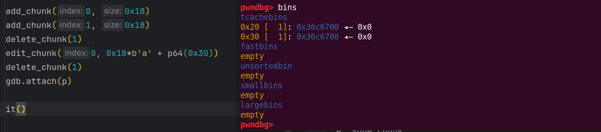

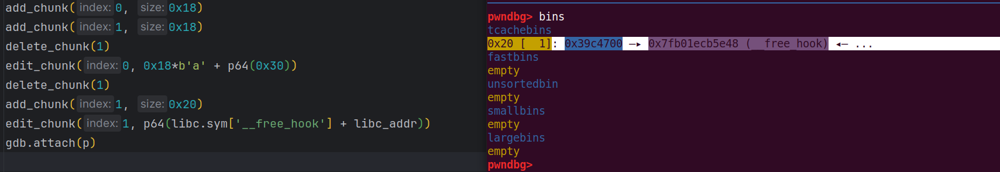

但是现在__free_hook 还是无法申请出来，采用如下方法：

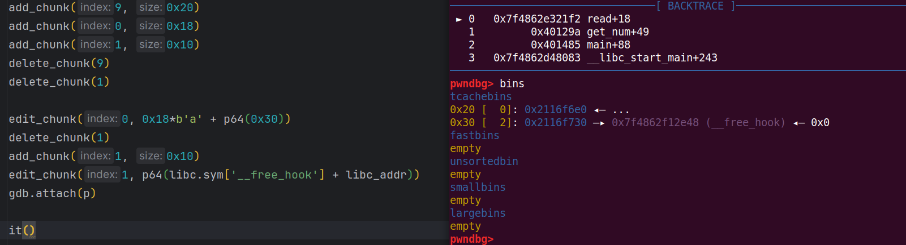


## 4.tcache stash with fastbin double free

这里先解释一下 stash 机制：malloc 时如果从 fastbin 中成功返回了一个需要的 chunk，那么对应 fastbin 中的其他 chunk 会被放进相应的 tcache bin 中，直到上限。需要注意的是 chunks 在 tcache bin 的顺序和在 fastbin 中的顺序是反过来的

tcache stash with fastbin double free 原理：在 fastbin 中并没有严密的 double free 检测，可以在填满对应的 tcache 链条后在 fastbin 中完成 double free，然后用完 tcache，随后通过 stash 机制将 fastbin 中的 chunk 倒回 tcache 中，由于我们申请出来的 chunk8 在用户手上，所以执行他为 hook 函数就行了，再 malloc3 次就可以将其申请出来了

原理图：

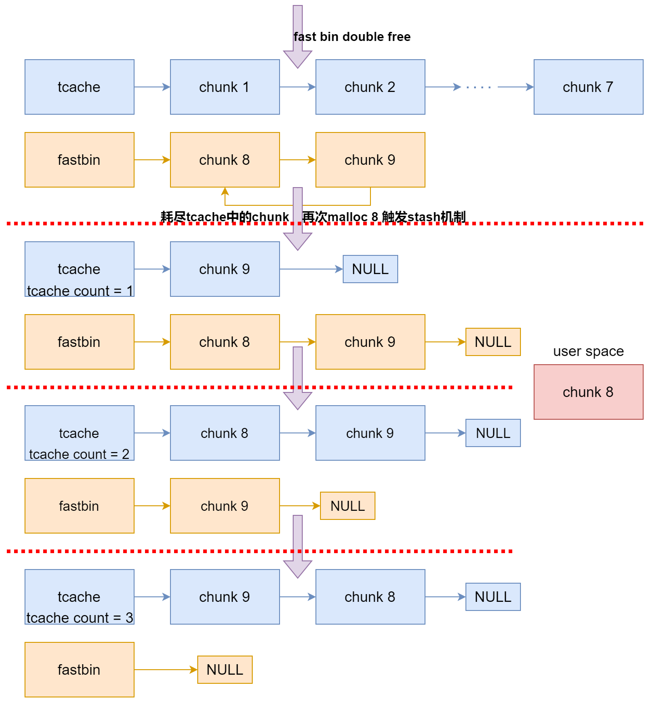

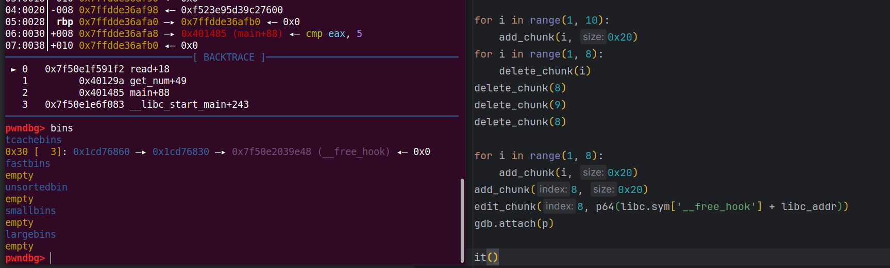


## 5.House of Botcake

最大的 fastbin：0xB0，最大的 tcache：0x410

利用了 unsorted bin 会立即合并物理地址上相邻的 chunk 的原理

House of Botcake 原理：同一个 chunk 释放到 tcache 和 unsorted bin 中，释放在 unsorted bin 的 chunk 借助堆块合并改变大小，接着可以从 unsorted bin 中申请合并堆块并对其修改，进而影响到 tcache 中的 chunk

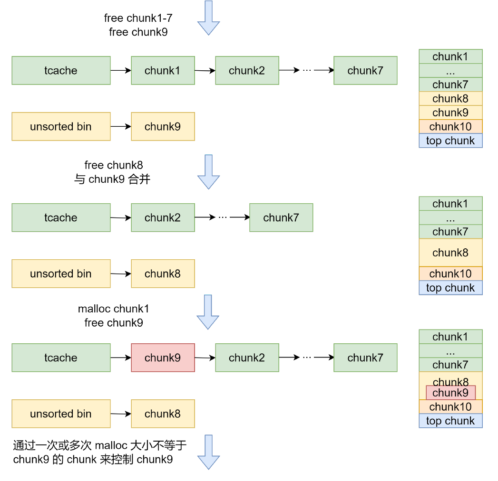

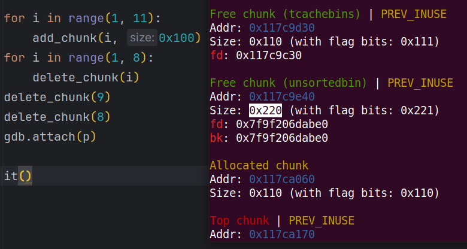

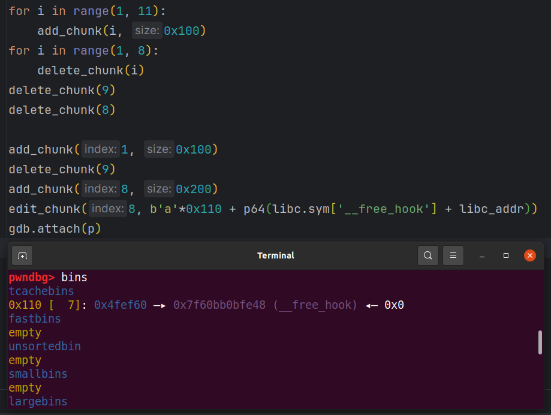
