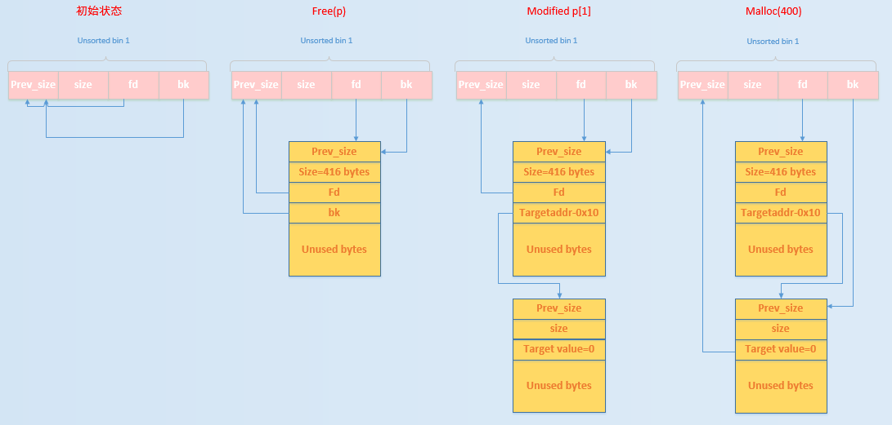

# unsortedbin attack


## 1.基本原理

基本来源：

- 当一个较大的 chunk 被分割成两半后，如果剩下的部分大于 MINSIZE，就会被放到 unsorted bin 中。
- 释放一个不属于 fast bin 的 chunk，并且该 chunk 不和 top chunk 紧邻时，该 chunk 会被首先放到 unsorted bin 中。
- 当进行 malloc_consolidate 时，可能会把合并后的 chunk 放到 unsorted bin 中，如果不是和 top chunk 近邻的话。

使用：

- Unsorted Bin 在使用的过程中，采用的遍历顺序是 FIFO，**即插入的时候插入到 unsorted bin 的头部（靠近bins的），取出的时候从链表尾获取（远离bins的）**。
- 在程序 malloc 时，如果在 fastbin，small bin 中找不到对应大小的 chunk，就会尝试从 Unsorted Bin 中寻找 chunk。如果取出来的 chunk 大小刚好满足，就会直接返回给用户，否则就会把这些 chunk 分别插入到对应的 bin 中。


_int_malloc 中：

```c
while ((victim = unsorted_chunks (av)->bk) != unsorted_chunks (av))
{
  bck = victim->bk;
  if (__builtin_expect (chunksize_nomask (victim) <= 2 * SIZE_SZ, 0)
      || __builtin_expect (chunksize_nomask (victim)
           > av->system_mem, 0))
    malloc_printerr ("malloc(): memory corruption");
  size = chunksize (victim);

  /*
     If a small request, try to use last remainder if it is the
     only chunk in unsorted bin.  This helps promote locality for
     runs of consecutive small requests. This is the only
     exception to best-fit, and applies only when there is
     no exact fit for a small chunk.
   */

  if (in_smallbin_range (nb) &&
      bck == unsorted_chunks (av) &&
      victim == av->last_remainder &&
      (unsigned long) (size) > (unsigned long) (nb + MINSIZE))
    {
      /* split and reattach remainder */
      remainder_size = size - nb;
      remainder = chunk_at_offset (victim, nb);
      unsorted_chunks (av)->bk = unsorted_chunks (av)->fd = remainder;
      av->last_remainder = remainder;
      remainder->bk = remainder->fd = unsorted_chunks (av);
      if (!in_smallbin_range (remainder_size))
        {
          remainder->fd_nextsize = NULL;
          remainder->bk_nextsize = NULL;
        }

      set_head (victim, nb | PREV_INUSE |
                (av != &main_arena ? NON_MAIN_ARENA : 0));
      set_head (remainder, remainder_size | PREV_INUSE);
      set_foot (remainder, remainder_size);

      check_malloced_chunk (av, victim, nb);
      void *p = chunk2mem (victim);
      alloc_perturb (p, bytes);
      return p;
    }

  /* remove from unsorted list */
  unsorted_chunks (av)->bk = bck;
  bck->fd = unsorted_chunks (av);
```

重点关注最后两行代码，在存在一个 UAF 的前提下，可以修改 bk 指针到 fake chunk，当我们再 malloc 一个 chunk 从 unsortedbin 中时，bck 是 fake chunk，bins 中的 bk 会指向 fake chunk，同时 fake chunk 的 fd 处的值会被修改



这样我们就可以实现任意地址写。在 target value 中写一个较大的值，或者方便内存中某些地方绕过判断

通过gdb打印出`global_max_fast`的地址的解，但是下载的libc，好像并没有这个`global_max_fast`符号，因为这是一个static变量，是可以被strip去符号的。不太清楚别人是怎么搞得，我只能通过原理上去找这个地址(libc+偏移)

`global_max_fast`这个全局变量的作用是用来标志`fastbin`的大小的阈值，小于这个值的堆块会被认为是fastbin

注意：bk字段必须可写


glibc2.28开始失效，因为会检查

```c
  /* remove from unsorted list */
  if (__glibc_unlikely (bck->fd != victim))
    malloc_printerr ("malloc(): corrupted unsorted chunks 3");
  unsorted_chunks (av)->bk = bck;
  bck->fd = unsorted_chunks (av);
```

