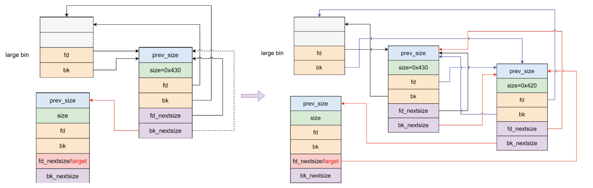

# largebin attack2

## 1.基本原理

新版本添加的检查措施：

致使前面的 largebin attack 修改 bk 和 bk_next 的利用难度增大，或者不可利用，因为很难控制 target addr 里的内容

```c
else
{
  victim->fd_nextsize = fwd;
  victim->bk_nextsize = fwd->bk_nextsize;
  if (__glibc_unlikely (fwd->bk_nextsize->fd_nextsize != fwd))
    malloc_printerr ("malloc(): largebin double linked list corrupted (nextsize)");
  fwd->bk_nextsize = victim;
  victim->bk_nextsize->fd_nextsize = victim;
}
bck = fwd->bk;
if (bck->fd != fwd)
  malloc_printerr ("malloc(): largebin double linked list corrupted (bk)");
```

但如果新加入的 chunk 小于 large bin 中的 chunk （即最小的 chunk）会进行如下操作：这里没有对双向链表进行任何检查

```c
bck = bin_at (av, victim_index);
fwd = bck->fd;
if (fwd != bck)
{
	...
    if ((unsigned long) (size) < (unsigned long) chunksize_nomask (bck->bk))
    {
        fwd = bck;
        bck = bck->bk;
        victim->fd_nextsize = fwd->fd;
        victim->bk_nextsize = fwd->fd->bk_nextsize;
        fwd->fd->bk_nextsize = victim->bk_nextsize->fd_nextsize = victim;
	}
...
}

victim->bk = bck;
victim->fd = fwd;
fwd->bk = victim;
bck->fd = victim;
```

因此如果将 largebin 中的最小的 chunk 的 bk_nextsize 指向 &target - 0x20 的位置，然后加入一个更小 chunk 就会将 target 写入新加入 chunk 的地址


