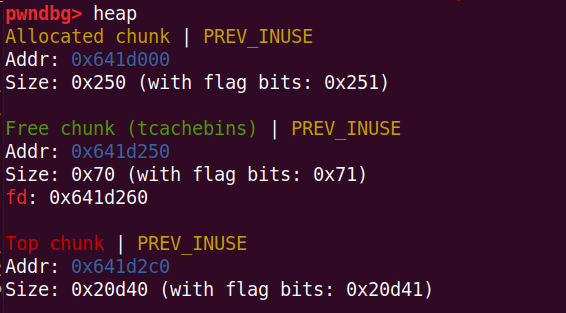
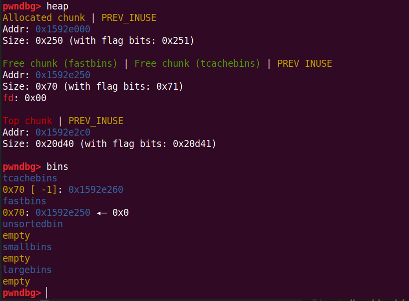

# 绕过tcache

如果想让释放的 chunk 不进入 tcache 有如下方法：

* 释放不在 tcache 大小范围的 chunk

  ```c
  add_chunk(0, 0x410)
  add_chunk(1, 0x10)
  delete_chunk(0)
  ```

  

* 释放 7 个同样大小的 chunk 进入 tcache 填满对应位置的位置

  ```c
  for i in range(7):
  	add_chunk(i, 0x68)
  add_chunk(7, 0x68)
  for i in range(7):
  	delete_chunk(i)
  delete_chunk(7)
  ```

* 如果题目限制了 free 次数那么需要通过 tcache dup （tcache double free） 再 malloc 3 次将 counts 对应位置置为 -1 来绕过 tcache（低版本才有效 2.27-3ubuntu1_amd64）

  ```python
  add_chunk(0, 0x68)
  delete_chunk(0)
  delete_chunk(0) 
  add_chunk(0, 0x68)
  add_chunk(0, 0x68)
  add_chunk(0, 0x68)
  delete_chunk(0)
  ```

  free两次后tcache会指向自己：

  

  执行完之后的结果，tcachebins中的数目变成了-：

  

* 控制 tcache_perthread_struct（tcache_perthread_struct 也在堆上，在堆初始化时该结构体对象生成）从而控制 counts 实现绕过 tcache ，但既然能控制任意地址了，其他方法也就更简单，这种方法也没必要了

  ```c
  typedef struct tcache_perthread_struct
  {
  	char counts[TCACHE_MAX_BINS];
  	tcache_entry *entries[TCACHE_MAX_BINS];
  } tcache_perthread_struct;
  ```

  
