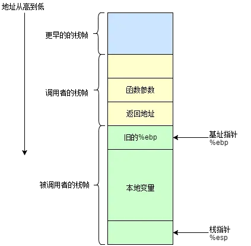

# 栈溢出常见漏洞

## 1.栈上的逻辑漏洞

> 栈溢出往往覆盖栈上的内容

* 注意输入长度变量是否存在溢出
* 注意循环条件

## 2.栈帧

* C 语言中，每个栈帧对应着一个未运行完的函数。栈帧中保存了该函数的返回地址和局部变量。
* 栈帧是一块因函数运行而临时开辟的空间。
* 每调用一次函数便会创建一个独立栈帧。
* 栈帧中存放的是函数中的必要信息，如局部变量、函数传参、返回值等。
* 当函数运行完毕栈帧将会销毁

栈帧示意图：

函数调用

函数调用分为以下几步:

* 参数入栈: 将参数按照调用约定(C 是从右向左)依次压入系统栈中;
* 返回地址入栈: 将当前代码区调用指令的下一条指令地址压入栈中，供函数返回时继续执行;
* 代码跳转: 处理器将代码区跳转到被调用函数的入口处;

