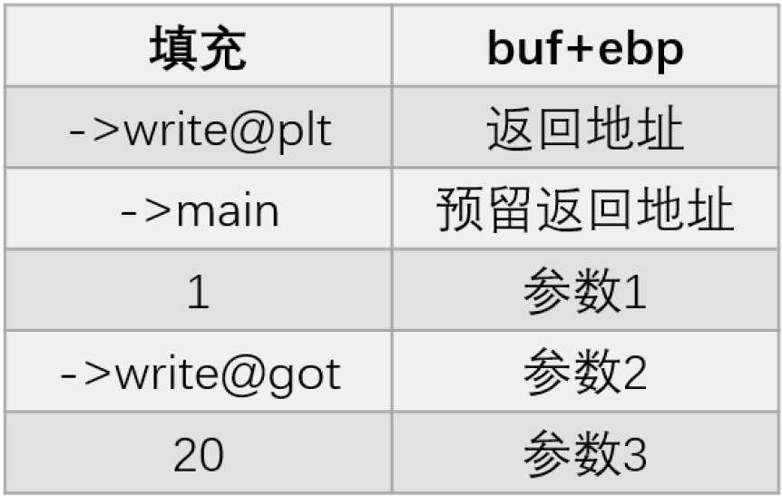

# ret2libc

> 找到system()函数的地址和"/bin/sh"的地址
>
> * 当程序中没有"/bin/sh"字符串时，我们可以利用程序中某些函数如:read,fgets,gets等函数将"/bin/sh"字符串写入bss段或某个变量中，并且要可以找到其地址；
>
> * 当程序中没有"/bin/sh"字符串时，执行system(sh)的效果与/bin/sh相同
>
> * 对于只给出了libc.so文件的程序，我们可以直接在libc.so文件当中去找system()函数和"/bin/sh"字符串，因为libc.so文件中也是包含了这些的；
>
> * 最后对于没有给出libc.so文件的程序，我们可以通过泄露出程序当中的某个函数的地址，通过查询来找出其使用lib.so版本是哪一个
>
> tips：
>
> * 32位libc 0xf7开头
> * 64位libc  0x7f开头
> * 偏移地址：libc是Linux新系统下的C函数库，其中就会有system()函数、"/bin/sh"字符串，而libc库中存放的就是这些函数的偏移地址。换句话说，只要确定了libc库的版本，就可以确定其中system()函数、"/bin/sh"字符串的偏移地址。解题核心在于如何确定libc版本
> * 基地址：每次运行程序加载函数时，函数的基地址都会发生改变。然而，哪怕每次运行时函数的真实地址一直在变，最后三位确始终相同。可以根据这最后三位是什么确定这个函数的偏移地址，从而反向推断出libc的版本（此处需要用到工具LibcSearcher/LibcSearcher3库）

## 1.解题思路

ret2libc类题目特点：

- 开启了NX保护不能写入shellcode并且ret2shellcode这样的方法不能拿shell
- 程序本身也没有像system("/bin/sh")这样直接的后门函数，因此没有ret2text这么直接
- 程序中可能既没有system函数，又没有"/bin/sh"字符串，需要我们在libc库中寻找


## 2.利用过程

### 2.1 泄露地址

需要程序中有输出函数能输出地址（puts，printf，write），通过输出函数，获取已经绑定过的函数的got表项内容

下面以write函数为例：

32位利用：



64位利用：

需要控制三个参数，rdi，rsi，rdx
第三个参数代表输出的size，如果没有rdx的gadget可以暂时不管，输出多少无所谓

### 2.2 获取libc基址

Python ljust() 方法返回一个原字符串左对齐,并使用空格填充右侧至指定长度的新字符串。如果指定的长度小于原字符串的长度则返回原字符串

ljust()方法语法：

```
str.ljust(width[, fillchar])
```

```c
write_addr = u64(io.recvuntil("\x7f")[-6:].ljust(8,b'\x00'))
```

​	

* 使用LibcSearcher获取libc基址（libc版本未知的情况下）

```python
from LibcSearcher import *
libc = LibcSearcher("write",write_addr) #使用一个已知符号地址作为约束条件初始化libsearcher
libc.add_condition("puts",puts_addr) #添加一个约束条件
libc_base = write_addr - libc.dump("write")
bin_sh_addr = libc_base + libc.dump("str_bin_sh")
system_addr = libc_base + libc.dump("system")
```

* 给了libc的情况下，使用elf的search

```python
libc = ELF("./libc.so.6")
# libc.address = 0 ，也可以指定libc.address，然后函数地址就是VA了
libc_base = write_addr - libc.symbols['write']
bin_sh_addr = libc_base + next(libc.search(b"/bin/sh"))
system_addr = libc_base + libc.symbols['system']
```

* ROPgadget --binary libc.so --string '/bin/sh'
* one_gadget 查找已知的libc中exevce("/bin/sh") 语句的地址
* 在线查询网址：https://libc.rip/

### 2.3 控制程序流执行

如：泄露出puts的got表内容后，重新回到start开始执行

```python
start = elf.sym['_start']
puts_plt = elf.plt['puts']
puts_got = elf.got['puts']
payload1 = flat([cyclic(0x64), b'a'*12, puts_plt, start, puts_got, b'\n'])
```

