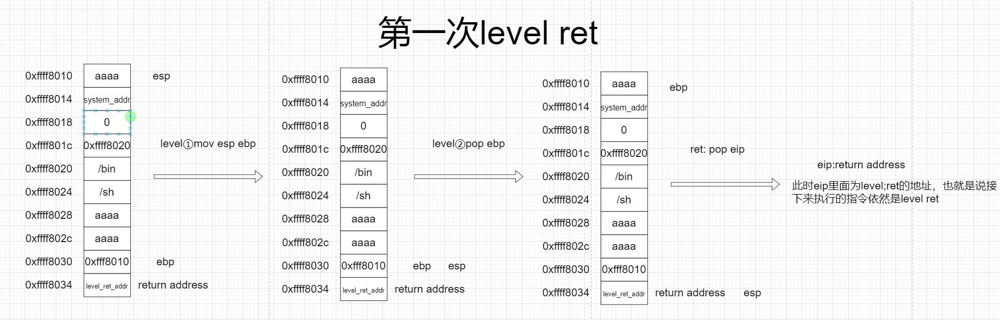
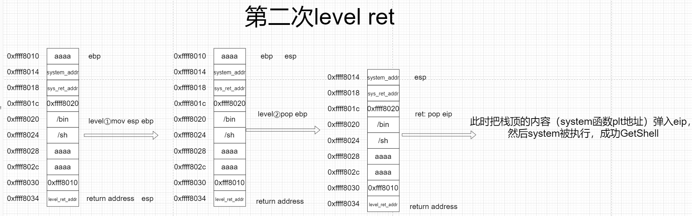
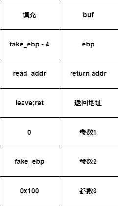

# 栈迁移

> 一般我们进行栈溢出攻击的时候，题目一般会给出足够大的空间写入我们的构造的ROP链，但是有一些题目会限制你的输入空间，比如我们只能只能覆盖到ebp,ret_addr这样的时候就是需要我们利用栈迁移将我们的栈转移到别的地方，一般是在bss段或栈中，我们可以在bss段或栈中设定一段gadget，之后将栈迁移从而getshell，这个时候就需要栈迁移

## 1.原理

栈迁移关键在于利用`leave;ret`指令

```
leave == mov esp ebp ; pop ebp (esp + 4/8)
ret == pop eip (esp +4/8)
```

首先获得要迁移的地址，然后利用溢出把EBP改掉，修改成要迁移的地址，然后返回地址改成leave；ret的地址，同时，迁移的地址处填写自己要利用的代码





## 2.栈迁移到数据填充段

即获得buf的地址，填充到buf中，easy


## 3.栈迁移到其他空闲地址

buf区填充不够，但可溢出的大小稍长（6字节），可调用read函数将rop写入fake_ebp空闲地址中（栈中或.text中），然后将栈迁移到该地址执行rop

read 函数中的leave;ret 语句不会对栈迁移造成影响

例: x86: 




在历史上，大多数UNX系统中支持main函数带3个参数，其中第3个参数就是表示环境表的地址

```c
int main(int argc,char *argv[].char *envp)
```

现在main函数一般只有两个参数，argc与argy。argc表示参数的个数；第二个参数中argv[0]为自身运行目录路径和程序名，argv[1]指向第一个参数、argv[2]指向第二个参数……

第三个参数env以后改用environ指针来处理，如果想要查看整个环境，必须使用整个environ全称为environment pointer环境指针，在glibc中存储程序运行时所需要的环境变量

**environ变量里面会存着栈地址，如果我们可以泄露栈地址，将大大有利于我们劫持程序执行流**


## 4.相对地址栈迁移

栈帧不以leave;ret结尾

而是 add esp，num ； pop ...pop ... ;retn;(等同于add esp xxx)

内核中的一种常用方法

此外，还有一些题目有jmp esp这样的提示
