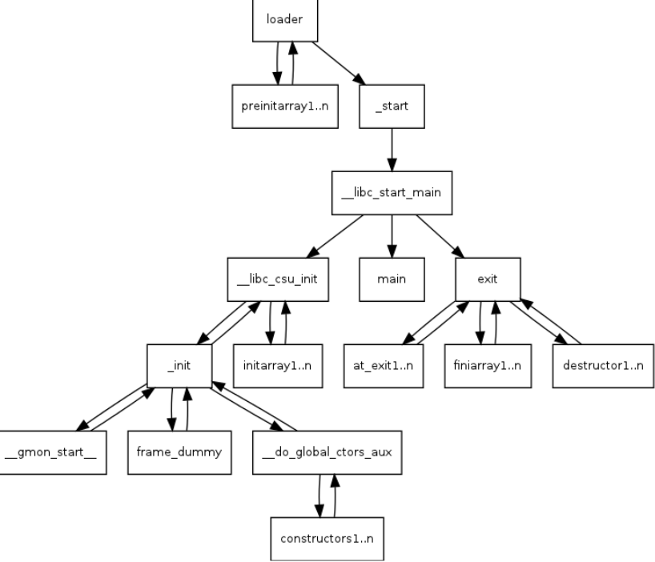

# ret2csu




## 1.程序执行流

- 首先程序调用 execve 生成一个进程，并且设置好数据
- 然后调用 `_start` 简单设置后就调用 `__libc_start_main`
- `__libc_start_main` 会先调用 `__libc_init_first` 获取环境变量 envp（作为 main 的第三个参数），然后越过 envp 数组之后的 `NULL` 字符，获取 ELF 辅助向量
- 把 `fini` 和 `rtld_fini` 作为参数传递给 `at_exit` 调用
- 调用其 `init` 参数，执行 `__libc_csu_init`
- 调用 `main` 函数，并把 `argc` 和 `argv` 参数、环境变量传递给它
- 调用 `exit` 函数，执行其中的 `__libc_csu_fini`


## 2.利用原理

在 64 位程序中(该利用方法只用用于 64 位程序)，函数的前 6 个参数是通过寄存器传递的（rdi , rsi , rdx , rcx , r8 , r9），但是大多数时候，我们很难找到每一个寄存器对应的 gadgets。这时候，我们可以利用 x64 下的__libc_csu_init 中的 gadgets

ret2csu 是 blackhat 大会在 2018 年的一个议题，即通过__libc_csu_init 中的两个特殊 gadgets 可实现万能传参

因为这个函数是用来对 libc 进行初始化操作的，而一般的程序都会调用 libc 函数，所以这个函数一定存在。同时利用完这段 gadget  之后可以控制函数的前三个参数（即 rdi rsi rdx）以及其他寄存器和调用函数地址，所以这个 gadget 也被称为 `通用 gadget`

```asm
text:0000000000400540                 public __libc_csu_init // c start up
.text:0000000000400540 __libc_csu_init proc near               ; DATA XREF: _start+16↑o
.text:0000000000400540 ; __unwind {
.text:0000000000400540                 push    r15
.text:0000000000400542                 push    r14
.text:0000000000400544                 mov     r15d, edi
.text:0000000000400547                 push    r13
.text:0000000000400549                 push    r12
.text:000000000040054B                 lea     r12, __frame_dummy_init_array_entry
.text:0000000000400552                 push    rbp
.text:0000000000400553                 lea     rbp, __do_global_dtors_aux_fini_array_entry
.text:000000000040055A                 push    rbx
.text:000000000040055B                 mov     r14, rsi
.text:000000000040055E                 mov     r13, rdx
.text:0000000000400561                 sub     rbp, r12
.text:0000000000400564                 sub     rsp, 8
.text:0000000000400568                 sar     rbp, 3 //算数右移
.text:000000000040056C                 call    _init_proc
.text:0000000000400571                 test    rbp, rbp
.text:0000000000400574                 jz      short loc_400596
.text:0000000000400576                 xor     ebx, ebx
.text:0000000000400578                 nop     dword ptr [rax+rax+00000000h]
.text:0000000000400580
.text:0000000000400580 loc_400580:   (gadget2)                 ; CODE XREF: __libc_csu_init+54↓j
.text:0000000000400580                 mov     rdx, r13
.text:0000000000400583                 mov     rsi, r14
.text:0000000000400586                 mov     edi, r15d
.text:0000000000400589                 call    qword ptr [r12+rbx*8]
.text:000000000040058D                 add     rbx, 1
.text:0000000000400591                 cmp     rbx, rbp
.text:0000000000400594                 jnz     short loc_400580
.text:0000000000400596
.text:0000000000400596 loc_400596:   (gadget1)                 ; CODE XREF: __libc_csu_init+34↑j
.text:0000000000400596                 add     rsp, 8
.text:000000000040059A                 pop     rbx //通常利用时设为0
.text:000000000040059B                 pop     rbp //通常利用时设为1
.text:000000000040059C                 pop     r12 //call addr
.text:000000000040059E                 pop     r13 //rdx
.text:00000000004005A0                 pop     r14 //rsi
.text:00000000004005A2                 pop     r15 //edi
.text:00000000004005A4                 retn
.text:00000000004005A4 ; } // starts at 400540
.text:00000000004005A4 __libc_csu_init endp
```

过程：

* 控制程序的执行流，把返回地址填写成 gadget1 的地址 0x40059A（因为我们并不需要 add rsp,8 这个指令，因此直接从 0x40059A 开始即可），现在就会把栈中的前 6 个数据分别弹给 rbx, rbp, r12, r13, r14, r15 这 6 个寄存器 
* gadget1 的结尾 ret 这里，然后我们紧接着写入 gadget2 的地址 0x400580
* 继续向下执行，因此又来到了 gadget2 这里
* 如果我们还需要继续控制参数的话，那就此时不填充垃圾数据，继续去控制参数，总之不管干啥呢，这里都要凑齐 56 字节的数据，以便我们执行最后的 ret，最后 ret 去执行我们想要执行的函数即可

注意：

* rbx 的值设置成 0，这样的目的是在执行 call qword ptr [r12+rbx*8]这个指令的时候，我们仅仅把 r12 的值给设置成指向我们想 call 地址的地址即可，从而不用管 rbx

* rbx 为 0，此时 call  r12，可以装 got 地址，也可以装一个地址（这个地址是被另一个地址所指向的），然后把 r12 填写成另一个地址，也可以 call 成功，原因也是出现在了 got 地址仅仅会跳转一次，也就是说填一个 got 地址，也是会从这个地址去跳到 got 地址所指向的地址（也就是真实地址)，因此结论就是要想去 call 去跳转到一个地址 A，那就必须用一个指向地址 A 的地址 B 放到 call 后面

* 如果仅仅是想利用 ret2csu 去控制参数，而并不想去用 call 执行，或者说是你想用 call 执行跳转，但是你找不到去指向你想跳转的那个地址，因此我们用最后的 ret 跳转（你想跳转到哪里，就填哪的地址即可）。我们可以 call 一个空函数（不需要参数，执行之后也不会对程序本身造成任何影响的函数），这个函数就是 `_term_proc`

  ```asm
  .fini:00000000004008B4                 public _term_proc
  .fini:00000000004008B4 _term_proc      proc near
  .fini:00000000004008B4                 sub     rsp, 8          ; _fini
  .fini:00000000004008B8                 add     rsp, 8
  .fini:00000000004008BC                 retn
  .fini:00000000004008BC _term_proc      endp
  ```

* rbp 设置成 1，因为这三个指令 add rbx,1；cmp rbx, rbp；jnz short loc_400580，我们通常并不想跳转到 0x400580 这个地方，因为此刻执行这三个指令的时候，我们就是从 0x400580 这个地址过来的。因此 rbx 加一之后，我们要让它和 rbp 相等，因此 rbp 就要提前被设置成 1

* r13, r14, r15 这三个值分别对应了 rdx, rsi, edi。这里要注意的是，r15 最后传给的是 edi, 最后 rdi 的高四字节都是 00，而低四字节才是 r15 里的内容。（也就是说如果想用 ret2csu 去把 rdi 里存放成一个地址是不可行的）

tips：

* read 函数和 write 函数最后的返回值都是实际读到和写入的字节数（如果执行成功的话），而返回值最后就会放到 rax 里面。也就是说可以利用 read 和 write 去控制想要的 rax，控制了 rax，就可以执行系统调用了

