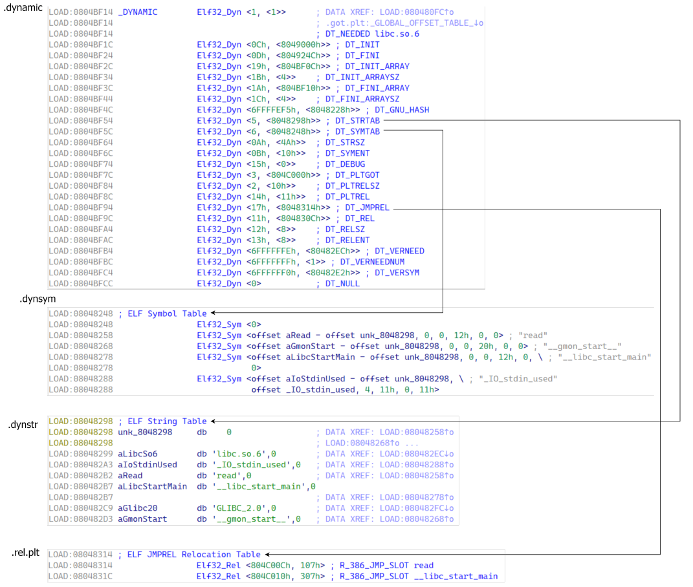

# ret2dl-resolve

> 题目的最大特征是不提供libc，如果使用ret2dlresolve则不能使用patchelf修改elf文件（会移动延迟绑定的相关结构）
>
> 同时题目也未开启Full RELRO禁用延迟绑定，即所有的导入符号在加载是便被解析，.got.plt段被完全初始化为目标函数的地址，并标记为只读，很显然，这种情况，我们几乎用不了ret2dl_resolve

## 1.主要相关结构

主要有 `.dynamic` 、`.dynstr` 、`.dynsym` 和 `.rel.plt` 四个重要的 section

以32位结构和关系图为例：



### 1.1 Dyn

```c
/* Dynamic section entry. */
typedef struct
{
	Elf32_Sword d_tag; /* Dynamic entry type */
	union
	{
		Elf32_Word d_val; /* Integer value */
		Elf32_Addr d_ptr; /* Address value */
	} d_un;
} Elf32_Dyn;

typedef struct
{
	Elf64_Sxword d_tag; /* Dynamic entry type */
	union
	{
		Elf64_Xword d_val; /* Integer value */
		Elf64_Addr d_ptr; /* Address value */
	} d_un;
} Elf64_Dyn;
```

Dyn 结构体用于描述动态链接时需要使用到的信息，其成员含义如下：

* d_tag 表示标记值，指明了该结构体的具体类型。比如， DT_NEEDED 表示需要链接的库名，DT_PLTRELSZ 表示 PLT 重定位表的大小，DT_STRTAB, DT_SYMTAB, DT_JMPREL这三项，分别包含了指向.dynstr, .dynsym, .rel.plt这3个section的指针
* d_un 是一个联合体，用于存储不同类型的信息。具体含义取决于 d_tag 的值。
  * 如果 d_tag 的值是一个整数类型，则用 d_val 存储它的值
  * 如果 d_tag 的值是一个指针类型，则用 d_ptr 存储它的值

### 1.2 Sym

```c
/* Symbol table entry. */
typedef struct
{
	Elf32_Word st_name; /* Symbol name (string tbl index) */
	Elf32_Addr st_value; /* Symbol value */
	Elf32_Word st_size; /* Symbol size */
	unsigned char st_info; /* Symbol type and binding */
	unsigned char st_other; /* Symbol visibility */
	Elf32_Section st_shndx; /* Section index */
} Elf32_Sym;

typedef struct
{
	Elf64_Word st_name; /* Symbol name (string tbl index) */
	unsigned char st_info; /* Symbol type and binding */
	unsigned char st_other; /* Symbol visibility */
	Elf64_Section st_shndx; /* Section index */
	Elf64_Addr st_value; /* Symbol value */	
	Elf64_Xword st_size; /* Symbol size */
} Elf64_Sym;
```

Sym 结构体用于描述 ELF 文件中的符号（Symbol）信息，其成员含义如下：

* st_name ：指向一个存储符号名称的字符串表的索引，即字符串相对于字符串表起始地址的偏移。
* st_info ：如果 st_other 为 0 则设置成 0x12 即可。
* **st_other** ：决定函数参数 link_map 参数是否有效。如果该值不为 0 则直接通过 link_map 中的信息计算出目标函数地址。为0则需要调用 _dl_lookup_symbol_x 函数查询出新的 link_map和 sym 来计算目标函数地址。
* st_value ：符号地址相对于模块基址的偏移值

### 1.3 Rel

```c
/* Relocation table entry without addend (in section of type SHT_REL). */
typedef struct
{
	Elf32_Addr r_offset; /* Address */
	Elf32_Word r_info; /* Relocation type and symbol index */
} Elf32_Rel;

typedef struct
{
	Elf64_Addr r_offset; /* Address */
	Elf64_Xword r_info; /* Relocation type and symbol index */
} Elf64_Rel;
```

Rel 结构体用于描述重定位（Relocation）信息，其成员含义如下：

* r_offset ：指向got表指针，加上传入的参数 link_map->l_addr 等于该函数对应 got 表地址。
* r_info ：符号索引的低 8 位（32 位 ELF）或低 32 位（64 位 ELF）指示符号的类型这里设为7即可，高 24 位（32 位 ELF）或高 32 位（64 位 ELF）指示符号的索引即 Sym 构造的数组中的索引

### 1.4 link_map

```c
struct link_map
{
	ElfW(Addr) l_addr; /* Difference between the address in the ELF file and the addresses in memory. */
	...
	ElfW(Dyn) *l_info[DT_NUM + DT_THISPROCNUM + DT_VERSIONTAGNUM + DT_EXTRANUM + DT_VALNUM + DT_ADDRNUM];
```

link_map 是存储目标函数查询结果的一个结构体，我们主要关心 l_addr 和 l_info 两个成员即可。

* l_addr ：目标函数所在 lib 的基址。
* l_info ： Dyn 结构体指针，指向各种结构对应的 Dyn 。
  * l_info[DT_STRTAB] ：即 l_info 数组第 5 项，指向 .dynstr 对应的 Dyn 。
  * l_info[DT_SYMTAB] ：即 l_info 数组第 6 项，指向 Sym 对应的 Dyn 。
  * l_info[DT_JMPREL] ：即 l_info 数组第 23 项，指向 Rel 对应的 Dyn 。


`_dl_fixup`实现代码：

```c
/* We use this macro to refer to ELF types independent of the native wordsize.
   `ElfW(TYPE)' is used in place of `Elf32_TYPE' or `Elf64_TYPE'.  */
#define ElfW(type) _ElfW(Elf, __ELF_NATIVE_CLASS, type)
#define _ElfW(e, w, t) _ElfW_1(e, w, _##t)
#define _ElfW_1(e, w, t) e##w##t

/* All references to the value of l_info[DT_PLTGOT],
  l_info[DT_STRTAB], l_info[DT_SYMTAB], l_info[DT_RELA],
  l_info[DT_REL], l_info[DT_JMPREL], and l_info[VERSYMIDX (DT_VERSYM)]
  have to be accessed via the D_PTR macro.  The macro is needed since for
  most architectures the entry is already relocated - but for some not
  and we need to relocate at access time.  */
#ifdef DL_RO_DYN_SECTION
#define D_PTR(map, i) ((map)->i->d_un.d_ptr + (map)->l_addr)
#else
#define D_PTR(map, i) (map)->i->d_un.d_ptr
#endif

#if (!ELF_MACHINE_NO_RELA && !defined ELF_MACHINE_PLT_REL) || ELF_MACHINE_NO_REL
#define PLTREL ElfW(Rela)
#else
#define PLTREL ElfW(Rel)
#endif

/* The type of the return value of fixup/profile_fixup.  */
#define DL_FIXUP_VALUE_TYPE ElfW(Addr)
/* Construct a value of type DL_FIXUP_VALUE_TYPE from a code address
   and a link map.  */
#define DL_FIXUP_MAKE_VALUE(map, addr) (addr)
/* Extract the code address from a value of type DL_FIXUP_MAKE_VALUE.
 */
#define DL_FIXUP_VALUE_CODE_ADDR(value) (value)
#define DL_FIXUP_VALUE_ADDR(value) (value)
#define DL_FIXUP_ADDR_VALUE(addr) (addr)

/* Result of the lookup functions and how to retrieve the base address.  */
typedef struct link_map *lookup_t;
#define LOOKUP_VALUE(map) map
#define LOOKUP_VALUE_ADDRESS(map, set) ((set) || (map) ? (map)->l_addr : 0)
/* Calculate the address of symbol REF using the base address from map MAP,
   if non-NULL.  Don't check for NULL map if MAP_SET is TRUE.  */
#define SYMBOL_ADDRESS(map, ref, map_set)                                                                  \
    ((ref) == NULL ? 0                                                                                     \
                   : (__glibc_unlikely((ref)->st_shndx == SHN_ABS) ? 0                                     \
                                                                   : LOOKUP_VALUE_ADDRESS(map, map_set)) + \
                         (ref)->st_value)

#ifndef reloc_offset
#define reloc_offset reloc_arg
#define reloc_index reloc_arg / sizeof(PLTREL)
#endif
/* This function is called through a special trampoline from the PLT the
   first time each PLT entry is called.  We must perform the relocation
   specified in the PLT of the given shared object, and return the resolved
   function address to the trampoline, which will restart the original call
   to that address.  Future calls will bounce directly from the PLT to the
   function.  */
DL_FIXUP_VALUE_TYPE
attribute_hidden __attribute((noinline)) ARCH_FIXUP_ATTRIBUTE
_dl_fixup
(
#ifdef ELF_MACHINE_RUNTIME_FIXUP_ARGS
    ELF_MACHINE_RUNTIME_FIXUP_ARGS,
#endif
    struct link_map *l, ElfW(Word) reloc_arg
)
{
    // 获取目标文件的动态符号表
    const ElfW(Sym) *const symtab = (const void *)D_PTR(l, l_info[DT_SYMTAB]);
    // 获取目标文件的动态字符串表
    const char *strtab = (const void *)D_PTR(l, l_info[DT_STRTAB]);
    // 根据给定的偏移获取待重定位表结构地址
    const PLTREL *const reloc = (const void *)(D_PTR(l, l_info[DT_JMPREL]) + reloc_offset);
    // 依据得到的重定位表项获取待解析符号的符号信息
    const ElfW(Sym) *sym = &symtab[ELFW(R_SYM)(reloc->r_info)];
    const ElfW(Sym) *refsym = sym;
    // rel_addr 中最终存储着要解析的符号的地址
    // 即 *rel_addr = addr_of_symbol_to_be_resolved
    void *const rel_addr = (void *)(l->l_addr + reloc->r_offset);
    lookup_t result;
    DL_FIXUP_VALUE_TYPE value;
    /* Sanity check that we're really looking at a PLT relocation.  */
    // 确保待重定位表项的类型为 ELF_MACHINE_JMP_SLOT
    assert(ELFW(R_TYPE)(reloc->r_info) == ELF_MACHINE_JMP_SLOT);
    /* Look up the target symbol.  If the normal lookup rules are not
      used don't look in the global scope.  */
    // 判断符号的可见性
    if (__builtin_expect(ELFW(ST_VISIBILITY)(sym->st_other), 0) == 0)
    {
        // 获取符号的版本信息
        const struct r_found_version *version = NULL;
        if (l->l_info[VERSYMIDX(DT_VERSYM)] != NULL)
        {
            const ElfW(Half) *vernum = (const void *)D_PTR(l, l_info[VERSYMIDX(DT_VERSYM)]);
            ElfW(Half) ndx = vernum[ELFW(R_SYM)(reloc->r_info)] & 0x7fff;
            version = &l->l_versions[ndx];
            if (version->hash == 0)
                version = NULL;
        }
        /* We need to keep the scope around so do some locking.  This is
         not necessary for objects which cannot be unloaded or when
         we are not using any threads (yet).  */
        int flags = DL_LOOKUP_ADD_DEPENDENCY;
        if (!RTLD_SINGLE_THREAD_P)
        {
            THREAD_GSCOPE_SET_FLAG();
            flags |= DL_LOOKUP_GSCOPE_LOCK;
        }
#ifdef RTLD_ENABLE_FOREIGN_CALL
        RTLD_ENABLE_FOREIGN_CALL;
#endif
        // 查询待解析符号所在的目标文件的 link_map
        result = _dl_lookup_symbol_x(strtab + sym->st_name, l, &sym, l->l_scope,
                                     version, ELF_RTYPE_CLASS_PLT, flags, NULL);
        /* We are done with the global scope.  */
        if (!RTLD_SINGLE_THREAD_P)
            THREAD_GSCOPE_RESET_FLAG();
#ifdef RTLD_FINALIZE_FOREIGN_CALL
        RTLD_FINALIZE_FOREIGN_CALL;
#endif
        /* Currently result contains the base load address (or link map)
         of the object that defines sym.  Now add in the symbol
         offset.  */
        // 基于查询到的 link_map 计算符号的绝对地址: result->l_addr + sym->st_value
        // l_addr 为待解析函数所在文件的基地址
        value = DL_FIXUP_MAKE_VALUE(result,
                                    SYMBOL_ADDRESS(result, sym, false));
    }
    else
    {
        /* We already found the symbol.  The module (and therefore its load
         address) is also known.  */
        value = DL_FIXUP_MAKE_VALUE(l, SYMBOL_ADDRESS(l, sym, true));
        result = l;
    }
    /* And now perhaps the relocation addend.  */
    value = elf_machine_plt_value(l, reloc, value);
    if (sym != NULL && __builtin_expect(ELFW(ST_TYPE)(sym->st_info) == STT_GNU_IFUNC, 0))
        value = elf_ifunc_invoke(DL_FIXUP_VALUE_ADDR(value));
    /* Finally, fix up the plt itself.  */
    // 修复 plt 表
    if (__glibc_unlikely(GLRO(dl_bind_not)))
        return value;
    return elf_machine_fixup_plt(l, result, refsym, sym, reloc, rel_addr, value);
}

static inline ElfW(Addr)
elf_machine_fixup_plt (struct link_map *map, lookup_t t,
                       const ElfW(Sym) *refsym, const ElfW(Sym) *sym,
                       const ElfW(Rela) *reloc,
                       ElfW(Addr) *reloc_addr, ElfW(Addr) value)
{
  return *reloc_addr = value;
}
/* Return the final value of a PLT relocation.  On x86-64 the
   JUMP_SLOT relocation ignores the addend.  */
static inline ElfW(Addr)
elf_machine_plt_value (struct link_map *map, const ElfW(Rela) *reloc,
                       ElfW(Addr) value)
{
  return value;
}
```

`_dl_fixup`中主要操作：

```c
_dl_fixup(struct link_map *l, ElfW(Word) reloc_arg)
{
    // 首先通过参数reloc_arg计算重定位入口，这里的JMPREL即.rel.plt，reloc_offset即reloc_arg
    const PLTREL *const reloc = (const void *) (D_PTR (l, l_info[DT_JMPREL]) + reloc_offset);
    // 然后通过reloc->r_info找到.dynsym中对应的条目
    const ElfW(Sym) *sym = &symtab[ELFW(R_SYM) (reloc->r_info)];
    // 这里还会检查reloc->r_info的最低位是不是R_386_JUMP_SLOT=7
    assert (ELFW(R_TYPE)(reloc->r_info) == ELF_MACHINE_JMP_SLOT);
    // 接着通过strtab+sym->st_name找到符号表字符串，result为libc基地址
    result = _dl_lookup_symbol_x (strtab + sym->st_name, l, &sym, l->l_scope, version, ELF_RTYPE_CLASS_PLT, flags, NULL);
    // value为libc基址加上要解析函数的偏移地址，也即实际地址
    value = DL_FIXUP_MAKE_VALUE (result, sym ? (LOOKUP_VALUE_ADDRESS (result) + sym->st_value) : 0);
    // 最后把value写入相应的GOT表条目中
    return elf_machine_fixup_plt (l, result, reloc, rel_addr, value);
}
```

