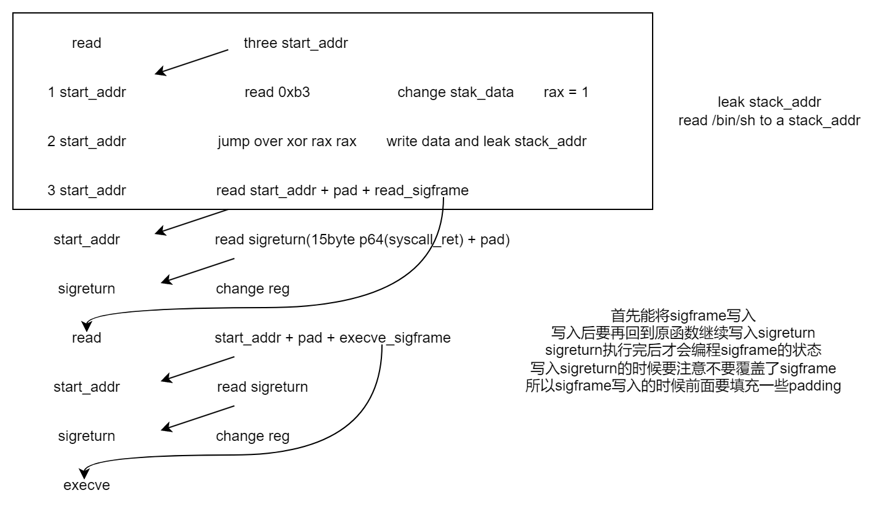

# SROP

## 1.前言

信号是用户态进程与内核进行通信的一种方式，它是陷阱（软中断）的一种

信号类型：Linux系统共定义了64种信号，分为两大类，在终端，可通过`kill -l`查看所有的signal信号：

* 不可靠信号（前32种）：非实时信号，不支持排队，信号可能会丢失
* 可靠信号（后32种）：实时信号，支持排队, 信号不会丢失, 发多少次, 就可以收到多少次

信号抵达进行需要经过两个步骤，一是发送信号，而是接收信号：

* 信号产生的原因：
  * 硬件方式：
    * 用户输入产生signal信号，即外部事件触发的信号（如 I/O 设备、其他进程）。通过 Shell 运行的进程，通过键盘输入 CTRL + C 或 CTRL + Z 可以向进程发送 SIGINT 或 SIGTSTP 信号
    * 硬件异常，CPU检测到内存非法访问等异常，内核检测到错误发送（比如段错误，但并不是所有的错误都会导致信号产生）进而向进程组发送信号
  * 软件方式：通过系统调用主动发送signal信号：kill()，raise()，sigqueue()，alarm()，setitimer()，abort()

* 信号的接收：进程接收到信号后，会根据信号的类型执行默认的行为（终止进程、终止进程并转储、挂起、忽略信号）


一般 64 位系统会用 syscall（陷阱）来传递中断信息，而 32 位系统则会使用 int n（中断）

它们都会把系统调用号装入“rax/eax”寄存器，然后把必要的参数装入其他寄存器

常见的信号：

* 11=SIGSEGV=无效内存访问
* 13=SIGPIPE=管道破损，没有读端的管道写数据
* 15=SIGTERM=终止信号
* 16=SIGSTKFLT=栈溢出
* 31=SIGSYS=系统调用异常


## 2.signal 机制

- 信号发送与进程挂起：当内核向某个进程发送信号时，该进程会被暂时挂起并进入内核态。这是为了处理信号而进行的上下文切换。
- 保存上下文和建立信号栈（Signal Frame）
  - 内核为该进程保存当前的上下文，主要包括将所有寄存器的值压入栈中。
  - 在用户进程的地址空间中，创建一个称为 `Signal Frame` 的结构。这个结构包含了信号信息（`siginfo`）和用户上下文（`ucontext`），以及指向 `sigreturn` 系统调用的地址。
  - 此后，控制流会跳转到事先注册的信号处理函数（`signal handler`），具体怎么处理的我们不用关心。
- 信号处理函数执行：进程执行信号处理函数，处理接收到的信号。函数处理完signal后，栈指针寄存器sp（64位是rsp，32位是esp）会指向进程P之前保存的sigFrame的栈顶，即rt_sigreturn所在的位置，Signal Handler函数最后一个指令是ret，那么就会将栈指针寄存器sp指向的rt_sigreturn中的内容
- 执行 sigreturn 系统调用
  - 为了快捷地切态，`sigreturn` 不会做任何检查
  - 信号处理函数执行完毕后，进程执行 `sigreturn` 系统调用。
  - `sigreturn` 负责恢复之前保存的上下文，包括将所有压入栈中的寄存器值恢复（`pop`）回相应的寄存器
  - 在 32 位系统中，`sigreturn` 的系统调用号是 `119（0x77）`，而在 64 位系统中，系统调用号是 `15（0xf）`, 也就是说我们要控制 rax 的寄存器为该系统调用好，并执行 syscall 函数
- 恢复进程执行：完成上述步骤后，进程继续其正常执行流程。


重点：

* sigreturn：一种系统调用，用于从 ESP 指向的内存中恢复整个寄存器上下文。大规模的读写操作需要更高的权限，所以需要进入 **内核态**，由于恢复的任务比较艰巨，系统干脆提供了一个系统调用 sigreturn
* ucontext：linux 中设计的一种结构体，给用户让渡了一部分控制代码上下文的能力
* siginfo：一种结构体，用于存储信号的信息
* Signal Frame：我们称 ucontext 以及 siginfo 这一段为 Signal Frame 
* 进程发起 signal 后，先会保存上下文并在栈顶添加一个 sigreturn ，然后控制 IP 指针指向 Siganl Handler，程序执行完成后又会还原上下文，最后控制 IP 指针返回
* SROP 的核心就是伪造 Signal Frame，欺骗程序执行我们需要的代码，并且没有验证运行时信号帧是否合法


Signal Frame 是由 ucontext 和 siginfo 组成的区域，signal 中的信息都会存储在这里，其末尾就是 **sigreturn**，可以根据 Signal Frame 在返回原栈帧和原寄存器数据


Signal Frame 的结构在 32 位系统和 64 位系统中有些许不同：

每一次在请求 signal 后，signal handler 执行前，程序都会在栈上构建这个栈帧

如果栈溢出的数据可以覆盖它的话，就可以进行伪造，欺骗程序

* x86_64 Linux 系统的信号帧结构的定义

```c
struct rt_sigframe {
	char __user *pretcode; //保存了信号处理程序的返回地址。处理程序执行完毕后，它将跳转到此字段中的地址。__user 宏表示用户空间中的地址。
	struct ucontext uc;
	struct siginfo info;
	/* fp state follows here */
};
```

* ucontext：结构体 ucontext 用于保存上下文信息，有了它，许多上下文切换的操作都可以完成，linux 也为它提供了一组 api

```c
struct ucontext {
	unsigned long	  uc_flags; //存储指示执行上下文的当前状态的标志
	struct ucontext  *uc_link; //指向执行上下文的指针，当当前上下文完成时，该执行上下文应该恢复，用于上下文切换和线程调度
	stack_t		  uc_stack; //当前信号上下文使用的堆栈
	struct sigcontext uc_mcontext; //执行上下文的机器架构特定快照
	sigset_t	  uc_sigmask;	/* mask last for extensibility */
};
```

```c
typedef struct sigaltstack {
	void __user *ss_sp;
	int ss_flags;
	__kernel_size_t ss_size;
} stack_t;
```

```c
struct sigcontext_32 {
	__u16				gs, __gsh;
	__u16				fs, __fsh;
	__u16				es, __esh;
	__u16				ds, __dsh;
	__u32				di;
	__u32				si;
	__u32				bp;
	__u32				sp;
	__u32				bx;
	__u32				dx;
	__u32				cx;
	__u32				ax;
	__u32				trapno;
	__u32				err;
	__u32				ip;
	__u16				cs, __csh;
	__u32				flags;
	__u32				sp_at_signal;
	__u16				ss, __ssh;
	__u32				fpstate; /* Zero when no FPU/extended context */
	__u32				oldmask;
	__u32				cr2;
};

struct sigcontext_64 {
	__u64				r8;
	__u64				r9;
	__u64				r10;
	__u64				r11;
	__u64				r12;
	__u64				r13;
	__u64				r14;
	__u64				r15;
	__u64				di;
	__u64				si;
	__u64				bp;
	__u64				bx;
	__u64				dx;
	__u64				ax;
	__u64				cx;
	__u64				sp;
	__u64				ip;
	__u64				flags;
	__u16				cs;
	__u16				gs;
	__u16				fs;
	__u16				ss;
	__u64				err;
	__u64				trapno;
	__u64				oldmask;
	__u64				cr2;
	__u64				fpstate; /* Zero when no FPU/extended context */
	__u64				reserved1[8];
};
```

* siginfo

```c
typedef struct {
    int si_signo;// signal number 的简写，该变量用来存储信号编号并且恒有值
    int si_code;// signal code 的简写，可以获取多种变量值
    union sigval si_value;// ignal value 的简写，这个变量是一个结构体
    int si_errno;// 如果该位不为 0，则和信号在一起的有一个错误代码（信号发生错误）
    pid_t si_pid;//	发送该信号的进程 id
    uid_t si_uid;// 发送该信号的用户 id
    void *si_addr;// 错误发生的地址
    int si_status;
    int si_band;
} siginfo_t;
```


## 3.获取 sheel

具体 SROP 操作如下：

- 通过栈溢出劫持返回地址，构造 SROP
- 控制 rax 寄存器为 sigreturn 的系统调用号
- 执行 syscall 进入 sigreturn 系统调用
- 控制栈布局，使 sigreturn 系统调用结束后的 pop 指令能够准确控制各个寄存器成我们想要的值

伪造一个 Signal Frame，如下图所示，这里以 64 位为例子，给出 Signal Frame 更加详细的信息


## 4.调用链

- 控制栈指针
- 把原来 rip 指向的 syscall gadget 换成 syscall; ret gadget

下图所示 ，这样当每次 syscall 返回的时候，栈指针都会指向下一个 Signal Frame。因此就可以执行一系列的 sigreturn 函数调用

也可以类比开启沙箱保护后 ORW 的利用


## 5.SROP 特点

- 依赖系统调用(syscall)强但对 libc.so 的依赖极少，同时还需要能够控制 rax（方法：像 read 函数的返回值就是 rax，可以通过控制输入大小来控制 rax）
- 需要有够大的空间来存放 Signal Frame 的信息（至少 248（0xf8）字节）
- 知道栈地址，从而知道传入'/bin/sh'的地址
- 与其他 rop 相比，对的依赖 gadgets 较少 


## 6.SigreturnFrame 构造

pwntools 中使用 SigreturnFrame()类构造即可

在 payload 构造中利用 bytes(frame)包裹即可

```
from pwn import *

context.arch = "amd64"
syscall_ret = 
sigframe = SigreturnFrame()
sigframe.rax = constants.SYS_execve
sigframe.rdi = 
sigframe.rsi = 
sigframe.rdx = 
sigframe.rcx = 
sigframe.rsp = 
sigframe.rip = syscall_ret

# 32位注意以下几个方面
# 1、上下文初始化
# context.arch = "i386"
# sigframe = SigreturnFrame(kernel="i386")
# 2、sigframe.eax = xx  注意寄存器的名字
# 3、syscall指令在32位下可以找int 0x80
```


## 7.经典题目：360 smallest-pwn

整个程序只有这几行汇编代码

```asm
.text:00000000004000B0 ; signed __int64 start()
.text:00000000004000B0                 public start
.text:00000000004000B0 start           proc near               ; DATA XREF: LOAD:0000000000400018↑o
.text:00000000004000B0                 xor     rax, rax
.text:00000000004000B3                 mov     edx, 400h       ; count
.text:00000000004000B8                 mov     rsi, rsp        ; buf
.text:00000000004000BB                 mov     rdi, rax        ; fd
.text:00000000004000BE                 syscall                 ; LINUX - sys_read
.text:00000000004000C0                 retn
.text:00000000004000C0 start           endp
```

只有 read 的 syscall（rax = 0），通过 read 的大小控制 rax 来实现不同的系统调用，同时还要往内存中写入'/bin/sh'字符串



## 8.syscall 注意点

在程序中有两种 syscall：

一种是 syscall 函数，在 ida 中以以下类似汇编代码出现：也能在 ida 中找到其 plt 表

以 syscall 函数形式出现的 syscall, 传参有所不同，所以遇见的时候需要具体分析


```asm
.text:00000000004013F7 48 8D 45 E0                   lea     rax, [rbp+var_20]
.text:00000000004013FB B9 18 00 00 00                mov     ecx, 18h
.text:0000000000401400 48 89 C2                      mov     rdx, rax
.text:0000000000401403 BE 01 00 00 00                mov     esi, 1
.text:0000000000401408 BF 01 00 00 00                mov     edi, 1                          
.text:000000000040140D B8 00 00 00 00                mov     eax, 0
.text:0000000000401412 E8 49 FC FF FF                call    _syscall
```

另一种是以 syscall 的机器码形式出现的：

```asm
0F 05                         syscall
```

