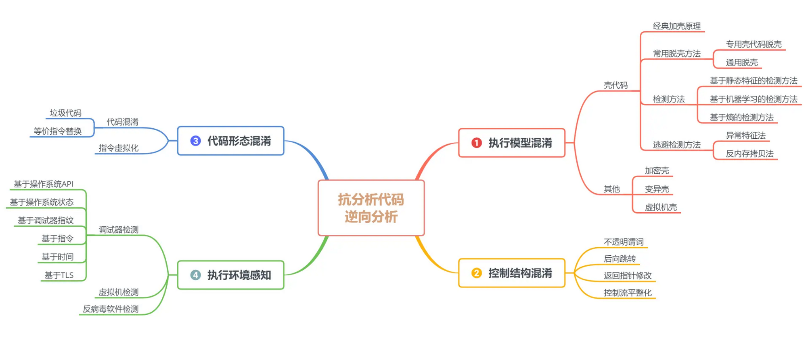
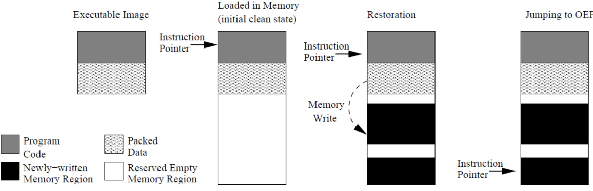

# 抗分析性代码



## 1.执行模型混淆

壳一般指用于对可执行文件的压缩或加密的程序；

加壳、运行时壳 Runtime Packing，是指实施加壳的程序动作；

壳代码一般指加壳后的可执行程序

总之，混淆可以从代码级和机器码级别进行混淆

### 1.1 典型加壳原理

壳工具加壳过程：

* 将原始可执行文件打包成数据
* 生成新的加壳可执行文件
* 将打包数据作为一个数据段
* 生成一个代码段，称为脱壳桩代码 unpacking stub，用于释放打包数据。由脱壳桩代码负责解压，从原始入口点 Original Entry Point 开始执行。

壳代码运行过程：



* 点击运行，进入脱壳桩代码
* 脱壳桩代码保存内存执行现场，主要是寄存器和栈
* 将原始数据释放到内存对应的数据段和代码段
* 建立原始程序的动态属性：如动态链接库、导入表等
* 恢复内存执行现场
* 长跳转到原始入口点 OEP（Original Entry Point），开始原始程序的执行


## 2.控制结构混淆

线性反汇编 Linear disassembly：

* 逐条指令反汇编，线性顺序，直至结束
* obidump

递归下降反汇编 Flow-Oriented disassembly：

* 分支目标地址优先反汇编
* 在反汇编的过程中，记录指令的目标地址，并优先从目标地址开始反汇编。比如记录 jump、call 等的目标地址，构成列表
* 商用反汇编器大都采用这种反汇编算法，如 IDA pro， od
* 需要精心处理代码边界，使用多种启发式策略

### 2.1 不透明谓词/指令替换

Opaque predicates

添加隐晦的判断谓词，增加控制结构的复杂度。是在野恶意代码最常使用的方法

例 1：将无条件跳转分支转变为两个有条件跳转分支，而 IDA 总是优先处理 false 分支

例 2：语义上确保总是跳转到有条件跳转分支

```asm
xor eax.eax 
jz short loc_401497
```

### 2.2 向后跳转

跳转到某条指令的中间位置继续执行，而不是边界处

### 2.3 返回指针修改


### 2.4 伪造控制流

构造出根本不会去真正执行的控制流， 从而在静态分析时， 会对分析形成强烈的干扰， 增加逆向人员的分析工作量。

### 2.5 控制流平坦化

Control Flow Flattening，就是将程序原有的顺序、选择、循环结构统一重构为 Switch 结构，使得程序的结构图从原有正常形态转变为扁平状


## 3.代码形态混淆

### 3.1 常量展开

* 编译时会将常量表达式替换成常量值

* 在指令级展开常量

  ```asm
  push 2
  等同于
  push 1 
  inc dword ptr [esp],1
  ```

  

3.2 模式替换

使用语义完全相等的指令序列互换

3.3 死代码插入

3.4 垃圾字节代码

##### 标识符重命名

将代码中的各种元素， 如变量、 函数、 类的名字改写成无意义的名字， 比如改写成单个字母或者数字， 又或者字母和数字的组合等， 使得阅读的人无法根据名字猜测其用途。

##### － 等价表达式

重写代码中的部分逻辑， 将其变成功能上等价， 但是更难理解的形式， 比如将循环改成递归， 精简中间变量等。

##### － 代码重排

打乱原有代码格式， 比如将多行代码挤到一行代码中。

##### － 花指令

通过构造字节码插入程序的适当位置， 使得反汇编器出错， 产生无法反编译或者反编译出错的情况。

##### － 自解密

通过对程序部分进行加密， 在即将运行时代码进行自解 密， 然后执行解密之后的代码


VMProtect

 VMP 能够实现代码虚拟化，将部分或者全部代码使用 VMP 混淆，将该部分代码转换为自身才能解释执行的代码，按照 VMP 自身实现的虚拟机架构去解释执行


## 4.执行环境监测

### 4.1 调试器监测

原理：恶意代码通过检测当前执行环境是否处于调试状态，实现调试器检测与逃避

意义：阻碍代码的动态分析

常用方法：

* 基于 Windows API 的调试器检测
  * IsDebuggerPresent，通过 PEB (Process Environment Block)结构的标志位
  * CheckRemoteDebuggerPresent，检测本地机器中其他进程是否被调试
  * NtQueryInformationProcess，可用于调试器检测
  * OutputDebugString，向调试器发送一个字符串用于展示，OllyDBG 的格式字符串漏洞
* 基于操作系统状态的调试器检测
  * 检查是否被调试的状态，PEB 结构偏移 0x02 处为是否被调试的标志位，在 x86 结构下，fs: [30h] 指向 PEB 的首地址
  * 检查 ProcessHeap 标志，该标志位于 PEB 偏移 0x18 处
  * 检查 NTGlobal 标志，该标志位于 PEB 偏移 0x68 处
* 基于调试器指纹的调试器检测
* 基于指令的调试器检测
* 基于时间的调试器检测
* 基于 TLS 回调函数的调试器检测

### 4.2 虚拟机监测

### 4.3 反病毒软件监测
