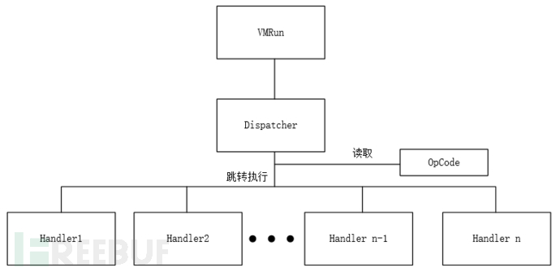

# VM逆向

## 1.基本介绍

VM逆向不是指VMware或VirtualBox一类的虚拟机，而是一种解释执行系统或者模拟器（Emulator）。逆向中的虚拟机保护是一种基于虚拟机的代码保护技术。它将基于x86汇编系统中的可执行代码转换为字节码指令系统的代码，来达到不被轻易逆向和篡改的目的。简单点说就是将程序的代码转换自定义的操作码(opcode)，然后在程序执行时再通过解释这些操作码，选择对应的函数执行，从而实现程序原有的功能。也就是说程序所要执行的有意义的代码没有直接显露出来，我们需要通过分析将拆分了的代码重新拼接起来具有可读性才能知道程序到底执行了什么。

* vm_start：虚拟机的入口函数，对虚拟机环境进行初始化
* vm_dispatcher:调度器，解释opcode，并选择对应的handle函数执行，当handle执行完后会跳回这里，形成一个循环。
* opcode :程序可执行代码转换成的操作码
* handler：各种功能对象模块

在这种情况下，如果要逆向程序，就需要对整个emulator结构进行逆向，理解程序功能，还需要结合opcode进行分析



## 2.逆向分析

解题一般步骤：

* 分析VM结构->分析opcode->编写parser->re算法

VM结构常见类型：

* 基于栈、基于队列、基于信号量

opcode：

* 与VM数据结构对应的指令 ：push pop
* 运算指令：add、sub、mul


## 3.简单实现

简单实现vm虚拟机代码：

主要是要定义一套opcode并实现opcode的解释器（对opcode进行解释，从而选择对应的handle函数执行）

```c
#include<stdio.h>
#include<stdlib.h>
#include<string.h>
#include<unistd.h>

#define OPCODE_N 7
#define F_LEN 12


// FLAG:1ds8i0*qA0-0

char *vm_stack;
char enc_flag[] = {0x23, 0x76, 0x61, 0x2a, 0x7b, 0x22, 0x38, 0x63, 0x53, 0x22, 0x3f, 0x22};

enum regist{

    R1 = 0xe1,
    R2 = 0xe2,
    R3 = 0xe3,

};

enum opcodes
{
    MOV = 0xf1,
    XOR = 0xf2,
    RET = 0xf4,
    READ = 0xf5,
};


//f1 mov ; f2 xor ; f4 ret ; f5 read
unsigned char vm_code[] = {
    0xf5, // read
    0xf1,0xe1,0x0,0x00,0x00,0x00, // mov r1,vm_stack+0x0
    0xf2, // r1 = r1 xor r2 xor 0x12
    0xf1,0xe4,0x20,0x00,0x00,0x00, //mov r1,0x20 实际是将r1的值送到vm_stack+0x20的位置
    0xf1,0xe1,0x1,0x00,0x00,0x00,   
    0xf2,   
    0xf1,0xe4,0x21,0x00,0x00,0x00,  
    0xf1,0xe1,0x2,0x00,0x00,0x00,   
    0xf2,   
    0xf1,0xe4,0x22,0x00,0x00,0x00,  
    0xf1,0xe1,0x3,0x00,0x00,0x00,
    0xf2,
    0xf1,0xe4,0x23,0x00,0x00,0x00,
    0xf1,0xe1,0x4,0x00,0x00,0x00,
    0xf2,
    0xf1,0xe4,0x24,0x00,0x00,0x00,
    0xf1,0xe1,0x5,0x00,0x00,0x00,
    0xf2,
    0xf1,0xe4,0x25,0x00,0x00,0x00,
    0xf1,0xe1,0x6,0x00,0x00,0x00,
    0xf2,
    0xf1,0xe4,0x26,0x00,0x00,0x00,
    0xf1,0xe1,0x7,0x00,0x00,0x00,
    0xf2,
    0xf1,0xe4,0x27,0x00,0x00,0x00,
    0xf1,0xe1,0x8,0x00,0x00,0x00,
    0xf2,
    0xf1,0xe4,0x28,0x00,0x00,0x00,
    0xf1,0xe1,0x9,0x00,0x00,0x00,
    0xf2,
    0xf1,0xe4,0x29,0x00,0x00,0x00,
    0xf1,0xe1,0xa,0x00,0x00,0x00,
    0xf2,
    0xf1,0xe4,0x2a,0x00,0x00,0x00,
    0xf1,0xe1,0xb,0x00,0x00,0x00,
    0xf2,
    0xf1,0xe4,0x2b,0x00,0x00,0x00,
    0xf1,0xe1,0xc,0x00,0x00,0x00,
    0xf2,
    0xf1,0xe4,0x2c,0x00,0x00,0x00,
    0xf4
};

/*
    call read_
    MOV R1,flag[0]
    XOR
    MOV R1,0x20;
    MOV R1,flag[1]
    XOR
    MOV R1,0x21;
    MOV R1,flag[2]
    XOR
    MOV R1,0x22
    MOV R1,flag[3]
    XOR
    MOV R1,0x23;
    MOV R1,flag[4]
    XOR
    MOV R1,0x24;
    MOV R1,flag[5]
    XOR
    MOV R1,0x25;
    MOV R1,flag[6]
    XOR
    MOV R1,0x26;
    MOV R1,flag[7]
    XOR
    MOV R1,0x26
    MOV R1,flag[8]
    XOR
    MOV R1,0X27
    MOV R1,flag[9]
    XOR
    MOV R1,0x28
    MOV R1,flag[10]
    XOR
    MOV R1,0X29
    MOV R1,flag[11]
    XOR
    MOV R1,0x2A
    MOV R1,flag[12]
    XOR   
    MOV R1,0x2B
    MOV R1,flag[13]
    RET ; over
*/  

typedef struct
{
    unsigned char opcode;
    void (*handle)(void *);

}vm_opcode;

typedef struct vm_cpus
{
    int r1;	
    int r2;	
    int r3;	
    unsigned char *eip;	
    vm_opcode op_list[OPCODE_N];	//opcode list, store opcode and handle

}vm_cpu;


void mov(vm_cpu *cpu);      //change flag position
void xor(vm_cpu *cpu);      //xor flag , 0x1-0x9
void read_(vm_cpu *cpu);    //call read ,read the flag


void xor(vm_cpu *cpu)
{  
    int temp;
    temp = cpu->r1 ^ cpu->r2;
    temp ^= 0x12;
    cpu->r1 = temp;
    cpu->eip +=1;                //xor指令占一个字节             
}

void read_(vm_cpu *cpu)
{

    char *dest = vm_stack;
    read(0,dest,12);           //用于往虚拟机的栈上读入数据
    cpu->eip += 1;            //read_指令占一个字节  
}

void mov(vm_cpu *cpu)
{
    // mov指令的参数都隐藏在字节码中，指令表示后的一个字节是寄存器标识，第二到第五是要mov的数据在vm_stack上的偏移
    // 这里只是实现了从vm_stack上取数据和存数据到vm_stack上
    unsigned char *res = cpu->eip + 1;  //寄存器标识
    int *offset = (int *) (cpu->eip + 2);    //数据在vm_stack上的偏移
    char *dest = 0;
    dest = vm_stack;


    switch (*res) {
        case 0xe1:
            cpu->r1 = *(dest + *offset);
            break;    

        case 0xe2:
            cpu->r2 = *(dest + *offset);
            break;    

        case 0xe3:
            cpu->r3 = *(dest + *offset);
            break;    
        case 0xe4:
            {
                int x = cpu->r1;
                *(dest + *offset) = x;
                break;

            }
    }    

    cpu->eip += 6;
    //mov指令占六个字节，所以eip要向后移6位
}    

void vm_init(vm_cpu *cpu)	
{
    cpu->r1 = 0;
    cpu->r2 = 0;
    cpu->r3 = 0;
    cpu->eip = (unsigned char *)vm_code;

    cpu->op_list[0].opcode = 0xf1;
    cpu->op_list[0].handle = (void (*)(void *))mov;

    cpu->op_list[1].opcode = 0xf2;
    cpu->op_list[1].handle = (void (*)(void *))xor;

    cpu->op_list[2].opcode = 0xf5;
    cpu->op_list[2].handle = (void (*)(void *))read_;

    vm_stack = malloc(0x512);
    memset(vm_stack,0,0x512);
}

void vm_dispatcher(vm_cpu *cpu)
{
    int i;
    for(i=0 ; i < OPCODE_N ; i++)
    {
        if(*cpu->eip == cpu->op_list[i].opcode)	
        {
            cpu->op_list[i].handle(cpu);
            break;
        }
    }

}

void vm_start(vm_cpu *cpu)
{

    cpu->eip = (unsigned char*)vm_code;
    while((*cpu->eip)!= RET)
    {
        vm_dispatcher(cpu);
    }

}

void check()
{
    int i;
    char *target = vm_stack;
    for(i = 0; i < F_LEN; i++)
    {
        int offset = i + 0x20;
        if((char)target[offset] != enc_flag[i])
        {
            puts("error");
            exit(0);
        }
        else
        {
            continue;
        }

    }
    puts("right");
    exit(0);
}

int main()
{
    vm_cpu *cpu={0};
    puts("power by zs0zrc");
    puts("---------------------");
    puts("please input the flag:");
    vm_init(&cpu);
    vm_start(&cpu);
    check();
    return 0;
}
```

exp：

```python
flag = ''
middle = 0 ^ 0x12 # 18
enc_flag= [0x23, 0x76, 0x61, 0x2a, 0x7b, 0x22, 0x38, 0x63, 0x53, 0x22, 0x3f,0x22]
for i in range(len(enc_flag)):
    f = enc_flag[i] ^ middle
    flag += chr(f)
print(flag)
```

