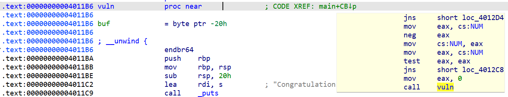

# IDA

## 1.反汇编视图 IDA View-A

* 是主要的数据视图，有两种不同的形式：
  * 图形视图（默认）
  * 列表视图（使用 `space` 键切换） 
* 图形视图：将一个函数分解成了许多基本块
  * 绿色箭头：分支 yes
  * 红色箭头：分支 no
  * 蓝色箭头：执行下一个基本块，顺序执行
  * `ctrl+鼠标滚轮`：调整图形大小
* 列表视图：
  * 左边的窗口箭头：
    * 实线：非条件跳转
    * 虚线：条件跳转
    * 粗线（实/虚）：逆向流程（循环）
* 可创建其他的反汇编窗口帮助分析

## 2.桌面使用技巧

* View-> Open Subviews 恢复无意关闭的数据窗口
* Window-> Reset Desktop 将桌面恢复原始布局
* Windows-> Save Desktop 保存桌面布局
* Windows-> Load Desktop 打开之前保存的一个桌面布局

## 3.假名字

- sub_ 指令和子函数起点
- locret_ 返回指令 
- loc_ 指令
- off_ 数据，包含偏移量
- seg_ 数据，包含段地址值
- asc_ 数据，ASCII 字符串
- byte_ 数据，字节（或字节数组）
- word_ 数据，16 位数据（或字数组）
- dword_ 数据，32 位数据（或双字数组）
- qword_ 数据，64 位数据（或 4 字数组）
- flt_ 浮点数据，32 位（或浮点数组）
- dbl_ 浮点数，64 位（或双精度数组）
- tbyte_ 浮点数，80 位（或扩展精度浮点数）
- stru_ 结构体(或结构体数组)
- algn_ 对齐指示
- unk_ 未处理字节

- LOWORD()得到一个 32bit 数的低 16bit 
- HIWORD()得到一个 32bit 数的高 16bit
- LOBYTE()得到一个 16bit 数最低（最右边）那个字节
- HIBYTE()得到一个 16bit 数最高（最左边）那个字节

## 4.交叉引用

两种基本的交叉引用 xref：

* 代码交叉引用
* 数据交叉引用

* CODE XREF：代码交叉引用
* main+CB：交叉引用的源地址
* ↓p：引用位置的相对方向

### 4.1 代码交叉引用

代码交叉引用用于一条指令将控制权转交给另一条指令，在 IDA 里也称之为流（flow），同时又分为三种基本的流：

* 普通流：是一种最简单的流，表示从一条指令到另一条指令的顺序流，这是默认的执行流，没有特殊的显示标志
* 跳转流：每个无条件分支指令和条件分支指令，后缀 `j` (jump)
* 调用流：call 指令, 由函数调用导致的交叉引用用后缀 `p` (procedure)

### 4.2 数据交叉引用

数据交叉引用用于跟踪二进制文件访问数据的方式

* 读取交叉引用：访问的是某个内存位置的内容，后缀 `r`
* 写入交叉引用：指出了修改变量内容的位置，后缀 `w`
* 偏移量交叉引用：引用某个位置的地址，后缀 `o`

## 5.快捷键

* `space`：在 IDA View 窗口切换视图
* `shift+F2`：脚本
* `Shift+E`：提取数据
* `F5`：汇编代码转成 C 代码
* `/`，`;`：添加注释
* `Ctrl+W`：保存数据库
* `Ctrl+Shift+W`：唤起 IDB 快照窗口
* `Ctrl+Shift+T`：唤出 IDB 快照弹窗

search:

* `shift+F12`：打开 string 窗口
* `ALT+T`：子字符串搜索，`CTRL+T` 可匹配下一个
* `ALT+B`：二进制搜索（十六进制应每两位一个空格），`CTRL+B` 可匹配下一个

jump：

* `G`：跳转到指定虚拟地址
* `Esc`：在 IDA View 窗口相当于后退，其他窗口相当于关闭窗口
* `CTRL+L`：名字选择器
* `CTRL+P`：函数选择器
* `CTRL+S`：段选择器
* `x`：查看某个变量或函数的交叉引用
* `Alt+M`：标记
* `CTRL+M`：跳转到标记

edit:

* `C`：将数据转化为指令

* `D`：将指令转化为数据

* `N`：更改某个变量或函数的名称

* `R`：将选中的数字转换为相应的 ASCII 字符

* `A`：将选中的数字转换为相应的字符串

other：

* 快速导航菜单：Windows 上按住 `Alt` 键（或启用一个系统选项），就能看到菜单选项名称下面的下划线
* 命令选项板：默认快捷方式为`Ctrl`–`Shift`–`P`

## 6.结构体

先在 structure 中添加一个空白的结构体，然后在，local type 中用 c 代码写好结构体的定义
