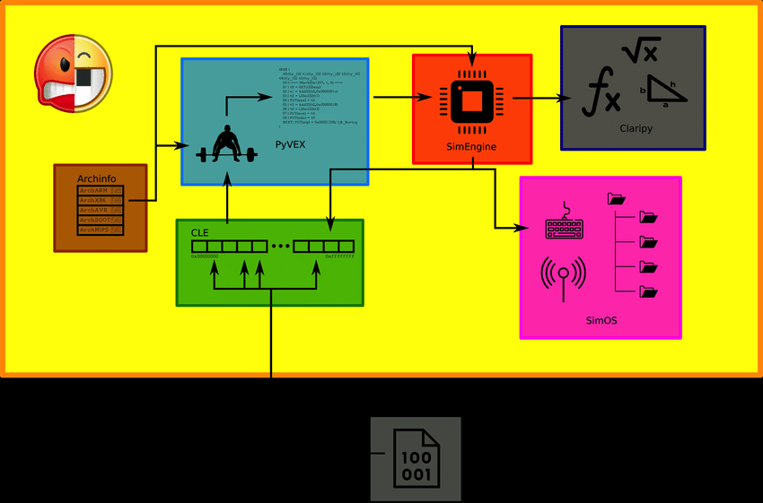

# angr

> [angr](https://github.com/angr/angr) 是一个使用 Python 编写的跨平台开源二进制混合执行引擎，实现了程序插桩、符号执行等二进制分析技术
>
> 程序插桩是在在不改变程序原有逻辑的前提下，向程序代码中添加额外的代码片段，这些额外的代码的主要目的是收集程序运行时的详细信息，以便于分析、测试、调试或性能监控，辅助分析代码覆盖率、热点代码片段，甚至发现内存泄漏等安全漏洞
>
> 符号执行就是在运行程序时，用符号来替代真实值。符号执行相较于真实值执行的优点在于，当使用真实值执行程序时，我们能够遍历的程序路径只有一条，而使用符号进行执行时，由于符号是可变的，我们就可以利用这一特性，尽可能的将程序的每一条路径遍历，这样的话，必定存在至少一条能够输出正确结果的分支，每一条分支的结果都可以表示为一个离散关系式，使用约束求解引擎即可分析出正确结果。


## 1.angr概述

- angr功能：
  - 控制流图恢复
  - 符号执行
  - 使用angrop自动构建ROP链
  - 使用patcherex自动进行二进制强化
  - 使用rex自动生成漏洞利用程序（用于DECREE和简单的Linux二进制程序）
  - 使用angr-management（一个angr的GUI）来分析二进制程序
- angr构成（模块）
  - 可执行文件和库的加载器：CLE(CLE Load Everything) 负责装载二进制对象以及它所依赖的库，将自身无法执行的操作转移给angr的其它组件，最后生成地址空间，表示该程序已加载并可以准备运行。
  - 描述各种架构的库：archinfo
  - 关于二进制代码转换VEX的python包装器 ：PyVEX（angr需要处理不同的架构，所以它选择一种中间语言来进行它的分析，angr使用Valgrind的中间语言——VEX来完成这方面的内容。VEX中间语言抽象了几种不同架构间的区别，允许在他们之上进行统一的分析）
  - 中间语言VEX执行的模拟器：SimuVEX，它允许你控制符号执行
  - 抽象的约束求解包装器：Claripy（大部分用法和Z3类似）这个模块主要专注于将变量符号化，生成约束式并求解约束式，这也是符号执行的核心所在。
  - 程序分析套件：angr（上层封装好的接口）



## 2.顶层接口

Project类是angr的主类，也是angr的开始，通过初始化该类的对象，可以将你想要分析的二进制文件加载进来

```python
import angr
proj = angr.Project('./test')
```

使用angr时最重要的就是效率问题，少加载一些无关结果的库能够提升angr的效率，如下：

```python
proj = angr.Project('/bin/true', auto_load_libs=False)
```

Project的基本属性：

* arch：程序指令架构
* entry：入口点
* filename：程序绝对路径


## 3.加载器

CLE的结果叫做加载器（loader），在Project类的属性`.loader` 中可用

```python
In [7]: proj.loader
Out[7]: <Loaded 0_angr_find, maps [0x8048000:0x8607fff]>
 
In [8]: proj.loader.shared_objects
Out[8]:
OrderedDict([('00_angr_find',
              <ELF Object 0_angr_find, maps [0x8048000:0x804a03f]>),
             ('libc.so.6',
              <ELF Object libc-2.31.so, maps [0x8100000:0x82edf0b]>),
             ('ld-linux.so.2',
              <ELF Object ld-2.31.so, maps [0x8300000:0x832c987]>),
             ('extern-address space',
              <ExternObject Object cle##externs, maps [0x8400000:0x8407fff]>),
             ('cle##tls',
              <ELFTLSObjectV2 Object cle##tls, maps [0x8500000:0x8514807]>)])
 
In [9]: proj.loader.min_addr
Out[9]: 0x8048000
 
In [10]: proj.loader.max_addr
Out[10]: 0x8607fff
 
In [11]: proj.loader.main_object # 加载了多个二进制程序，这是主对象
Out[11]: <ELF Object 0_angr_find, maps [0x8048000:0x804a03f]>
 
In [12]: proj.loader.main_object.execstack # 查询主对象是否开启了NX
Out[12]: False
 
In [13]: proj.loader.main_object.pic # 查询主对象是否开启了PIC
Out[13]: False
```

`project.factory` 为我们提供了一些实用的类的构造器，angr 以**基本块为单位分析代码**，可以通过 `project.factory.block(address)` 获取给定地址所在的基本块，一个 Block 类实例

```python
In [14]: block = proj.factory.block(proj.entry) # 从程序的入口处提取一个代码块
 
In [15]: block.pp() # 打印反汇编代码
0x8048450:    xor    ebp, ebp
0x8048452:    pop    esi
0x8048453:    mov    ecx, esp
0x8048455:    and    esp, 0xfffffff0
0x8048458:    push    eax
0x8048459:    push    esp
0x804845a:    push    edx
0x804845b:    push    0x8048710
0x8048460:    push    0x80486b0
0x8048465:    push    ecx
0x8048466:    push    esi
0x8048467:    push    0x80485c7
0x804846c:    call    0x8048420
 
In [16]: block  # 查看block对象
Out[16]: <Block for 0x8048450, 33 bytes>
 
In [17]: block.instructions # 块里有多少条指令
Out[17]: 0xd
 
In [18]: block.instruction_addrs # 块里所有指令对应的地址
Out[18]:
[0x8048450,
 0x8048452,
 0x8048453,
 0x8048455,
 0x8048458,
 0x8048459,
 0x804845a,
 0x804845b,
 0x8048460,
 0x8048465,
 0x8048466,
 0x8048467,
 0x804846c]
```


## 3.模拟执行

Project实际上只是将二进制文件加载进来了，要执行它，实际上是对SimState对象进行操作，它是程序的状态

创建状态：

```python
state = proj.factory.entry_state() #初始化状态为程序运行到程序入口点处的状态
state = proj.factory.blank_state(0xdeadbeef) #大多数数据都没有初始化，状态中下一条指令为addr处的指令
```

- `state.regs`：寄存器状态组，其中每个寄存器都为一个 *位向量* （BitVector），可以通过寄存器名称来访问对应的寄存器（例如 `state.regs.esp -= 12` ）。
- `state.mem`：该状态的内存访问接口，我们可以直接通过 `state.mem[addr].type` 完成内存访问（例如 `state.mem[0x1000].long = 4` ，对于读而言还需指定 `.resolved` 或 `.concrete` 表示位向量或是实际值，例如 `state.mem[0x1000].long.concrete`）。
- `state.memory`：另一种形式的内存访问接口：
- `state.memory.load(addr, size_in_bytes)` ：获取该地址上指定大小的位向量。
- `state.memory.store(addr, bitvector)` ：将一个位向量存储到指定地址。
- `state.posix`：POSIX 相关的环境接口，例如 `state.posix.dumps(fileno)` 获取对应文件描述符上的流。

上述state方式只是预设了程序开始分析时的状态，要分析程序就必须要让它到达下一个状态，这就需要模拟管理器

```python
simgr = p.factory.simgr(state)
```

SM常用技术：

* `simgr.step()`：**以基本块为单位**的单步执行。
* `simgr.explore()`：进行路径探索找到满足相应条件的状态，explore有如下参数：
  * find：传入目标指令的地址或地址列表，或者一个用于判断的函数，函数以state为形参，返回布尔值
  * avoid：传入要避免的指令的地址或地址列表，或者一个用于判断的函数，用于减少路径
  * explorer找到的符合find的状态会被保存在simgr.found这个列表当中，可以遍历其中元素获取状态，若无法找到则该列表为空。