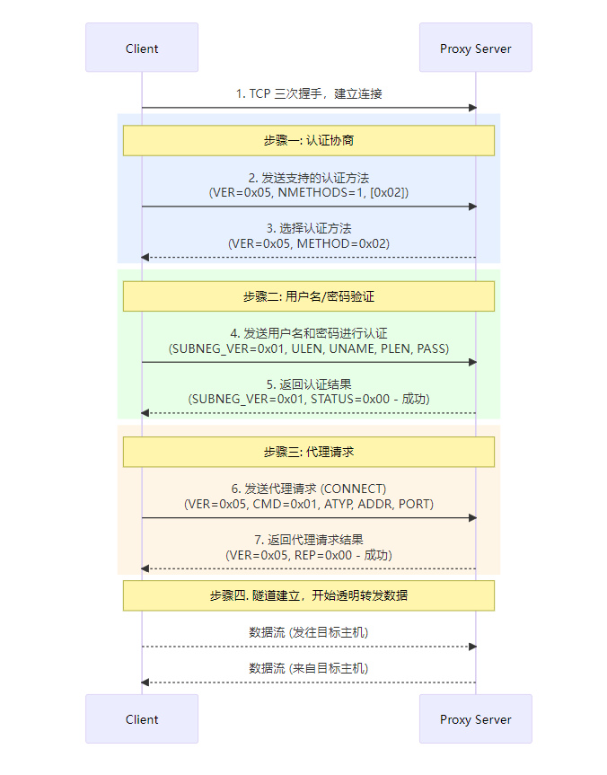

# socks5

## 1.工作原理

socks5 协议工作原理：

- 首先客户端向代理服务器发出请求信息，用以协商版本和认证方法。随后代理服务器应答，将选择的方法发送给客户端
- 客户端和代理服务器进入由选定认证方法所决定的子协商过程，子协商过程结束后，客户端发送请求信息，其中包含目标服务器的 IP 地址和端口。代理服务器验证客户端身份，通过后会与目标服务器连接，目标服务器经过代理服务器向客户端返回状态响应
- 连接完成后，代理服务器开始作为中转站中转数据


## 2.具体流程

客户端发起请求：

- VER：协议版本，socks5 为 0x05
- NMETHODS：支持认证的方法数量
- METHODS：对应 NMETHODS，NMETHODS 的值为多少，METHODS 就有多少个字节

```
+----+----------+----------+
|VER | NMETHODS | METHODS  |
+----+----------+----------+
| 1  |    1     | 1 to 255 |
+----+----------+----------+
```

socks5 服务器选中一个 METHOD 返回给客户端：定义的 METHOD 为 0x00 表示无需认证，0x02 表示用户名/密码认证

```
+----+--------+
|VER | METHOD |
+----+--------+
| 1  |   1    |
+----+--------+
```

接下来是认证协商（属于可选项），客户端向 socks5 服务器发起认证请求：

- VER: 版本，通常为 0x01
- ULEN: 用户名长度
- UNAME: 对应用户名的字节数据
- PLEN: 密码长度
- PASSWD: 密码对应的数据

```
+----+------+----------+------+----------+
|VER | ULEN |  UNAME   | PLEN |  PASSWD  |
+----+------+----------+------+----------+
| 1  |  1   | 1 to 255 |  1   | 1 to 255 |
+----+------+----------+------+----------+
```

socks5 服务器收到客户端的认证请求后，解析内容，验证信息是否合法，然后给客户端响应结果：STATUS 字段如果为 0x00 表示认证成功，其他的值为认证失败

```
+----+--------+
|VER | STATUS |
+----+--------+
| 1  |   1    |
+----+--------+
```

顺利通过协商阶段后，客户端向 socks5 服务器发起请求:

- VER 版本号，socks5 的值为 0x05
- CMD
  - 0x01 表示 CONNECT 请求
  - 0x02 表示 BIND 请求
  - 0x03 表示 UDP 转发
- RSV 保留字段，值为 0x00
- ATYP 目标地址类型，DST.ADDR 的数据对应这个字段的类型。
  - 0x01 表示 IPv4 地址，DST.ADDR 为 4 个字节
  - 0x03 表示域名，DST.ADDR 是一个可变长度的域名，这种情况下 DST.ADDR 的第一个字节表示域名长度，剩下部分是域名内容
  - 0x04 表示 IPv6 地址，DST.ADDR 为 16 个字节长度
- DST.ADDR 一个可变长度的值
- DST.PORT 目标端口，固定 2 个字节

```
+----+-----+-------+------+----------+----------+
|VER | CMD |  RSV  | ATYP | DST.ADDR | DST.PORT |
+----+-----+-------+------+----------+----------+
| 1  |  1  | X'00' |  1   | Variable |    2     |
+----+-----+-------+------+----------+----------+
```

socks5 服务器收到客户端的请求后，需要返回一个响应：

- VER socks 版本，这里为 0x05
- REP Relay field, 内容取值如下
  - X’00’ succeeded
  - X’01’ general SOCKS server failure
  - X’02’ connection not allowed by ruleset
  - X’03’ Network unreachable
  - X’04’ Host unreachable
  - X’05’ Connection refused
  - X’06’ TTL expired
  - X’07’ Command not supported
  - X’08’ Address type not supported
  - X’09’ to X’FF’ unassigned
- RSV 保留字段
- ATYPE 同请求的 ATYPE
- BND.ADDR 服务绑定的地址
- BND.PORT 服务绑定的端口 DST.PORT

```
+----+-----+-------+------+----------+----------+
|VER | REP |  RSV  | ATYP | BND.ADDR | BND.PORT |
+----+-----+-------+------+----------+----------+
| 1  |  1  | X'00' |  1   | Variable |    2     |
+----+-----+-------+------+----------+----------+
```

完整流程：

```
客户端                         代理服务器
   |--------------------------------->|   TCP 连接建立 (三次握手)
   |  支持的认证方法列表                 |
   |  VER=0x05, NMETHODS=1, [0x02]    |   (0x02 = 用户名/密码)
   |--------------------------------->|
   |                                  |
   |                选择认证方式        |
   |<---------------------------------|
   |           VER=0x05, METHOD=0x02  |
   |                                  |
   |  发送用户名密码认证请求           	  |
   |  VER=0x01, ULEN, UNAME, PLEN,    |
   |  PASS                            |
   |--------------------------------->|
   |                                  |
   |           验证成功/失败            |
   |<---------------------------------|
   |        VER=0x01, STATUS=0x00     | (0x00 = 成功)
   |                                  |
   |  发送代理请求 (CONNECT 命令)		  |
   |  VER=0x05, CMD=0x01, ATYP, ADDR, |
   |  PORT                            |
   |--------------------------------->|
   |                                  |
   |        返回请求结果 (成功/失败) 	  |
   |<---------------------------------|
   |  VER=0x05, REP=0x00 (成功)   	  |
   |                                  |
   |========= 建立隧道，传输数据 ========|
   | <------ 客户端与目标主机通信 ------>|
   |      (代理只转发数据，不再认证)      |
```




### 3.C 实现

```c
// gcc -o socks5 socks5.c -lpthread
// curl --proxy "socks5://user: pass@your.proxy.host: 1080" https://ifconfig.me
#include <stdio.h>
#include <stdlib.h>
#include <string.h>
#include <unistd.h>
#include <sys/socket.h>
#include <netinet/in.h>
#include <arpa/inet.h>
#include <pthread.h>
#include <errno.h>
#include <netdb.h>
#include <sys/select.h>
#include <signal.h>
#include <time.h>
#include <sys/time.h>
#include <fcntl.h>

#define SOCKS5_VERSION 0x05
#define METHOD_NO_AUTH 0x00
#define METHOD_PASSWORD 0x02
#define METHOD_NOT_ACCEPTABLE 0xFF

#define CMD_CONNECT 0x01
#define CMD_BIND 0x02
#define CMD_UDP_ASSOCIATE 0x03

#define ATYP_IPV4 0x01
#define ATYP_DOMAINNAME 0x03
#define ATYP_IPV6 0x04

#define REP_SUCCESS 0x00
#define REP_GENERAL_FAILURE 0x01
#define REP_CONNECTION_NOT_ALLOWED 0x02
#define REP_NETWORK_UNREACHABLE 0x03
#define REP_HOST_UNREACHABLE 0x04
#define REP_CONNECTION_REFUSED 0x05
#define REP_TTL_EXPIRED 0x06
#define REP_COMMAND_NOT_SUPPORTED 0x07
#define REP_ADDRESS_TYPE_NOT_SUPPORTED 0x08

#define AUTH_VERSION 0x01
#define AUTH_SUCCESS 0x00
#define AUTH_FAILURE 0x01

#define BUFFER_SIZE 4096
#define MAX_ALLOWED_SUBNETS 256
#define MAX_USERNAME_LEN 32
#define MAX_PASSWORD_LEN 32
#define MAX_CLIENTS 1000
#define MAX_DOMAIN_LEN 255
#define CONNECT_TIMEOUT 10
#define TRANSFER_TIMEOUT 300
#define RECV_TIMEOUT 30

static volatile sig_atomic_t server_running = 1;
static int server_fd = -1;

typedef struct {
    const char *username;
    const char *password;
} User;

User allowed_users[] = {
    {"admin", "admin@password123"},
    {NULL, NULL}
};

typedef struct {
    int active_connections;
    pthread_mutex_t mutex;
} ConnectionPool;

static ConnectionPool conn_pool = {0, PTHREAD_MUTEX_INITIALIZER};

typedef struct {
    int port;
    int require_auth;
    int max_connections;
    int connect_timeout;
    int transfer_timeout;
    char *log_file;
} ServerConfig;

static ServerConfig g_config = {
    .port = 1080,
    .require_auth = 1,
    .max_connections = MAX_CLIENTS,
    .connect_timeout = CONNECT_TIMEOUT,
    .transfer_timeout = TRANSFER_TIMEOUT,
    .log_file = NULL
};

char *allowed_subnets[MAX_ALLOWED_SUBNETS] = {
    NULL
};

int set_socket_timeout(int fd, int timeout_sec) {
    struct timeval timeout;
    timeout.tv_sec = timeout_sec;
    timeout.tv_usec = 0;
    
    if (setsockopt(fd, SOL_SOCKET, SO_RCVTIMEO, &timeout, sizeof(timeout)) < 0) {
        return -1;
    }
    if (setsockopt(fd, SOL_SOCKET, SO_SNDTIMEO, &timeout, sizeof(timeout)) < 0) {
        return -1;
    }
    return 0;
}

ssize_t safe_recv(int fd, void *buf, size_t len, int timeout_sec) {
    struct timeval tv;
    tv.tv_sec = timeout_sec;
    tv.tv_usec = 0;
    
    fd_set readfds;
    FD_ZERO(&readfds);
    FD_SET(fd, &readfds);
    
    int ret = select(fd + 1, &readfds, NULL, NULL, &tv);
    if (ret <= 0) {
        return -1;
    }
    
    size_t total = 0;
    while (total < len) {
        ssize_t n = recv(fd, (char*)buf + total, len - total, 0);
        if (n <= 0) {
            return n;
        }
        total += n;
    }
    return total;
}

ssize_t send_all(int fd, const void *buf, size_t len, int flags) {
    size_t total_sent = 0;
    const char *ptr = (const char *)buf;

    while (total_sent < len) {
        ssize_t sent = send(fd, ptr + total_sent, len - total_sent, flags);

        if (sent < 0) {
            if (errno == EINTR) {
                continue;
            }
            return -1;
        }

        if (sent == 0) {
            return -1;
        }

        total_sent += sent;
    }

    return (ssize_t)total_sent;
}

int verify_credentials(const char *username, const char *password) {
    for (int i = 0; allowed_users[i].username != NULL; i++) {
        if (strcmp(username, allowed_users[i].username) == 0 &&
            strcmp(password, allowed_users[i].password) == 0) {
            return 1;
        }
    }
    return 0;
}

int handle_authentication(int client_fd) {
    uint8_t buffer[BUFFER_SIZE];
    ssize_t n;

    // 读取版本和用户名长度
    n = safe_recv(client_fd, buffer, 2, RECV_TIMEOUT);
    if (n != 2 || buffer[0] != AUTH_VERSION) {
        return -1;
    }

    uint8_t username_len = buffer[1];
    if (username_len == 0 || username_len > MAX_USERNAME_LEN) {
        return -1;
    }

    // 读取用户名
    n = safe_recv(client_fd, buffer, username_len, RECV_TIMEOUT);
    if (n != username_len) {
        return -1;
    }
    char username[MAX_USERNAME_LEN + 1];
    memcpy(username, buffer, username_len);
    username[username_len] = '\0';

    // 读取密码长度
    n = safe_recv(client_fd, buffer, 1, RECV_TIMEOUT);
    if (n != 1) {
        return -1;
    }
    uint8_t password_len = buffer[0];
    if (password_len == 0 || password_len > MAX_PASSWORD_LEN) {
        return -1;
    }

    // 读取密码
    n = safe_recv(client_fd, buffer, password_len, RECV_TIMEOUT);
    if (n != password_len) {
        return -1;
    }
    char password[MAX_PASSWORD_LEN + 1];
    memcpy(password, buffer, password_len);
    password[password_len] = '\0';

    printf("Auth attempt: username=%s\n", username);

    // 验证并发送结果
    uint8_t auth_response[] = {AUTH_VERSION, AUTH_FAILURE};
    if (verify_credentials(username, password)) {
        auth_response[1] = AUTH_SUCCESS;
        printf("User %s auth succeeded\n", username);
    } else {
        printf("User %s auth failed\n", username);
    }

    if (send_all(client_fd, auth_response, 2, MSG_NOSIGNAL) != 2) {
        return -1;
    }

    return auth_response[1] == AUTH_SUCCESS ? 0 : -1;
}

uint32_t ip_to_int(const char *ip) {
    struct in_addr addr;
    if (inet_pton(AF_INET, ip, &addr) <= 0) {
        return 0;
    }
    return ntohl(addr.s_addr);
}

int is_ip_in_subnet(uint32_t ip, const char *subnet) {
    char network[16];
    int mask_bits;
    
    if (sscanf(subnet, "%15[^/]/%d", network, &mask_bits) != 2) {
        return 0;
    }
    
    if (mask_bits < 0 || mask_bits > 32) {
        return 0;
    }
    
    uint32_t network_ip = ip_to_int(network);
    if (network_ip == 0) {
        return 0;
    }
    
    uint32_t mask = (0xFFFFFFFF << (32 - mask_bits)) & 0xFFFFFFFF;
    return (ip & mask) == (network_ip & mask);
}

int is_allowed(const char *target_ip) {
    uint32_t ip = ip_to_int(target_ip);
    if (ip == 0) {
        return 0;
    }
    
    if (allowed_subnets[0] == NULL) {
        return 1;
    }
    
    for (int i = 0; allowed_subnets[i] != NULL; i++) {
        if (is_ip_in_subnet(ip, allowed_subnets[i])) {
            return 1;
        }
    }
    
    return 0;
}

int send_response(int client_fd, uint8_t rep, const char *bind_addr, uint16_t bind_port) {
    uint8_t response[10];
    struct in_addr addr;
    
    response[0] = SOCKS5_VERSION;
    response[1] = rep;
    response[2] = 0x00;
    response[3] = ATYP_IPV4;
    
    inet_pton(AF_INET, bind_addr, &addr);
    memcpy(&response[4], &addr.s_addr, 4);
    
    uint16_t port = htons(bind_port);
    memcpy(&response[8], &port, 2);

    return send_all(client_fd, response, 10, MSG_NOSIGNAL);
}

int handle_handshake(int client_fd, int *selected_method) {
    uint8_t buffer[256];
    ssize_t n;

    // 读取版本和方法数量
    n = safe_recv(client_fd, buffer, 2, RECV_TIMEOUT);
    if (n != 2 || buffer[0] != SOCKS5_VERSION) {
        return -1;
    }

    uint8_t nmethods = buffer[1];
    if (nmethods == 0) {
        return -1;
    }

    // 读取方法列表
    n = safe_recv(client_fd, buffer, nmethods, RECV_TIMEOUT);
    if (n != nmethods) {
        return -1;
    }

    *selected_method = METHOD_NOT_ACCEPTABLE;

    if (g_config.require_auth) {
        for (int i = 0; i < nmethods; i++) {
            if (buffer[i] == METHOD_PASSWORD) {
                *selected_method = METHOD_PASSWORD;
                break;
            }
        }
    } else {
        for (int i = 0; i < nmethods; i++) {
            if (buffer[i] == METHOD_NO_AUTH) {
                *selected_method = METHOD_NO_AUTH;
                break;
            }
        }
    }

    uint8_t response[2] = {SOCKS5_VERSION, *selected_method};
    if (send_all(client_fd, response, 2, MSG_NOSIGNAL) != 2) {
        return -1;
    }

    return *selected_method != METHOD_NOT_ACCEPTABLE ? 0 : -1;
}

int handle_domain_request(int client_fd, char *target_addr, uint16_t *target_port) {
    uint8_t buffer[MAX_DOMAIN_LEN + 10];
    ssize_t n;

    // 读取域名长度
    n = safe_recv(client_fd, buffer, 1, RECV_TIMEOUT);
    if (n != 1) {
        send_response(client_fd, REP_GENERAL_FAILURE, "0.0.0.0", 0);
        return -1;
    }

    uint8_t domain_len = buffer[0];
    if (domain_len == 0) {
        send_response(client_fd, REP_GENERAL_FAILURE, "0.0.0.0", 0);
        return -1;
    }

    // 读取域名和端口
    n = safe_recv(client_fd, buffer, domain_len + 2, RECV_TIMEOUT);
    if (n != domain_len + 2) {
        send_response(client_fd, REP_GENERAL_FAILURE, "0.0.0.0", 0);
        return -1;
    }

    char domain[MAX_DOMAIN_LEN + 1];
    memcpy(domain, buffer, domain_len);
    domain[domain_len] = '\0';

    *target_port = ntohs(*(uint16_t *)&buffer[domain_len]);

    struct addrinfo hints, *result;
    memset(&hints, 0, sizeof(hints));
    hints.ai_family = AF_INET;
    hints.ai_socktype = SOCK_STREAM;

    int ret = getaddrinfo(domain, NULL, &hints, &result);
    if (ret != 0) {
        send_response(client_fd, REP_HOST_UNREACHABLE, "0.0.0.0", 0);
        return -1;
    }

    struct sockaddr_in *addr_in = (struct sockaddr_in *)result->ai_addr;
    inet_ntop(AF_INET, &addr_in->sin_addr, target_addr, INET_ADDRSTRLEN);

    freeaddrinfo(result);
    return 0;
}

void forward_data(int client_fd, int target_fd) {
    fd_set read_fds;
    char buffer[BUFFER_SIZE];
    ssize_t n;
    struct timeval timeout;
    time_t last_activity = time(NULL);

    while (server_running) {
        FD_ZERO(&read_fds);
        FD_SET(client_fd, &read_fds);
        FD_SET(target_fd, &read_fds);

        int max_fd = (client_fd > target_fd) ? client_fd : target_fd;

        timeout.tv_sec = 1;
        timeout.tv_usec = 0;

        int activity = select(max_fd + 1, &read_fds, NULL, NULL, &timeout);

        if (activity < 0) {
            if (errno == EINTR) continue;
            break;
        }

        if (activity == 0) {
            if (time(NULL) - last_activity > g_config.transfer_timeout) {
                printf("Connection timeout, closing...\n");
                break;
            }
            continue;
        }

        last_activity = time(NULL);

        if (FD_ISSET(client_fd, &read_fds)) {
            n = recv(client_fd, buffer, BUFFER_SIZE, 0);
            if (n <= 0) break;
            if (send_all(target_fd, buffer, n, MSG_NOSIGNAL) != n) break;
        }

        if (FD_ISSET(target_fd, &read_fds)) {
            n = recv(target_fd, buffer, BUFFER_SIZE, 0);
            if (n <= 0) break;
            if (send_all(client_fd, buffer, n, MSG_NOSIGNAL) != n) break;
        }
    }
}

int connect_with_timeout(int sockfd, const struct sockaddr *addr, socklen_t addrlen, int timeout_sec) {
    int flags = fcntl(sockfd, F_GETFL, 0);
    fcntl(sockfd, F_SETFL, flags | O_NONBLOCK);

    int ret = connect(sockfd, addr, addrlen);
    if (ret < 0 && errno != EINPROGRESS) {
        return -1;
    }

    if (ret == 0) {
        fcntl(sockfd, F_SETFL, flags);
        return 0;
    }

    fd_set writefds;
    FD_ZERO(&writefds);
    FD_SET(sockfd, &writefds);

    struct timeval tv;
    tv.tv_sec = timeout_sec;
    tv.tv_usec = 0;

    ret = select(sockfd + 1, NULL, &writefds, NULL, &tv);
    if (ret <= 0) {
        return -1;
    }

    int error = 0;
    socklen_t len = sizeof(error);
    if (getsockopt(sockfd, SOL_SOCKET, SO_ERROR, &error, &len) < 0 || error != 0) {
        return -1;
    }

    fcntl(sockfd, F_SETFL, flags);
    return 0;
}

void *handle_client(void *arg) {
    int client_fd = *(int *)arg;
    free(arg);

    char target_addr[INET_ADDRSTRLEN];
    uint16_t target_port;
    int target_fd = -1;
    int selected_method;
    int connection_counted = 0;

    // 设置客户端 socket 超时
    set_socket_timeout(client_fd, RECV_TIMEOUT);

    pthread_mutex_lock(&conn_pool.mutex);
    if (conn_pool.active_connections >= g_config.max_connections) {
        pthread_mutex_unlock(&conn_pool.mutex);
        fprintf(stderr, "Maximum connection limit reached\n");
        close(client_fd);
        return NULL;
    }
    conn_pool.active_connections++;
    pthread_mutex_unlock(&conn_pool.mutex);
    connection_counted = 1;

    do {
        // 1. 握手
        if (handle_handshake(client_fd, &selected_method) != 0) {
            printf("Handshake failed\n");
            break;
        }

        // 2. 认证
        if (selected_method == METHOD_PASSWORD) {
            if (handle_authentication(client_fd) != 0) {
                printf("Authentication failed\n");
                break;
            }
        }

        // 3. 处理请求
        uint8_t buffer[4];
        ssize_t n = safe_recv(client_fd, buffer, 4, RECV_TIMEOUT);
        if (n != 4 || buffer[0] != SOCKS5_VERSION) {
            send_response(client_fd, REP_GENERAL_FAILURE, "0.0.0.0", 0);
            break;
        }

        if (buffer[1] != CMD_CONNECT) {
            send_response(client_fd, REP_COMMAND_NOT_SUPPORTED, "0.0.0.0", 0);
            break;
        }

        // 根据地址类型处理
        if (buffer[3] == ATYP_IPV4) {
            uint8_t addr_port[6];
            n = safe_recv(client_fd, addr_port, 6, RECV_TIMEOUT);
            if (n != 6) {
                send_response(client_fd, REP_GENERAL_FAILURE, "0.0.0.0", 0);
                break;
            }
            struct in_addr addr;
            memcpy(&addr.s_addr, addr_port, 4);
            inet_ntop(AF_INET, &addr, target_addr, INET_ADDRSTRLEN);
            target_port = ntohs(*(uint16_t *)&addr_port[4]);

        } else if (buffer[3] == ATYP_DOMAINNAME) {
            if (handle_domain_request(client_fd, target_addr, &target_port) != 0) {
                break;
            }
        } else {
            send_response(client_fd, REP_ADDRESS_TYPE_NOT_SUPPORTED, "0.0.0.0", 0);
            break;
        }

        printf("Request: %s:%d\n", target_addr, target_port);

        // 4. 检查访问权限
        if (!is_allowed(target_addr)) {
            send_response(client_fd, REP_CONNECTION_NOT_ALLOWED, "0.0.0.0", 0);
            break;
        }

        // 5. 连接目标
        target_fd = socket(AF_INET, SOCK_STREAM, 0);
        if (target_fd < 0) {
            send_response(client_fd, REP_GENERAL_FAILURE, "0.0.0.0", 0);
            break;
        }

        struct sockaddr_in target_addr_in;
        memset(&target_addr_in, 0, sizeof(target_addr_in));
        target_addr_in.sin_family = AF_INET;
        target_addr_in.sin_port = htons(target_port);
        inet_pton(AF_INET, target_addr, &target_addr_in.sin_addr);

        if (connect_with_timeout(target_fd, (struct sockaddr *)&target_addr_in, 
                                sizeof(target_addr_in), g_config.connect_timeout) < 0) {
            printf("Connect to %s:%d failed\n", target_addr, target_port);
            send_response(client_fd, REP_CONNECTION_REFUSED, "0.0.0.0", 0);
            break;
        }

        // 设置目标 socket 超时
        set_socket_timeout(target_fd, g_config.transfer_timeout);

        // 6. 发送成功响应并转发数据
        send_response(client_fd, REP_SUCCESS, "0.0.0.0", 0);
        printf("Connection established: %s:%d\n", target_addr, target_port);
        forward_data(client_fd, target_fd);

    } while(0);

    // 清理资源
    if (target_fd >= 0) close(target_fd);
    close(client_fd);

    if (connection_counted) {
        pthread_mutex_lock(&conn_pool.mutex);
        conn_pool.active_connections--;
        pthread_mutex_unlock(&conn_pool.mutex);
    }

    return NULL;
}

void signal_handler(int sig) {
    if (sig == SIGINT || sig == SIGTERM) {
        server_running = 0;
        if (server_fd != -1) {
            shutdown(server_fd, SHUT_RDWR);
        }
    }
}

int main(int argc, char *argv[]) {
    signal(SIGPIPE, SIG_IGN);
    signal(SIGINT, signal_handler);
    signal(SIGTERM, signal_handler);

    if (argc > 1) {
        g_config.port = atoi(argv[1]);
        if (g_config.port <= 0 || g_config.port > 65535) {
            fprintf(stderr, "Invalid port: %s\n", argv[1]);
            return 1;
        }
    }

    server_fd = socket(AF_INET, SOCK_STREAM, 0);
    if (server_fd < 0) {
        fprintf(stderr, "Create socket failed: %s\n", strerror(errno));
        return 1;
    }

    int opt = 1;
    setsockopt(server_fd, SOL_SOCKET, SO_REUSEADDR, &opt, sizeof(opt));
    setsockopt(server_fd, SOL_SOCKET, SO_KEEPALIVE, &opt, sizeof(opt));

    struct sockaddr_in server_addr;
    memset(&server_addr, 0, sizeof(server_addr));
    server_addr.sin_family = AF_INET;
    server_addr.sin_addr.s_addr = INADDR_ANY;
    server_addr.sin_port = htons(g_config.port);

    if (bind(server_fd, (struct sockaddr *)&server_addr, sizeof(server_addr)) < 0) {
        fprintf(stderr, "Bind failed: %s\n", strerror(errno));
        close(server_fd);
        return 1;
    }

    if (listen(server_fd, 128) < 0) {
        fprintf(stderr, "Listen failed: %s\n", strerror(errno));
        close(server_fd);
        return 1;
    }

    printf("[*] SOCKS5 proxy started\n");
    printf("[*] Port: %d\n", g_config.port);
    printf("[*] Auth: %s\n", g_config.require_auth ? "required" : "optional");
    printf("[*] Max connections: %d\n", g_config.max_connections);
    printf("[*] Credentials: admin/admin@password123\n");
    printf("[*] Press Ctrl+C to stop\n\n");

    while (server_running) {
        struct sockaddr_in client_addr;
        socklen_t client_len = sizeof(client_addr);

        int client_fd = accept(server_fd, (struct sockaddr *)&client_addr, &client_len);
        if (client_fd < 0) {
            if (errno == EINTR || errno == EBADF) {
                continue;
            }
            if (!server_running) break;
            fprintf(stderr, "Accept failed: %s\n", strerror(errno));
            continue;
        }

        char client_ip[INET_ADDRSTRLEN];
        inet_ntop(AF_INET, &client_addr.sin_addr, client_ip, INET_ADDRSTRLEN);
        printf("[+] New connection: %s:%d\n", client_ip, ntohs(client_addr.sin_port));

        int *client_fd_ptr = malloc(sizeof(int));
        if (!client_fd_ptr) {
            close(client_fd);
            continue;
        }
        *client_fd_ptr = client_fd;

        pthread_t thread_id;
        pthread_attr_t attr;
        pthread_attr_init(&attr);
        pthread_attr_setdetachstate(&attr, PTHREAD_CREATE_DETACHED);
        
        if (pthread_create(&thread_id, &attr, handle_client, client_fd_ptr) != 0) {
            close(client_fd);
            free(client_fd_ptr);
        }
        
        pthread_attr_destroy(&attr);
    }

    printf("\n[*] Shutting down gracefully...\n");
    
    if (server_fd != -1) {
        close(server_fd);
        server_fd = -1;
    }

    printf("[*] Waiting for connections to close...\n");
    sleep(2);

    printf("[*] Server stopped.\n");
    return 0;
}
```