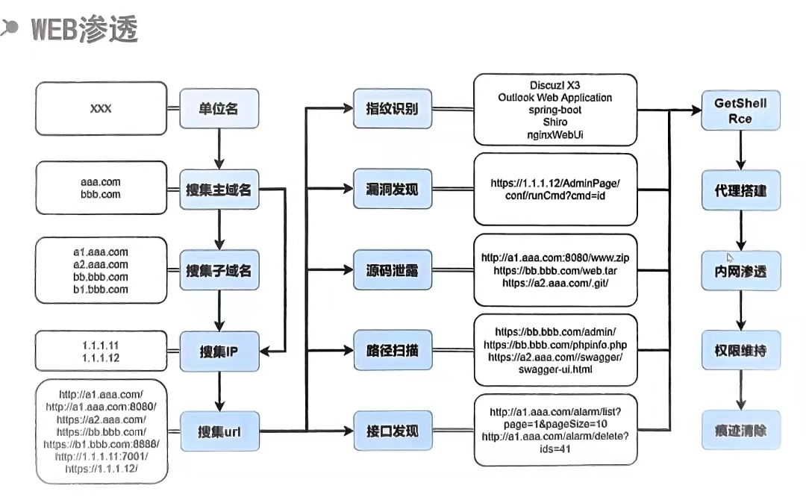
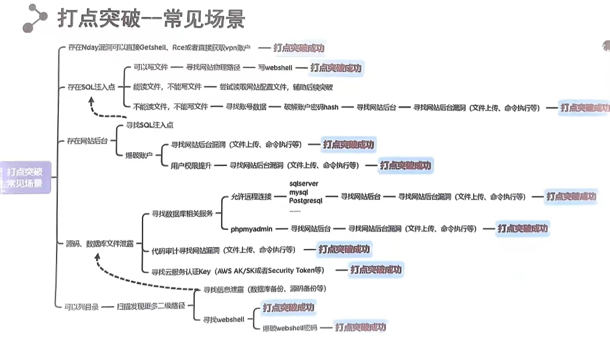
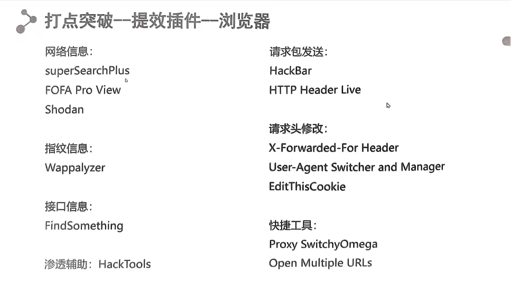
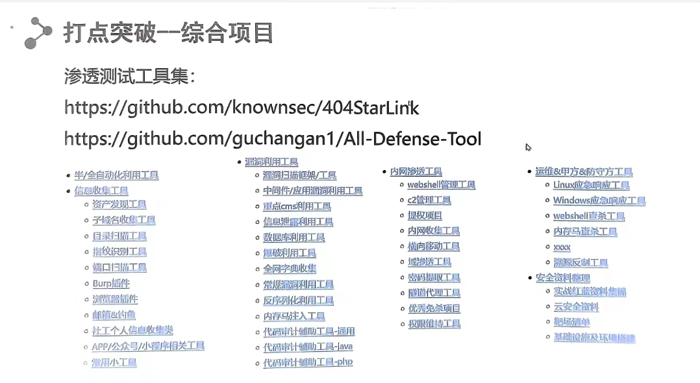

# Web渗透流程浅析

## 一. 渗透三板斧

信息收集，打点突破，横向渗透

## 二. 信息收集

### 2.1目标组织架构

* 爱企查
* 企查查

### 2.2主域名

* 天眼查（网站备案，微信公众号）

* 小蓝本（备案未备案（无法访问）都可查）
* ENScanGO（GitHub）
* Goole，WIkipedia（国外）

### 2.3 子域名

- 利用搜索引擎发现子域名，常见资产包括办公系统，邮箱i同，论坛，管理系统，网站管理后台等

- 子域名爆破

- DNS数据集搜集子域，威胁情报平台搜集子域名

- 子域爬取

- 利用证书透明度搜集子域

- 网上爬虫档案搜集子域名

- https://hunter.qianxin.com/

- https://fofa.info

- https://github.con/wgppsec/fofa_viewer

- 自动搜索工具：OneForAll（https://github.com/shmilylty/OneForAll）

### 2.4 IP, 端口，旁段，C段

IP：

* 子域名IP：
  * 主站虽然是用了CDN，但子域名可能没有使用CDN
* 多地ping
* 历史DNS解析记录

端口：

* nmap扫描
* 在线端口检测

旁站，C段：

* 旁站：是和目标网站在同一台服务器但开放在其他端口的网站
* C段：是和目标服务器ip处在同一个C段的其它服务器
* 站长之家——同IP网站查询
* 网络空间搜索引擎

## 三. 打点突破

>  核心思想：突破网络边界（上传webshell，命令执行，vpn拨入）

### 3.1 指纹识别

了解web服务类型，框架，版本，帮助我们更好的去测试已知漏洞和大概的利用方法，为渗透测试提供重要方向

- 在线网站：云悉，潮汐指纹，CMS指纹识别，
- GitHub：EHOle

### 3.2 漏洞发现

#### 3.2.1 基于已知漏洞的poc获exp进行验证

- GitHub：zin8in/aforg，r00tSe7en/JNDIMontior，welk1n/JNDI-Injection-Exploit，chaitin/xray/release，chaitin/xpoc
- dnslog

#### 3.2.2基于常见web漏洞payload的fuzz

* AWVS

### 3.3 源码泄露

针对所有目标url，批量扫描文件泄露

当某web应用是某种通过框架，通用系统，先搜集去哪玩相同web应用，再批量扫描其文件泄露

工具：projectdiscovery/httpx（GitHub）

### 3.4 路径扫描

dirsearch，御剑，dirmap

字典：TheKingOfDuck/fuzzDicts（GitHub）

### 3.5 接口发现

- mickeystone/JSFinderPlus

- rtcatc/Packer-FUzzer

- ping0cy/URLFinder

